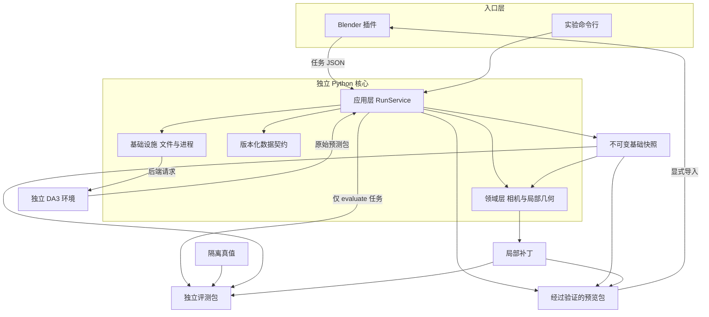
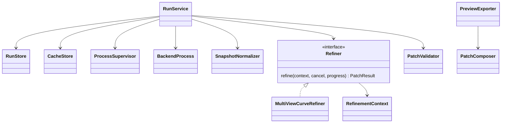

# Creator Newage：详细系统设计

版本：设计 v0.1；日期：2026-09-13；根目录：`D:/Creator-newage`。

本文给出模块边界与公开接口，不声称这些类已经全部实现。项目骨架已建立，具体可用入口见 [开发说明](../development.md)；数值重建和修复尚未实现。技术栈沿用 [ADR 0002](../decisions/0002-reconstruction-stack.md)，具体选择见 [ADR 0003](../decisions/0003-newage-architecture.md)。

## 1. 用户得到什么

在 Blender 中导入同一物体的多张照片，得到初步重建；在照片上框选有问题的细杆，点击增强，查看原版和候选版以及修改依据，选择接受或撤回。

首版处理静态、不透明、视角充分的直杆或分段直杆。例子是椅背横杆、架子的支撑条、栏杆。细绳、透明杆、完全遮挡结构、整张场景的自动建模不是首版验收对象。

结果可以是可检查的中心线与保留的基础点云，并不保证闭合、带材质的最终生产网格。显示粗细与测量出的半径分开。

最重要的研究问题是：**在相同输入条件下，能否补回确有图像证据的细结构，同时少造假杆、少误连，并清楚地指出做不到的情况。**

## 2. 架构总图



图中的评测包可以使用核心几何工具，但核心修复模块不能反向导入它。文件交换是跨 Python 环境边界；一个环境内部直接调用函数，不把每个模块变成子进程。

## 3. 五层及依赖方向

| 层 | 主要位置 | 负责 | 禁止承担 |
| --- | --- | --- | --- |
| 入口层 | `reconstruction/.../cli/`、`blender_addon/` | 收集参数、冻结请求、显示状态 | 在按钮回调中做推理；绕开契约修改结果 |
| 应用层 | `reconstruction/.../application/` | 一个用例的顺序、前置检查、阶段产物、错误传播 | 自己实现三角化、偷偷访问真值、修改 bpy |
| 领域层 | `reconstruction/.../domain/`、`refinement/` | 相机几何、观测、匹配、拟合、补丁语义 | 进程启动、窗口操作、网络下载、实验答案 |
| 基础设施层 | `reconstruction/.../infrastructure/` | 文件校验、原子发布、缓存、进程、锁和日志 | 决定一根杆在物理上是否正确 |
| 外部适配层 | `backends/`、插件的 `bridge/` 和 `importing/`、`experiments/` | 把真实外部能力转换成协议，处理宿主特例 | 伪造模型没有的字段；把显示数据当研究真值 |

`contracts/` 是各层共用的数据语言，只有 Pydantic 与基础类型，不导入应用、模型或 Blender。领域层可使用 NumPy/SciPy/OpenCV，不依赖某个基础模型。

应用层在启动入口组装具体对象；只给实际可替换的边界建立协议：`Refiner`、`CancellationToken`、`ProgressSink`。存储和进程首版使用具体类，不设置 Repository → Service → Manager 的重复转发层。

## 4. 目标目录和包边界

以下是目标布局。源码模块边界和轻量入口已建立；权重、数据、运行缓存与其余功能按实际实施阶段建立。

```text
D:/Creator-newage/
  README.md
  docs/
    README.md
    decisions/
    architecture/
  schemas/v1/                       # 从核心 DTO 导出，固定协议样例
  reconstruction/                   # 核心 uv 项目；不依赖 DA3 包
    pyproject.toml
    uv.lock
    src/creator_recon/
      cli/main.py
      contracts/                    # 按数据主题拆文件，不按每类拆一个文件
      application/
        case_builder.py
        run_service.py
        reconstruct.py
        refine.py
        export_preview.py
        evaluate.py
      domain/
        camera.py
        image_geometry.py
        snapshot.py
        patch.py
      refinement/
        api.py
        observations.py
        association.py
        triangulation.py
        fitting.py
        acceptance.py
        multiview.py
      infrastructure/
        artifacts.py
        run_store.py
        cache_store.py
        process_supervisor.py
        gpu_lease.py
        runtime.py
        logging.py
      adapters/
        backend_process.py
        snapshot_normalizer.py
        preview_exporter.py
    tests/                          # 几何、契约、生命周期和关键集成测试
  backends/
    da3/                            # 独立 uv 项目和锁文件
      src/creator_da3/
        runner.py
        adapter.py
        preprocess.py
        serialization.py
    moge3/                          # 仅在强对照需要时建立；单图能力
  blender_addon/
    creator_recon/
      __init__.py
      operators/
      ui/
      properties/
      session/
      bridge/
      importing/
  experiments/                      # 实验 uv 项目，依赖核心，反向依赖禁止
    src/creator_eval/
      dataset/
      alignment/
      metrics/
      reporting/
      runner.py
    synthetic/                      # Blender 后台生成已知几何测试数据
    protocols/                      # 冻结的数据划分、阈值和实验配置
  configs/                          # 可分享的默认值；不放密钥及个人绝对路径
  tests/fixtures/                   # 很小的协议/几何样例，不放模型权重
  data/                             # 案例输入；真值与方法输入分目录
  runs/                             # 作业请求、日志、阶段文件、完成记录
  cache/                            # 内容寻址快照与修复结果
  models/                           # 可配置位置的权重缓存
  .local/                           # 机器解释器路径等个人运行配置
  .runtime/                         # 运行写锁、项目 GPU 锁和归属记录
```

核心、DA3、实验包分别锁定依赖；实验包可在本地以路径依赖使用核心。没有要一次安装全部模型的根目录“万能环境”。插件使用 Blender 自带 Python，只消费文件协议；不导入外部 `creator_recon` 包。因此外部核心和插件内部包同名也不共享模块状态。

`data/`、`runs/`、`cache/`、`models/`、`.local/`、`.runtime/` 与虚拟环境不纳入源代码版本控制；小型合成样例与实验协议纳入。对应忽略规则已建立。职责模块明确标记未来实现，不通过空成功结果模拟功能。

## 5. 模块与公开对象目录

| 模块 | 核心对象 | 输入 → 输出 | 详细规范 |
| --- | --- | --- | --- |
| 数据契约 | `CaseManifest`、`FrameRecord`、`CameraRecord`、`RegionSelection` | 明确的照片和人工选择 → 可校验输入 | [02](02-data-contracts.md) |
| 任务契约 | `RunRequest`、`RunStatus`、`RunRecord` | 冻结请求 → 可追踪运行及终态 | [02](02-data-contracts.md)、[04](04-runtime-and-blender.md) |
| 产物契约 | `BackendPredictionManifest`、`BaseSnapshot`、`PatchResult`、`PreviewManifest` | 原始预测 → 基底、改动、展示副本 | [02](02-data-contracts.md) |
| 应用编排 | `RunService`；四个用例处理函数 | 请求与运行上下文 → 终态和产物引用 | 本文 §6 |
| 后端接入 | `BackendProcess`、`DA3Adapter`、`SnapshotNormalizer` | 输入照片及配置 → 统一基础快照 | [03](03-reconstruction-and-refinement.md) |
| 几何服务 | `CameraGeometry`、`ImageGeometry`、`SnapshotView` | 数值、相机和映射 → 投影、射线、局部点 | [03](03-reconstruction-and-refinement.md) |
| 修复流程 | `Refiner`、`MultiViewCurveRefiner` 及内部六步 | 快照、原图、ROI → 补丁与证据 | [03](03-reconstruction-and-refinement.md) |
| 补丁处理 | `PatchValidator`、`PatchComposer` | 基底与补丁 → 完整候选的可迭代几何 | [03](03-reconstruction-and-refinement.md) |
| 磁盘与缓存 | `RunStore`、`CacheStore`、`ArtifactResolver` | 临时产物 → 校验并提交的清单；统一解析引用 | [04](04-runtime-and-blender.md) |
| 进程与资源 | `ProcessSupervisor`、`GpuLease` | 子进程任务 → 受控执行、取消与资源释放 | [04](04-runtime-and-blender.md) |
| 预览 | `PreviewExporter`；插件预览导入组件 | 完整候选 → 有预算的显示包 | [04](04-runtime-and-blender.md) |
| Blender | 属性、操作器、会话和版本控制组件 | 用户操作 → 作业与独立场景集合 | [04](04-runtime-and-blender.md) |
| 实验 | 数据集、对齐、指标与报告组件 | 产物 + 隔离真值 → 可复现实验报告 | [05](05-evaluation-and-delivery.md) |

每行的对象拥有明确职责。数据 DTO 不包含进程控制方法；纯计算函数不写运行终态；界面类不拥有研究数组的权威副本。

## 6. 应用层详细接口

接口中的 `Ref[T]` 表示已校验的产物引用，具体字段采用 [02](02-data-contracts.md) 的 `ArtifactRef`；不是任意路径字符串。

### RunService

| 项目 | 约定 |
| --- | --- |
| 责任 | 根据任务种类分派用例，统一状态、取消、错误与提交顺序 |
| 主要依赖 | `RunStore`、`CacheStore`、`ProcessSupervisor`、`GpuLease`、各用例处理函数 |
| 入口 | `execute(request: RunRequest, cancel: CancellationToken, progress: ProgressSink) -> RunRecord` |
| 输入检查 | 请求版本、字段、案例与产物身份、允许的任务种类、环境配置、写入位置 |
| 状态所有权 | 正常运行只有核心协调者写权威状态；崩溃后受锁保护的恢复步骤接管，见 [04](04-runtime-and-blender.md) |
| 错误行为 | 产生分类错误与日志引用；不把异常吞成“无可靠修改”；任务终态规则由 [04](04-runtime-and-blender.md) 定义 |

四个用例以函数实现，除非后续确有跨调用状态，不再增加四个只有 `execute` 的服务类。

| 处理函数 | 前置条件与职责 | 成功的主要产物 |
| --- | --- | --- |
| `reconstruct(request, runtime)` | 验证照片；命中缓存或执行后端；规范化坐标；检查并发布快照 | `BaseSnapshot` |
| `refine(request, runtime)` | 必须明确现有 `base_snapshot_id`、ROI 和方法版本；加载只读上下文；修复；校验补丁 | `PatchResult`，可含 `no_supported_change` |
| `export_preview(request, runtime)` | 明确基础快照和可选补丁；先组合完整候选，再按显示预算导出点/线段块，Blender 可将线段显示为管状曲线 | `PreviewManifest` |
| `evaluate(request, runtime)` | 校验实验协议与真值引用；调用独立评测包；不再调用修复器调整结果 | `EvaluationReport` |

`refine` 不隐式更换模型或重建基底。希望以更高分辨率重建时，先创建一个新的 `reconstruct` 作业。一个界面流程可以先后提交数个任务，但每个都有自己的请求、哈希、耗时与终态。

首版预览导出是独立 CPU 作业。界面可在前一个作业完成后继续提交导出，但“研究产物完成”和“预览可用”分开显示；导出失败不把有效研究产物抹掉。

`evaluate` 的应用入口只负责文件与任务控制，可在实验环境执行；只有实验环境安装 `creator_eval`。普通插件不能通过上传任意模块名来执行代码，任务分派为固定四种。

### 取消和进度

| 接口 | 方法 | 契约 |
| --- | --- | --- |
| `CancellationToken` | `is_requested() -> bool`；`raise_if_requested() -> None` | 在阶段边界及有上限的循环中检查；不要求模型内核能瞬时停止 |
| `ProgressSink` | `report(stage, completed, total, message) -> None` | `total` 未知可以为空；不伪造百分比；节流后写小状态，由核心统一序列化 |

取消不是算法质量差。缺少足够视角的局部目标可以返回正常的无改动结果；整个请求格式错误、坐标未知或 OOM 则是分类失败。

## 7. 对象关系



图中表示使用或实现关系，不要求所有依赖都保存在一个巨大的构造函数中。入口组合根按用例创建依赖；纯 DTO 省略于图中。

## 8. 从按钮到结果的一次完整链路

1. 导入图片，核心建立 `CaseManifest`、稳定 frame ID 和方向归一后的照片；Blender 显示输入清单。
2. 提交 `reconstruct`。外部核心启动 DA3 环境，获得原始预测包，再规范化为不可变基础快照。
3. 提交 `export_preview`；用户显式导入基础版本。预览点的来源可追溯，但预览不是完整数值结果。
4. 在一张或多张照片上框选目标，保存 `RegionSelection`；自动传播到其他照片的 ROI 标为推断。
5. 提交 `refine`，明确基底、区域、方法与参数。核心读取原图和固定相机，建立局部观测、匹配并拟合，检查支持证据。
6. 生成补丁：哪些基础点需要抑制、增加哪些中心线、为何接受或拒绝。原始快照从未被修改。
7. 再导出候选预览。候选是 `(基础几何 − 抑制部分) + 新增几何`；先完成语义组合，再做展示简化。
8. 显式导入一个新集合，与原集合切换比较。接受选择该版本；撤回切回原版。手工编辑使用派生工作副本。
9. 批量实验读取同一基础快照和补丁，另外获得真值，输出质量与成本报告。

## 9. 首版刻意保持简单的地方

- 原始快照只生成一次身份，不建设可变场景数据库。
- 修复只能以基础快照为输入；多个不同 ROI 可生成多个并列候选。需要多处一起修改时提交包含多个区域的一次请求，内部检查改动冲突；不自动串联已有补丁。
- 第一种算法只处理容易定义和验证的杆状中心线，不同时承诺任意曲面和材质。
- 不建立插件商店、算法市场、远程 API、用户账户或多机训练任务系统。
- 公开类型覆盖模块边界；普通数学步骤用函数，避免用大量类把简单算法包复杂。

## 10. 实施入口

第一批实现应覆盖：协议小样例、相机与图像变换、DA3 最小适配、快照校验、CLI 和只读预览。随后用受控测试补丁验证抑制、新增、取消、撤回及保存重开。此时仍不声称算法有效。

研究方法在这条链路上迭代；验证到可重复改进后，再完善 ROI 交互、证据查看和发行包。完整分阶段验收见 [05](05-evaluation-and-delivery.md)。

类和接口在下一版源码出现后，需要逐条映射到实现与关键测试。文档已写完、类型定义齐全、界面能启动，都不能单独作为研究阶段的完成标准。
