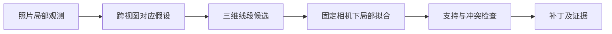

# 重建与局部修复：模块、类和算法接口

设计 v0.1；2026-09-13。字段、坐标和数组的权威定义见 [02 数据契约](02-data-contracts.md)，任务生命周期见 [04](04-runtime-and-blender.md)。

## 1. 固定什么，试验什么

固定输入为照片、相机、不可变基础快照和人工区域；固定输出为新增几何、被抑制的原点、证据和未解决原因。

首个候选方法叫 `MultiViewCurveRefiner`：从高分辨率照片的局部区域找杆状观测，建立跨视图对应，恢复三维中心线，再用各视图检查候选和旧几何。这个名字用于代码定位，不是新算法或论文贡献的宣称。

首版优先直杆，弯杆可分成有限短线段；不先做任意图拓扑搜索。内部具体检测器、匹配代价和拟合参数可以在开发集上替换，外部契约不变。设计目的在于产生一个能被反例推翻的实现起点。

## 2. 输入准备

### CaseBuilder

位置：`application/case_builder.py`，由 `creator case create` 调用；这是数据导入事务，不是第五种研究任务。

| 方法 | 责任 | 失败条件 |
| --- | --- | --- |
| `create(source_paths, options, output_dir, cancel) -> CaseManifest` | 检查输入、复制/内容寻址保留原图、统一 EXIF、保存照片预览、按请求顺序赋 frame ID、最后发布案例清单 | 读图失败、重复/错误身份、无权限、校准与尺寸矛盾、取消 |
| `validate_existing(case_ref) -> CaseManifest` | 核对清单、引用、哈希和最小输入条件 | 文件丢失、修改、格式版本不支持 |

用户选文件的顺序必须在导入请求中冻结；同一内容重复出现可以标记重复并提示，不能不留记录地合并。案例中的照片标识不由文件名唯一决定。

原图、方向归一图和显示缩略图是不同产物；缩略图映射由核心产生。Blender 不自行重新处理 EXIF，也不以缩略图坐标存 ROI。数据导入成本另行记录，不混入基础模型推理时间。

## 3. 后端适配边界

### BackendProcess

位置：`adapters/backend_process.py`；只负责协议和进程，不导入 torch 或模型包。

`invoke(request: BackendRequest, cancel: CancellationToken, progress: ProgressSink) -> BackendPredictionManifest`

- 从本机配置中读取已验证的解释器路径和固定 runner 入口，向 `ProcessSupervisor` 提交参数数组。
- 把实际视图、已知相机输入、预处理配置和运行输出位置写入请求；校验后端能力是否满足要求。
- 等待合法完成清单、核对文件与退出状态；模型调用日志归属于父运行。
- 未知后端 ID、未知坐标声明、缺失输出、OOM、取消分别报告。退出码为零也不能代替产物验证。

### DA3Adapter

位置：`backends/da3/src/creator_da3/adapter.py`；仅在 DA3 环境中运行。

| 方法 | 责任 |
| --- | --- |
| `describe() -> BackendCapabilities` | 声明多图输入、深度、相机与原始置信评分能力；实际可用能力绑定后端版本 |
| `infer(request, cancel, progress) -> NativePrediction` | 加载已指定权重，按固定配置推理，保留原始预测和实际预处理 |
| `write_prediction(prediction, request, output_dir) -> BackendPredictionManifest` | 写可移植数组和语义声明；不把 torch 对象写入交换包 |

`NativePrediction` 是后端进程的临时内存对象，不属于公开文件协议。预处理与序列化是同包中的函数模块，首版无需再建有状态管理器。

后端不下载未声明的其他权重、不静默减少视图、不以过滤后的展示 GLB 作为输出。DA3 的实际深度、内参、位姿和置信评分是否已按上游 API 规范化，必须对应锁定提交检查，不能再做一遍不明来源的尺度变换。

图像预处理记录必须来自实际执行路径。若上游不能暴露精确变换，需要对锁定版本做可验证的薄包装；不能凭“输入宽高除输出宽高”近似恢复后便宣称坐标正确。

MoGe-3 的独立对照适配可以复用文件容器，但必须声明没有跨视图外参。核心遇到“要求多视图快照却缺少外参”的组合时拒绝，不用单位矩阵补齐。

### SnapshotNormalizer

位置：`adapters/snapshot_normalizer.py`。

`normalize(case: CaseManifest, prediction: BackendPredictionManifest, config) -> BaseSnapshot`

顺序为：校验照片身份与尺寸 → 解释后端坐标/深度/像素约定 → 统一预处理内参 → 统一全局世界框架和尺度声明 → 建立有效点身份 → 发布规范化数组。

只接受能够明确转换的约定；未知约定直接失败。转换不修正模型预测本身的错误，只保证读者知道每个数值代表什么。

首版可按需从深度和相机计算 XYZ，不必重复保存每个像素的所有几何数组。保留置信评分与有效掩码，按块访问；展示过滤不改变原点身份。

## 4. 领域几何服务

这些对象只处理数组与显式参数，可在没有 Blender 和模型环境的情况下验证。

| 对象与位置 | 公开方法 | 约定与异常 |
| --- | --- | --- |
| `CameraGeometry`，`domain/camera.py` | `project(points_world, camera, space) -> ProjectedPoints`；`unproject(pixels, depth_z, camera, space) -> Points3D`；`rays(pixels, camera, space) -> Rays3D` | `space` 明确 oriented/processed；返回可见/有效掩码，不能把相机后方点当正常投影；不把欧氏距离当 Z 深度 |
| `ImageGeometry`，`domain/image_geometry.py` | `map_pixels(pixels, source_space, target_space, frame, camera)`；`map_region(region, target_space, frame, camera)` | 非线性畸变单独求映射；出界点保留状态；不把有损裁剪当双射 |
| `SnapshotView`，`domain/snapshot.py` | `iter_points(frame_ids, masks, chunk_size)`；`lookup(point_ids)`；`cameras()` | 只读访问已校验快照，使用稳定 ID；不因 mmap 可写而允许原地修改 |
| `PatchValidator`，`domain/patch.py` | `validate(base, patch, policy) -> PatchValidationReport` | 核查基底、ID、有限数值、支持关系、改动作用域和数组结构；不判断真实几何准确率 |
| `PatchComposer`，`domain/patch.py` | `iter_candidate(base, patch, chunk_size) -> GeometryChunks` | 先抑制对应原点再新增几何；不改变基底；不强制把不同几何类型挤成单个 mesh |

`ProjectedPoints`、`Rays3D`、`GeometryChunks` 是轻量内存记录。没有必要为每个矩阵建立序列化类；公开的磁盘数组按 [02](02-data-contracts.md) 保存。

对前景遮挡的判断不能只比较一张不可靠的基底深度图。初版把视图状态分成有支持、明确冲突、可能遮挡、无观测；证据不足不自动成为支持。

## 5. 修复入口与运行上下文

```text
Refiner.refine(
    context: RefinementContext,
    cancel: CancellationToken,
    progress: ProgressSink
) -> PatchResult
```

`Refiner` 是结构化接口协议；`MultiViewCurveRefiner` 是首个实现。由固定方法 ID 映射到已知实现，不允许请求传入任意 Python 模块或代码。

`RefinementContext` 是同进程只读上下文，包含：

| 成员 | 含义 |
| --- | --- |
| `case` | 当前案例及输入照片集合 |
| `base` | `SnapshotView`，仅当前请求绑定的基底 |
| `regions` | `RegionSelection`，包括人工来源与推断来源 |
| `images` | 按 frame ID 读取原图/处理图的只读访问器；允许有预算的局部缓存 |
| `method_config` | 验证后的阈值、候选预算、拟合参数、版本与随机种子 |
| `scratch_dir` | 本次运行的临时诊断目录，由应用层创建 |

不包含真值、测试分组答案、评测报告或 bpy 对象。读取器只暴露请求允许的照片；隐藏评测视图不能作为“额外检查”进入上下文。算法可写诊断文件，不拥有作业终态和最终发布权限。

没有可信候选时返回零新增、零抑制的合法补丁，内容状态为 `no_supported_change`。异常、损坏输入和资源失败抛出明确错误，不能转换成正常空补丁。

## 6. 第一种候选算法：六个内部模块



这些是同一个方法内部的函数模块，可独立检查；不先做可热插拔的六层算法框架。

| 模块与函数 | 输入 → 输出 | 要解决的具体问题 |
| --- | --- | --- |
| `observations.extract(context, region, cancel)` | 图像、ROI、相机 → `ObservationSet` | 哪些像素可能来自细杆，哪些只是纹理边界 |
| `association.propose(observations, cameras, priors, config)` | 多图观测 → `CorrespondenceHypotheses` | 哪些二维线段可能属于同一根三维杆 |
| `triangulation.initialize(hypotheses, cameras, config)` | 对应 → `CurveHypotheses` | 从有视差的观测建立三维初值，拒绝病态几何 |
| `fitting.fit(hypotheses, observations, context, config)` | 初值和观测 → `FittedCurves` | 同时兼顾多个视图，减少局部重投影误差 |
| `acceptance.check(curves, context, observations, config)` | 拟合候选 → `AcceptedEdits` 与拒绝记录 | 有足够独立支持吗，会不会穿过明确背景或误连 |
| `multiview.build_patch(edits, context)` | 通过检查的候选 → `PatchResult` | 挑出允许抑制的原点，记录修改及来源 |

### 6.1 观测提取

先将人工 ROI 精确映射到照片局部；使用原始有效分辨率，不把已经消失在缩略图中的杆重新猜出来。基底几何可提供宽松搜索范围，不得要求缺失部位原本就有正确深度。

首个实现试验线段/脊线检测和成对边缘线索，保留方向、像素宽度、局部颜色描述及检测响应。单条物体轮廓边不是杆中心线；只有一侧边缘时标记不确定，不能偷偷加半个任意宽度当中心。

人工 ROI 仅限制搜索区域，不是精确分割真值。纹理直线、阴影、重复横杆和交叉位置都必须进入开发反例集；若此阶段无法建立可靠观测，后面的优化不会自动补救。

### 6.2 对应假设

利用固定相机下的极线约束缩小候选，再用方向、宽度变化和局部外观比较排序。基础深度只提供软先验；缺失深度不意味着禁止恢复。

为每个局部目标保留少量可竞争的对应假设，预算由参数固定。重复栏杆不能仅因颜色相同便确定匹配；多解难以区分时留下未解决状态。

如果用户只在一张照片画 ROI，其他照片可以由粗几何/极线产生搜索带，必须标记为推断。搜索无法可靠定位时可要求更多 ROI，但本次作业先返回明确原因，不能悄悄拿人工补选后的结果当原先输入的成功结果。

### 6.3 三维初值

对于直杆，在明确对应的图像线段上建立反投影平面，求三维直线候选；也可在具有可靠匹配的采样点上三角化。有限端点需额外确定可见区间，不能把无限直线裁剪成任意好看的长度。

计算视差、深度正值、条件数/扰动敏感性与端点支持。近平行观测、近乎同位置相机、射线交会不稳定的候选拒绝或标低证据；“两张图”并不自动等于足够三维信息。

遮挡区域可以连接两侧有依据的局部段，但首版不宣称恢复了不可观测拓扑。跨越大段无观测区域的连接默认保留断开。

### 6.4 固定相机下的拟合

首版固定基础相机，优化线段端点或少量折线控制点；不同时联合优化全部位姿、尺度和复杂网格。相机明显错误时报告该限制，并用单列的已知相机实验诊断，不能在正式方法中偷用真相机。

候选目标函数包含：支持视图中的鲁棒点到二维曲线距离、可靠对应的深度/位置软先验、有限的平滑或直线偏好。各项权重与单位在方法配置中给出；图像误差用相应图像空间的像素，几何误差用该快照的单位。

正则项会偏好某种形状，不能当作观测证据。“椅子通常对称”之类物体先验不属于首版默认输入。后续若引入，需要单独消融。

不用全分辨率图像做全局穷举。按 ROI、视图和固定候选预算分批处理；默认数值计算在 CPU，只有测量表明确需自动求导/GPU 才给核心增加相应运行配置。

### 6.5 接受检查

最低要求是至少两个有足够视差的输入视图支持；有额外输入视图时检查候选是否与它们一致。用于拟合以外的检查视图仍然属于方法可见输入，不等于真正保留的测试视图。

支持数、残差、条件性、明确背景冲突、基底遮挡可信度和候选间冲突分别记录，不压成一个未经校准的“正确率”。无法判断遮挡时记录未知，不按通过处理。

未检测到线段、位于人工 ROI 外或基底深度缺失，都不是背景证据。首个观测器只给出线/边缘时，不拥有可靠的全图背景标签；没有独立且已验证的可见性或背景判据，就把对应冲突标为 `unknown`，不执行依赖这种证据的删除。未来增加判据时，必须记录来源并加入反例验证。

多根候选在二维交叉并不代表三维连接。首版只有在端点几何及多视图连接证据成立时才合并；否则保留独立线段。不以“点云看起来连着”推断结构拓扑。

首版补丁存独立折线，不提供具有真实连接语义的 junction 图；几何上连续的折线也不等于已经恢复物体的结构连接。连接质量只在独立评测的固定图读出协议下讨论，不能把屏幕上两条线接触称为拓扑恢复。

### 6.6 抑制与生成补丁

抑制操作比新增更保守。通过局部点的来源像素、空间邻域和多视图冲突证据确定抑制范围，不能把整张 ROI 内的点全部删掉，也不能只按一条漂亮中心线扫出一个任意粗圆柱清空原点。

只有“对同一局部结构的有效替换”或“有独立证据的错误原点移除”才允许抑制。单个替换编辑的新增和抑制作为同一检查单元：新增候选被拒绝，相应抑制也撤销；不存在先删除后拟合失败的半成品。

原点误差无法确定时，可以只新增明确支持的缺失部分，或者输出无改动。不能为了视觉上解除粘连而把删除范围调到没有依据。

多个 ROI 的接受结果统一去重并检查冲突；同一个原点不能被含义相反的编辑反复处理。最后一次性形成绑定基础快照的补丁。

## 7. 内部数据记录

这些记录只服务候选方法，版本由 `method_version` 管理；需要展示的稳定证据转换到公开 `EvidenceRecord`，不是把全部临时对象作为文件协议。

| 记录 | 关键成员 | 生命周期 |
| --- | --- | --- |
| `Observation2D` | frame/region ID、像素空间、采样曲线、可见区间、方向/宽度线索、响应值 | 某次观测阶段 |
| `CorrespondenceHypothesis` | 观测 ID 集、匹配分项代价、歧义组、候选来源 | 匹配与初始化 |
| `CurveHypothesis` | 世界坐标初值、支持区间、生成视图、条件性与不确定状态 | 拟合前 |
| `FittedCurve` | 控制点、优化终止原因、逐视图残差、可见性状态 | 接受检查前 |
| `AcceptedEdit` | 可接受的新几何、候选抑制点、证据索引、编辑作用域 | 补丁提交前 |
| `RejectionRecord` | 对象/区域/候选 ID、原因代码、支持诊断引用 | 汇总为公开未解决记录 |

首版不声称对所有误差都估计了协方差。缺少统计校准时，条件数与扰动响应仅作为诊断，不以置信椭球制造精度印象。

## 8. 中心线、半径和预览

研究中心线由真实三维控制点表示；其几何长度和位置可以评测。`estimated_radius` 只有算法明确估计时才存在，附方法与观测来源。否则字段为空。

`display_radius` 属于预览配置，可能为了屏幕可见性而变粗；不进入补丁的研究几何，也不参与表面误差计算。核心 `PreviewExporter` 输出有预算的点和线段块，Blender 根据线段生成显示曲线，可用管状粗细展示；这类显示几何不能被 `PatchValidator` 当成新的研究表面接受。

`PatchComposer` 返回带类型的点与中心线集合；评测包使用冻结的共同读出协议比较基底与候选，详见 [05](05-evaluation-and-delivery.md)。研究算法不能根据评测读出或真值反馈反复修改测试结果。

## 9. 关键不变量与故障映射

| 情况 | 结果 |
| --- | --- |
| case、ROI 或后端坐标声明不合法 | 输入/契约失败，修复不运行 |
| 模型产生局部无效深度 | 在有效掩码中标记；可对其他有证据区域继续，不自动填零作为有效点 |
| 某候选无足够视差、歧义过大、支持不足 | 拒绝该候选，记录原因；没有其他候选时合法无改动 |
| 基底与补丁 ID 不一致 | 拒绝补丁，不能猜对应关系 |
| 数值求解未收敛 | 按候选记录失败；所有候选失败仍说明算法未解决，不能宣称获得修复 |
| 内存不足、进程异常或临时文件损坏 | 作业失败；不发布成功结果，不静默换参数 |
| 用户取消 | 传播取消；候选暂存不可导入，已完成基底保持有效 |
| 外部照片或既有产物被修改 | 哈希检查失败；重新导入/生成新身份 |

方法的“拒绝了多少”必须进入实验报告。只展示接受的三根杆、隐藏其他七根失败，不构成完整成功率。

## 10. 第一轮实验要回答的问题

1. 真正遗漏的是基础模型的细结构，还是输入分辨率、相机或展示过滤出了问题？
2. 从原图能否得到跨视角一致的杆状观测，而不把纹理/阴影当杆？
3. 更高分辨率、局部裁剪和简单拟合这些对照已经能改善多少？候选方法还剩什么增益？
4. 恢复的完整度上升时，错误补全和误连接是否同时恶化？
5. 共享估计相机下效果如何，已知相机诊断是否说明瓶颈主要来自姿态？

如果方法没有可重复收益，保留失败结果，替换观测或对应策略；不通过增加界面、圆管细分或更换漂亮样本来宣告完成。几何管线与独立评测的设计就是为了尽早发现这一点。

依据：[EPFL 细结构恢复课题](https://www.epfl.ch/labs/cvlab/projects/recovering-thin-structures-in-3d-foundation-models/)、[DA3 API](https://github.com/ByteDance-Seed/Depth-Anything-3/blob/main/src/depth_anything_3/api.py)、[DA3 预处理](https://github.com/ByteDance-Seed/Depth-Anything-3/blob/main/src/depth_anything_3/utils/io/input_processor.py)、[Vid2Curve](https://arxiv.org/abs/2005.03372)。这些支持问题背景与适配约束，不证明本文候选方法的新颖性或有效性。
