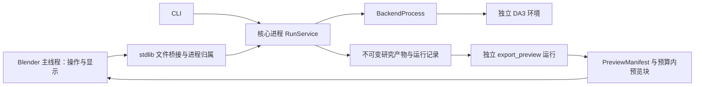
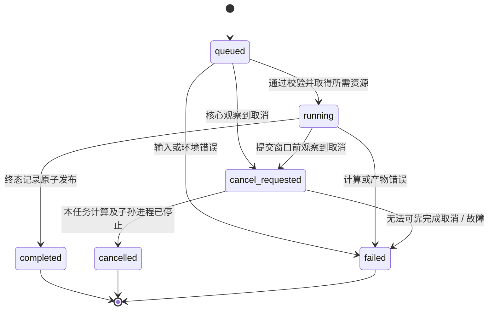

# 04 — 任务运行、存储与 Blender 交互

日期：2026-09-13。状态：待实现的首版契约。项目根目录：`D:/Creator-newage`。

本文回答两件事：计算怎样可靠地跑完或停下来；用户怎样在 Blender 中选择、比较和保留结果。方法本身是否改善重建，由独立实验判断，不能由任务的 `completed` 状态判断。

## 1. 进程与依赖边界



- `reconstruction/src/creator_recon/application/` 组织案例服务、任务和导出调用，不导入 `bpy`。
- `reconstruction/src/creator_recon/infrastructure/` 实现通用磁盘、缓存、锁与进程工具；`adapters/preview_exporter.py` 把研究产物转换为外部预览格式，再使用通用存储工具写盘。
- `reconstruction/src/creator_recon/contracts/` 的 Pydantic 模式是协议源；导出的 `schemas/v1/` 用于审核与兼容性检查。
- `backends/da3/` 是独立项目和环境。后端仅写自己的阶段目录与 `BackendPredictionManifest`，不写核心任务状态。
- `blender_addon/creator_recon/` 只包含宿主界面、轻量文件桥接、版本管理与预览导入。它不导入研究核心、Pydantic、torch 或 DA3。
- Blender 自带的 `bpy`、`gpu`、`blf` 可用于界面；“stdlib wire reader”指协议读取不额外安装模型或契约依赖，并非要求插件完全不用 Blender API。

没有网络服务、数据库、消息代理、常驻 GPU worker 或任意任务图。四种 `RunKind` 分别是 `reconstruct`、`refine`、`export_preview`、`evaluate`。每次运行只有一种任务、一份不可变请求、一份终态记录。

用户点击“重建并预览”时，插件先提交 `reconstruct`，成功后提交引用该结果的 `export_preview`；“增强并预览”同理。两次运行分别记录 ID 和成本，界面只做这一条固定顺序，不建设工作流引擎。评测由 CLI 或实验脚本发起。

首次照片导入使用 `application/case_builder.py` 中的 `CaseBuilder.create(source_paths, options, output_dir, cancel) -> CaseManifest`，由独立 CPU 命令 `creator case create --request <CaseImportRequest.json>` 执行。它是资料导入事务，不增加第五种研究 `RunKind`；已有案例直接使用其 ID。该进程同样受到 Job 归属与取消管理，但写独立的小 `import_status.json`，不冒充研究任务 `RunStatus`。原图拷贝、EXIF 归一、哈希及照片预览全部完成后才发布案例清单；取消不发布半个案例，导入时间与模型时间分开。

## 2. 核心类与接口

下列签名用于确定职责，不是已经存在的实现。`Path`、配置记录和返回记录的细字段以数据契约文档为准。内部可以使用普通函数；不为每个文件读取或矩阵运算增加抽象类。

| 类 / 模块 | 主要公开方法 | 职责及失败契约 |
| --- | --- | --- |
| `RunService`，`application/run_service.py` | `execute(request: RunRequest, cancel: CancellationToken, progress: ProgressSink) -> RunRecord`；`reconcile(run_id: str) -> RunRecord` | 唯一决定并写入 `RunStatus`、`RunRecord` 的核心服务；获取运行写锁、调用一种任务、发布产物、终结或恢复。可处理的业务失败转换为记录；写盘失败等无法可靠记录的故障以非零进程退出报告。 |
| `RunStore`，`infrastructure/run_store.py` | `create(request) -> Path`；`acquire_writer(run_id) -> ContextManager`；`stage_artifact(run_id, name) -> Path`；`publish_artifact(staged_path, specification) -> ArtifactRef`；`write_status(status) -> None`；`commit(record) -> ArtifactRef`；`read_record(run_id) -> RunRecord | None` | 管理运行目录、原子写入及路径边界；内部组合文件与哈希帮助函数。`commit` 不覆盖既有终态。抛出 `RunAlreadyExists`、`ArtifactInvalid`、`StorageError`、`RunBusy`。 |
| `CacheStore`，`infrastructure/cache_store.py` | `lookup(key) -> ArtifactRef | None`；`publish(key, manifest_ref) -> None`；`invalidate(key, reason) -> None` | 只索引已验证、不可变的完整产物；失配或损坏按未命中处理并记录原因，不假装命中。抛出需中止的存储故障；不删除源运行。 |
| `ArtifactResolver`，`infrastructure/artifacts.py` | `resolve(ref: ArtifactRef, access) -> Path`；`verify(ref: ArtifactRef) -> ArtifactValidation` | 使用可信存储映射解析包内路径、校验边界、长度、hash 和允许格式。通用字节检查在此实现，几何语义仍由领域校验负责；抛出 `ArtifactInvalid` 或 `StorageError`。 |
| `ProcessSupervisor`，`infrastructure/process_supervisor.py` | `start_owned(argv, cwd, env, stdout_path, stderr_path) -> ProcessHandle`；`poll(handle) -> ProcessExit | None`；`terminate_tree(handle, grace_seconds) -> ProcessExit`；`wait_empty(handle, timeout) -> bool` | 在 Windows Job Object 中启动本任务子进程；管理句柄、退出码、取消宽限与后代退出。无法建立归属时 `ProcessOwnershipError`，不继续无监管推理。 |
| `GpuLease`，`infrastructure/gpu_lease.py` | `acquire(project_root, device_id, run_id, cancel) -> LeaseHandle`；`register_execution(handle, process_identity, job_identity) -> None`；`release(handle) -> None` | 全项目 CLI 与插件共用的操作系统文件锁及归属记录；等待中可取消。检测前任尚未清退时继续等待或报告 `ResourceBusy`，不会依据过期 PID 擅自释放。 |
| `PreviewExporter`，`adapters/preview_exporter.py` | `export(base: BaseSnapshot, patch: PatchResult | None, options, cancel, progress) -> PreviewManifest` | 在外部核心环境物化有限点数/面数的完整基底与候选预览、来源映射、照片缩略预览引用。验证基底绑定和数量预算。抛出 `BaseSnapshotMismatch`、`PreviewBudgetInvalid`、`ArtifactInvalid`。 |

复用其他章节的算法边界，不再加包装层：

| 协作者 | 方法 | 运行时约束 |
| --- | --- | --- |
| `BackendProcess` | `invoke(request: BackendRequest, cancel, progress) -> BackendPredictionManifest` | 通过 `ProcessSupervisor` 启动后端；文件协议校验后返回，退出码 0 本身不等于产物完整。 |
| `SnapshotNormalizer` | `normalize(case, prediction, config) -> BaseSnapshot` | 后端退出后统一相机、坐标和来源记录；不改变原始后端文件。 |
| `Refiner` | `refine(context: RefinementContext, cancel, progress) -> PatchResult` | 只读取研究输入，不访问 Blender 或测试真值；返回新补丁，不原地修改快照。 |
| `CancellationToken` | `is_requested() -> bool`；`raise_if_requested() -> None` | 从取消请求与调用上下文读信号；可抛 `RunCancelled`。不会负责杀进程或写状态。 |
| `ProgressSink` | `report(stage, completed, total, message) -> None` | 向 `RunService` 报告受控阶段消息；`completed` 是已完成工作量，未知总量用 `total=None`，此时不显示百分比。节流写入；`message` 由受控模板生成，不把上游任意日志直接当作用户状态。 |

实现保持顺序应用服务：校验 → 必要的缓存检查与资源租约 → 算法或导出 → 产物校验 → 提交。函数调用足够的地方不引入工厂、事件总线或插件注册器。

## 3. 运行目录与文件所有权

以下是每个目录的职责；大数据可配置到别处，但所有入口共享同一个项目锁根。运行引用使用 `ArtifactRef`，不把外部任意绝对路径混入结果文件。

```text
D:/Creator-newage/
  .runtime/
    locks/gpu-<device>.lock
    locks/gpu-<device>.owner.json
    locks/runs/<run_id>.lock
  data/cases/<case_id>/
    manifest.json
    originals/                       不可变原文件
    oriented/                        EXIF 方向归一图
    photo-previews/                  照片画布预览
    selections/<selection_id>.json  RegionSelection
  runs/<run_id>/
    request.json                     RunRequest，只写一次
    status.json                      RunStatus，可原子替换
    control/cancel.json              前端发出的幂等取消请求
    events.jsonl                     核心结构化事件
    logs/core.log
    logs/backend.stdout.log
    logs/backend.stderr.log
    work/                            阶段临时文件，不是成功产物
    artifacts/                       校验后发布的不可变文件
      backend/                       可解释的原始模型预测
      result/                        补丁及其数组
      preview/                       显示清单和固定布局块
    run-record.json                  RunRecord，终态提交清单
  cache/<namespace>/<key>/index.json  指向完整产物的轻量索引
  cache/snapshots/<snapshot_digest>/  内容寻址的快照包
```

| 文件 | 谁能写 | 谁能读 | 关键限制 |
| --- | --- | --- | --- |
| `request.json` | 入口先完整写入；核心创建运行时验证并冻结 | 核心、恢复工具、审计 | 请求哈希与实际内容一致；同一 run ID 不能换请求 |
| `status.json` | 仅 `RunService`，恢复也通过该服务 | 插件、CLI | 单写者、递增 `sequence`；插件不能自行写 `failed` |
| `control/cancel.json` | 发起该任务的插件 / CLI | 核心 | 只表达取消意图，不是终态；写临时文件后原子发布，重复点击不覆盖成别的指令 |
| 后端阶段文件 | 对应后端进程 | 核心 | 路径限制在指定阶段目录；后端不能提交 `run-record.json` |
| `artifacts/` 与 `run-record.json` | 核心 | 插件、评测器、缓存 | 已发布文件不可覆盖；终态提交后只允许另写恢复事件或展示状态镜像 |
| 插件派生工作副本 | Blender 用户操作 | Blender | 保存于 BLEND，不写回研究快照 |

桥接读取 JSON 时限制文件大小、支持的 `schema_version`、类型、计数上限和必须字段。解析不是执行：不导入 JSON 指定的 Python 模块，不接受 pickle，不运行清单里的命令。

`ArtifactRef` 路径必须在声明的案例或运行产物根内；禁止绝对路径、`..` 越界及解析后越出根目录的链接。核心验证哈希、大小、数值形状与有限值；插件再次校验小清单和将要读取的预览块。协议不声称是运行任意不可信工程的安全沙箱。

## 4. 单写者状态机与终态竞争



`stage` 与 `state` 分开。等待 GPU 属于 `queued`，阶段为 `wait_resource`；其余标准阶段为 `validate`、`reconstruct`、`normalize`、`refine`、`validate_result`、`export_preview`、`evaluate`、`publish`、`finalize`。阶段不能推出几何成功；实际阶段按任务种类选用。

终态语义：

- `completed`：请求所需产物完整，`run-record.json` 提交成功。`PatchResult` 的 `no_supported_change` 仍可属于完成任务。
- `cancelled`：核心已观察取消，并确认本任务计算停止；不发布可供用户误当成功的最终候选。
- `failed`：明确错误或恢复时确认上次进程异常结束；保留故障信息及可诊断的阶段产物。
- 进程被强杀时，`status.json` 可能暂留 `running` 或 `cancel_requested`。这是“运行记录待恢复”，不是把旧状态当作仍在计算，也不能由插件随意补写终态。

取消与完成的线性化规则：核心在进入 `finalize` 前最后检查一次取消；已观察到取消则走取消路径。通过该门后，核心只完成有界的小文件提交，不再把迟到取消解释成撤销一个已提交结果。最终 `run-record.json` 是裁决依据；取消请求与提交同时到达时，UI 显示实际胜出的终态，而非保证每次点击取消都胜出。

提交期间发生磁盘失败或强杀，没有完整终态清单就不算完成。禁止先写 `completed` 再补几何文件。窗口内的强杀即使留下已校验几何，也需要恢复流程确认状态。

`RunRecord` 只能从无到有，不能从 `completed` 改为 `cancelled`。保存用户接受/撤回选择也不能改写该记录。

## 5. 原子发布与恢复

### 5.1 发布顺序

1. 在目标文件同一卷的临时位置写数据，关闭写句柄；必要的 flush 与同步由存储工具集中处理。
2. 核心验证 dtype、shape、数量、有限值、基底绑定、ID 引用及文件哈希。
3. 把文件发布为不可变产物路径；清单只引用已完成文件。
4. 发布阶段产物清单，构造带哈希的 `RunRecord`。
5. 最后原子发布 `run-record.json`，再更新 `status.json` 的终态镜像。

最终权威提交清单是 `run-record.json`；某个预览二进制块或中间 JSON 存在并不表示可以导入。读者短暂遇到 Windows 文件占用或替换失败时做有界重试；超过预算显示待重试或错误，不读取 `.tmp` 凑结果。同卷原子替换用于防止读到半个文件，不保证断电下所有数据都永久落盘，恢复时仍检查完整性。

预览必须同时满足：来源任务已完成、预览导出任务已完成、`PreviewManifest` 及所需预览块校验通过。显示文件损坏不能凭运行状态继续导入。

若已提交文件在事后被修改或丢失，读取端另报 `ArtifactInvalid`，禁止使用；历史 `RunRecord` 仍保留当时的终态，不被改写成另一场计算失败。后续校验/恢复事件记录这次完整性故障。

### 5.2 强杀和崩溃后怎样处理

`RunService.reconcile(run_id)` 是短时恢复入口，不是常驻监视器。插件检测到已持有的进程句柄退出、CLI 再次访问旧任务或用户点击“检查运行记录”时可调用。

恢复顺序：

1. 取得该运行写锁；拿不到就只读报告忙，不能与仍在工作的核心争写。
2. 核验进程创建时间、运行 nonce、Job 归属及已有终态；PID 单独不足以证明身份或死亡。
3. 若仍有本任务活动进程，先等待或按有归属证据的取消路径处理；未知归属保持隔离，不能猜测并杀其他 Python 进程。
4. 已有有效 `run-record.json` 时保留其终态，只恢复丢失或过期的 `status.json` 镜像，补记恢复事件。
5. 没有终态、原运行和后代已结束时，写一个 `failed` 终态，原因 `INTERRUPTED_BEFORE_COMMIT`；注明 `reconciled=true`、恢复时间和可知的强杀/退出原因。仅仅存在取消请求不能证明已完成了有序取消。
6. 保留 `work/` 与已写产物用于排错；不自动把它们当成功缓存，不自动接着运行不知状态的优化过程。重试创建新 run ID 并引用原请求。

因此，架构保证的是“可识别并收敛到终态”，不是“机器断电或宿主崩溃时，原核心一定来得及写终态”。恢复记录仍由核心服务写入。

## 6. GPU 锁与进程树归属

### 6.1 GPU 使用范围

`GpuLease` 的锁根固定于规范化项目路径 `.runtime/locks/`，与可配置的数据/运行目录分开。CLI、插件和本项目合成渲染入口使用同一 device ID 和同一锁；不同路径别名必须归一到同一根。

锁是操作系统持有的排他文件锁，owner JSON 只是诊断记录，包含 run ID、随机 nonce、进程创建时间、设备与本任务 Job 身份。不能因为 JSON 时间旧或 PID 查不到就删除锁文件。首版不做 FIFO 调度承诺；等待可取消，显示占用它的项目任务。

获得文件锁也不是立即开算的充分条件：上一个核心异常退出可能先释放锁，后代仍在退出。新持有者先检查前任登记的本项目 Job/进程已经清退；若不能确认，保持等待或报告 `ResourceBusy`。不得依赖“sleep 两秒应该退出了”。每次 GPU 子进程启动前登记可验证的归属，关闭后等待退出确认，再允许租约释放。

这只协调本项目的计算任务，不独占物理 GPU。Blender 视口和其他软件仍可能占显存；正常记录 OOM，不把驱动内存数字当作精确的空闲保证。CPU 导出一般不取 GPU 锁；有 GPU 的渲染、后端、未来修复阶段均要取锁。租约不可重入：父任务持有租约时，受控后端沿用父运行授权，不再竞争同一个锁。

### 6.2 Windows Job Object

Windows 目标运行器采用 Job Object 约束任务进程及后代，启用 `JOB_OBJECT_LIMIT_KILL_ON_JOB_CLOSE`，禁止主动 breakaway。Job 句柄不继承给孩子；否则父进程关闭句柄后仍可能有副本使清理延后。插件持有包含核心的外层 Job；核心 `ProcessSupervisor` 管理后端的内层 Job。CLI 核心自己持有后端 Job，核心异常退出时关闭句柄清理子孙。

首选在 Windows 10+ 使用 `PROC_THREAD_ATTRIBUTE_JOB_LIST` 于创建进程时建立 Job 归属。先创建挂起进程再 `AssignProcessToJobObject` 可以阻止孩子抢先执行，但父进程在两次调用之间崩溃仍可能遗留挂起进程；不能把它描述成无竞态方案。具体 Windows 版本、Blender 启动器既有 Job 和嵌套限制在首个环境里实测。原子归属失败就报告启动失败；不自动退化为裸 `Popen`。[Microsoft：原子 Job 创建](https://devblogs.microsoft.com/oldnewthing/20230209-00/?p=107812)、[Job 归属规则](https://learn.microsoft.com/en-us/windows/win32/api/jobapi2/nf-jobapi2-assignprocesstojobobject)、[嵌套 Job](https://learn.microsoft.com/en-us/windows/win32/procthread/nested-jobs)。

进程启动使用明确的解释器路径、参数数组、工作目录和允许的环境项。Windows 的底层命令行转换交给固定启动工具按参数规则处理，不拼接 shell 字符串；窗口隐藏。stdout/stderr 指向文件或受控的后台转储通道，不建立无人消费的大输出管道。

同一平台启动逻辑在核心监督器和插件 stdlib bridge 中保持小而明确的边界，并接受同一组进程归属测试；插件不能因此导入核心环境。首轮先验证一个父进程、孩子和孙子，不能以单进程退出演示代替整棵树验证。

### 6.3 取消顺序与宿主退出

1. 取消操作发布 `control/cancel.json`，面板立刻显示“取消请求已发送”。
2. 核心观察请求后更新 `cancel_requested`。CPU 循环在有界工作块之间检查；不可中断的模型调用不虚报即刻停止。
3. 核心要求后端停止并启动配置的宽限计时；到期只终止持有归属句柄的该任务 Job。
4. 等待后代退出并清理临时句柄，释放 GPU 租约，提交 `cancelled` 或真实故障。
5. 如果核心本身不响应，外层插件 bridge 可在宽限后终止包含核心的 Job；此时由下一次 `reconcile` 补终态，不假称被杀的核心会继续写状态。

插件关闭/Blender 正常退出默认结束插件发起的未完成任务，避免后台模型持续占显存。文件切换先脱离旧文档并请求取消；在新文档中不得自动关联旧任务。已经由 CLI 发起的独立运行不属于插件归属，插件不为退出而杀它。

## 7. 缓存是产物复用，不是省略记录

| 缓存命名空间 | 键至少包含 | 不应包含 / 特别限制 |
| --- | --- | --- |
| 重建快照 | 有序照片内容哈希、预处理、已知相机与来源、后端提交、权重 revision/哈希、精度、推理配置 | 不用照片文件名或文件夹 mtime 代替内容；显示过滤不改变快照 |
| 局部补丁 | `base_snapshot_id` 及内容哈希、完整 ROI 哈希、方法版本、参数、输入信息策略、种子 | 新 ROI 或新方法不能命中旧补丁；`no_supported_change` 也记录具体输入 |
| 预览 | 基底与补丁哈希、采样策略、显示变换 `B`、展示半径、点/面/块预算、导出器版本 | 不能把展示缓存拿去评测；显示配置变化生成新预览 |

缓存命中仍创建新的 `RunRecord`，注明来源产物、来源运行、`cache_hit=true`、查找/校验/本次执行时间。不能复制原推理耗时冒充本次耗时，也不能以缓存耗时表示完整推理速度。

多个请求计算出相同键时，发布索引要排他且幂等；已有一致条目复用，内容不一致则记录冲突，不覆盖一个正在被使用的有效条目。首版不在运行中自动回收缓存或源运行；清理先由独立显式工具检查引用，避免误删成功结果。

## 8. Blender 模块、类与操作入口

插件模块依赖方向为 `operators/ui → session/bridge/importing`。`properties` 仅保存可序列化偏好及状态引用，不保存进程句柄、大数组或完整日志。

| 类 / 模块 | 公开方法 / 核心职责 | 错误与边界 |
| --- | --- | --- |
| `AddonSession`，`session/state.py` | `attach_document(document_id)`；`update_source_location(path)`；`bind_run(run_id, handle)`；`detach(reason)`；`can_import(run_id, document_id) -> bool` | 在内存保存 session ID、文档代次和本插件发起的句柄。真正加载其他文件、新建、关闭文档、插件停用或退出时脱离；普通 Save As 只更新来源路径，不换代次、不取消任务。只用路径不能识别未保存文件及同路径新文档。 |
| `RunProcessBridge`，`bridge/process.py` | `submit(request_path) -> ProcessHandle`；`poll(run_id) -> RunStatus | None`；`request_cancel(run_id)`；`force_stop_owned(run_id)`；`reconcile(run_id)` | 启动外部解释器、读小文件、控制外层 Job。不解析模型数组；启动失败本地显示 bridge 错误，不伪写核心 `RunStatus`。 |
| `RoiController`，`ui/roi.py` | `begin(frame_id, image_ref, display_mapping)`；`update_rectangle(screen_start, screen_end)`；`confirm() -> RegionSelection`；`cancel()` | 在照片上绘制矩形，映射回 EXIF 方向归一原图。空框、越界、图像/视图改变则拒绝提交或重新确认，不把 3D 包围盒当照片 ROI。 |
| `PreviewImportSession`，`importing/session.py` | `begin(manifest, target_document, budget)`；`step(time_budget_ms) -> ImportProgress`；`commit() -> CollectionRef`；`abort()` | 为 modal operator 分批准备完整预览，在隐藏临时集合内构建；成功后一次登记版本，取消仅移除本次拥有的数据。 |
| `VersionController`，`session/versions.py` | `compare(base_id, candidate_id, mode)`；`accept(version_id)`；`revert()`；`make_working_copy(version_id) -> CollectionRef` | 管理显示、选中版本与派生副本；不修改文件上的 BaseSnapshot/PatchResult；不覆盖用户手工编辑。 |

上述 7 个核心运行/基础设施类、5 个 Blender 状态类构成此层的主要组件。其余优先为 DTO、简单函数或 Blender 要求的 Operator/PropertyGroup，不建设几十个 manager。

| Blender 类 | `bl_idname` | 调用与用户可见行为 |
| --- | --- | --- |
| `CREATOR_OT_import_case` | `creator.import_case` | 选择照片/案例；通过外部 `CaseBuilder` 导入事务生成规范化照片与引用，显示照片清单 |
| `CREATOR_OT_select_roi` | `creator.select_roi` | 启动 `RoiController` 模态矩形选择；确认后提交新选择版本 |
| `CREATOR_OT_reconstruct` | `creator.reconstruct` | 冻结配置并启动 `reconstruct`；面板允许选择成功后顺序生成预览 |
| `CREATOR_OT_refine` | `creator.refine` | 要求基底与 ROI，提交 `refine`；新补丁绑定明确 `base_snapshot_id` |
| `CREATOR_OT_cancel_run` | `creator.cancel_run` | 写取消意图；不能立即把任务显示成已取消 |
| `CREATOR_OT_import_preview` | `creator.import_preview` | 显式启动分批导入，不由轮询计时器静默执行 |
| `CREATOR_OT_compare_versions` | `creator.compare_versions` | 切换完整基底/完整候选或受控对比视图；叠加证据另列 |
| `CREATOR_OT_accept_version` | `creator.accept_version` | 在明确一次 Undo 操作内设置接受版本及显示状态 |
| `CREATOR_OT_revert_version` | `creator.revert_version` | 切回原基底，保留候选与所有运行文件 |
| `CREATOR_OT_make_working_copy` | `creator.make_working_copy` | 复制成用户可编辑工作副本，记录来源而不冒充研究原件 |
| `CREATOR_OT_reconcile_run` | `creator.reconcile_run` | 调用外部核心恢复旧任务，刷新真实状态 |

属性组可按 `CreatorPreferences`（解释器、项目路径与资源默认值）和 `CreatorSceneProperties`（案例/版本 ID、显示模式）分开；`CREATOR_PT_reconstruction` 面板只组织操作和简短状态。凭这些状态不能重建已丢失的研究文件。

## 9. 第一版 ROI 怎样让普通用户操作

首版采用“选照片 → 框住细杆所在区域 → 切到另一张照片再框一次”。先做矩形，不做自由笔刷、自动分割、三维点击到多视图传播等大功能。用户可选少量视图；其他区域若由算法传播，必须标记为推断结果。

界面使用插件控制的照片画布，首版按比例适配窗口并记录照片实际显示矩形。模态框选只处理该画布的事件；像素坐标由显式屏幕到图片映射得出。照片 Y 轴方向与 Blender 窗口坐标方向不同，必须在该边界转换。

核心案例准备服务负责 EXIF 方向归一，并输出有限尺寸的显示照片以及显示照片到归一原图的映射。插件不另写一套 EXIF 旋转逻辑。保存时始终写原图像素坐标；画布缩放、HiDPI、窗口尺寸与预览降采样不能改变同一 ROI 的含义。

最小交互规则：Esc 放弃未提交框；确认生成新 `RegionSelection`；已有任务继续引用旧选择；无标注的照片显式显示“未选择”；图像不一致或 frame ID 不存在时不能启用增强。矩形只提供范围，不把范围内所有像素当细杆真值。

可先用固定适配画布完成验证，再添加缩放平移。若采用 Blender 原生 Image Editor 的坐标转换，必须用已知角点、旋转图、非等比窗口与高 DPI 检查它的实际坐标语义，不能假定 UV 单位就是像素。

## 10. 导入预算、显示变换与主线程响应

计时器只做小文件轮询、轻量状态展示和会话检查，建议初始轮询间隔为 0.5–1 秒，具体以实测调整。不会在计时器里加载完整 NPZ、进行模型推理、逐点构建百万元素或自动接受版本。

`PreviewManifest` 由核心预先物化以下内容：完整基底预览、完整候选预览（如存在）、新增/抑制证据的有限显示索引、相机、照片预览引用、展示变换与块预算。候选按 `(base − suppressed) + added` 生成；预览抽样发生在这个语义之后，不能只给基底叠一根管。

首版预览只采用固定布局、无文件头、little-endian 的 packed `.bin` 块，不再保留 PLY/NPZ/mesh 任一种任选的入口。每个 `PreviewVersion.blocks` 元素都是 `PreviewBlock`，包含 `block_id`、`kind`、`artifact`、`record_count`、`record_stride`、`layout_version='1'`、必需的 `source_mapping` 与 `mapping_layout`。文件长度必须恰好是 `record_count × record_stride`，哈希来自 `ArtifactRef`；未知布局版本直接拒绝。

| 预览记录 | 固定布局 | 每条字节数 | 来源映射 |
| --- | --- | --- | --- |
| 基底点 / 新增点，各自独立块 | XYZ float32 × 3；RGB uint8 × 3；保留 flags uint8 | 16 | 基底点的来源以独立 uint32 × 3 little-endian 记录逐行对应；新增点以 JSON 关联补丁 PointSet ID 与元素索引 |
| 线段 | 两端 XYZ float32 × 6；RGB uint8 × 3；保留 flags uint8 | 28 | JSON 的 `segment_index` 对应研究 `line_id` 与 `edge_index` |

首版 flags 必须为 0，颜色只是显示颜色，不声称估计了真实材质。核心将同一种记录分成有界块；插件只需标准库的固定数值解包能力，不引入通用文件格式解析库。显示粗细由 Blender 根据显示设置生成曲线外观，不在首版预览包里输出 TubeMesh；真实科研 NPZ 与中心线/半径证据留在核心和评测器中。

所有预览位置与相机已由导出器转换到 `blender_world`；清单中的 `B` 用于追溯，导入时不能再次乘以它。研究产物仍保存 canonical 坐标。插件不得调用一次性阻塞的大文件导入算子。

`PreviewImportSession` 由 modal operator 驱动：

1. 检查目标文档代次、清单版本与基底绑定，分配隐藏临时集合。
2. 每次处理有界数据块；文件读取、哈希与对象更新都分块，给 UI 返回事件处理机会。
3. 为每个 Blender 对象设置 case/run/version ID、来源哈希、显示用途及是否派生副本。
4. 所有块完成并通过数量检查后，登记版本并开放显示；失败则清理本次临时对象。

预算同时限制总点/面数、单块字节和单次对象构建规模。`time_budget_ms` 是调度目标，Blender 单次调用不一定可中断；需测得最差一次调用耗时再选择块尺寸，不能仅设置一个 10 ms 参数就声称永不卡顿。

展示层使用一个明确的 `BlenderPreviewAssembler` 函数组，而非新增常驻 manager，校验 `blender_world` 预览、记录 `B` 的来源、设置已转换的相机和显示材质；不重复变换坐标。其输出只改变显示，不能把显示旋转/缩放或 `display_radius` 回写成研究坐标与真实半径。点/中心线与估计表面要在 UI 中区分。

## 11. 版本、Undo 与手工修改

导入结果至少分为不可变基底集合、不可变候选集合、用户工作副本集合。这里的不可变是插件的操作约定，不声称 Blender 能阻止用户通过所有入口编辑对象。

接受/撤回使用独立主线程 Operator，并作为明确的 Undo 步骤管理可见性与“当前接受版本”。Blender Undo 只撤回场景状态，不撤销外部已完成计算、不删除运行目录、不伪造取消，也不更改磁盘产物。

大预览导入在临时集合中完成后才提交一次用户可见版本；未完成时不把每个块压成数百次 Undo。Esc 或错误移除仅由本次导入创建、且仍具本次 ownership 标识的临时数据，不遍历清理同名用户对象。

用户需要手工调整时点击“创建工作副本”，得到独立数据块与来源标记。后续新结果永远导入新版本。若用户直接改动了插件管理的原件，插件不能静默覆盖：在下一次管理操作中检测到偏离可验证的来源表示时，提示保留为派生副本或重新从磁盘导入。无法判断的情况也保留原对象。

保存 BLEND 时保存案例/版本 ID、来源引用和场景对象。重开后重建内存会话，校验来源仍可用；不恢复旧进程句柄，不自动继续上次任务，不自动导入迟到结果。外部运行文件缺失时可保留现有可见几何，但标明来源无法验证，不能将其送去当原始研究快照。

文件加载 / 切换采用递增文档代次。一个任务完成后只有 `(session_id, document_generation, case_id)` 与原绑定一致时才显示相应可导入按钮；即使匹配，也需要用户明确导入。旧文件同一路径重新打开并不等于旧会话还有效。

普通保存或 Save As 仍属于当前文档，只更新其路径信息，不增加文档代次，也不取消正在运行的任务。只有真正的 load/new、关闭、插件停用或宿主退出触发会话脱离；不把 `save_post` 当成 `load_post` 处理。

## 12. 日志、诊断与关键验收

核心结构化事件记录 run ID、阶段、错误代码、后端版本、输入内容哈希、时间和资源测量；人读日志用于定位错误。状态只展示安全的 `message_code` 与受控摘要。

不把访问令牌、完整环境变量、用户照片、包含凭据的模型下载 URL 或任意命令输出写入分享报告。解释器路径和原始文件路径可在本地诊断中保留，但导出报告默认以项目相对路径、case/frame ID 代替个人目录。上游日志的脱敏不能宣称百分百可靠：限制记录渠道与体积，报告导出再做密钥模式检查并提供用户预览。未提出任何上传日志功能。

| 验收 ID | 故障 / 场景 | 必须观察到的结果 |
| --- | --- | --- |
| RT-01 | CLI 与插件同时提交 GPU 工作 | 只一个任务进入 GPU 阶段；另一个可取消等待；独立运行目录不互相覆盖 |
| RT-02 | 子进程再创建孙进程后取消 | 宽限后仅本任务树停止；下一任务启动前确认清退；不影响其他 Python / Blender |
| RT-03 | 在启动、运行、提交各阶段强杀核心 | 不导入半成品；恢复保留已提交终态或明确写 interrupted failure；锁不永久悬挂 |
| RT-04 | 取消与提交同时发生 | 单一终态；迟到取消不能覆盖已提交完成；UI 文案符合真实记录 |
| RT-05 | 写 packed 预览块/JSON 中途故障或清单哈希损坏 | 产物不能成为成功缓存或导入对象；有可定位错误 |
| RT-06 | 宿主已有 Job、创建归属调用失败 | 明确拒绝启动；没有裸进程、遗留挂起孩子或逃逸后代 |
| RT-07 | 用照片角点、EXIF 旋转、缩放和 HiDPI 框选 | 回写原图 ROI 与已知像素一致；窗口改变不改变已确认 ROI |
| RT-08 | 大预览分块导入期间 Esc / 切换文件 | UI 可处理事件；只清理自身临时集合；旧结果不进入新文档 |
| RT-09 | 接受、Undo、撤回、保存重开 | 正确切换完整版本，磁盘快照不变，来源与当前接受版本可追溯 |
| RT-10 | 用户工作副本已修改后导入新候选 | 工作副本不被覆盖；新结果是独立版本 |
| RT-11 | 完全相同输入与仅改变分辨率/ROI/权重 | 前者可命中并记录缓存；后者产生不同键与新记录 |
| RT-12 | 基底含应抑制点，补丁同时新增结构 | 完整候选确实去除对应基底元素；仅 overlay 的错误实现不能通过 |

先实现 RT-01 至 RT-06 的小进程/小文件测试，再接真实模型；先实现 RT-07 至 RT-10 的小几何闭环，再提高预览规模。性能预算必须从本机测量得到。该层做到可靠可追溯后，应把主要研发时间继续投入实际细结构方法与公平评测。
