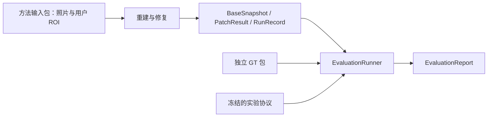

# 05 · 评测、测试与三个月交付

日期：2026-09-13。状态：待实现的实验与交付设计；本文没有给出已经取得的精度、速度或录取收益。

项目根目录：`D:/Creator-newage`。本文所有实现路径相对此根目录。

## 1. 这一层需要回答什么

评测器只回答三个问题：细结构是否更完整、是否补出了错误几何、为此多花了多少计算和人工操作。插件是否流畅、文件是否有效单独验收，不替代几何质量证据。

首期研究对象为具有足够多视角观测的静态、不透明杆状结构。候选方法 `MultiViewCurveRefiner` 尚未验证。中心线是首选研究结果，点集是辅助结果，显示圆管只是预览。

首期不以任意物体表面重建、全自动分割、所有遮挡情况或实时速度为验收范围。只有中心线时，不计算一个虚构的圆管表面来宣称表面重建提升。

## 2. 目录、依赖与运行入口

```text
experiments/
  src/creator_eval/
    dataset/        # 案例分组、GT DTO、输入隔离检查
    alignment/      # 固定全局对齐与退化检查
    metrics/        # 共同比较表示、几何与代价指标
    reporting/      # 个例、汇总、失败清单和报告
    runner.py       # 独立评测入口与协议验证
  synthetic/       # Blender headless：渲染与真值导出
  protocols/       # 冻结的评测协议、指标参数和套件清单
  tests/           # 小型解析几何样例与评测集成检查
```

评测使用独立包和入口，环境可复用核心的已锁定数值依赖。核心修复模块不能导入 `creator_eval`。Pydantic 公共契约源在 `reconstruction/src/creator_recon/contracts/`，导出的跨进程 JSON Schema 位于 `schemas/v1/`；GT DTO 仅存在于评测包。

统一任务分派支持 `RunKind = reconstruct | refine | export_preview | evaluate`。`evaluate` 接收独立 `EvaluationRequest`；不得把一个含 GT 的大请求对象转交修复入口。插件的普通增强操作不会生成评测请求。



## 3. 类、接口与责任

以下是待实现的公共接口约定，不是可执行实现；除边界协调器外，几何计算优先使用简单函数，不为每个指标引入继承层级。

| 模块与类型 | 关键接口 | 输入 / 输出与责任 |
| --- | --- | --- |
| `dataset.BenchmarkSuite` | `validate() -> SuiteValidation` | 校验固定案例、分组、方法和运行预算；不自动寻找磁盘上的新增案例 |
| `dataset.DatasetLoader` | `load_case(case_id) -> EvaluationCase` | 读取方法产物索引及独立 GT 引用；路径和哈希均需校验 |
| `dataset.GroundTruthBundle` | `validate() -> GroundTruthValidation` | GT 中心线、分支连接、可选真实半径/表面、相机、可见性和单位 |
| `dataset.LeakageAuditor` | `check(suite, method_inputs) -> LeakageReport` | 检查对象分组、测试视图、GT 路径及输入引用，发现违规阻止正式汇总 |
| `alignment.AlignmentEstimator` | `fit(base, gt, policy) -> AlignmentRecord` | 依据指定的全局协议估计一次变换；记录对应点、残差与退化状态 |
| `alignment.AlignmentApplier` | `apply(geometry, record) -> AlignedGeometry` | 只应用已确定的变换，不针对每条杆重新拟合 |
| `metrics.CandidateAssembler` | `compose(base, patch) -> EvaluationGeometry` | 复用核心 `PatchComposer`，只适配评测内部表示，不另写一套抑制/新增语义；拒绝错误的 `base_snapshot_id` |
| `metrics.CurveReadout` | `extract(geometry, context, config) -> CurveGraph` | 固定、无 GT 的比较表示转换；基底与候选使用同一实现和参数 |
| `metrics.CurveMetricSet` | `measure(predicted, gt, protocol) -> MetricBundle` | 弧长加权的精度、恢复率、位置误差和连接检查 |
| `metrics.PreservationMetricSet` | `measure(base, patch, target) -> MetricBundle` | 检查非目标区域被抑制和新增的几何；不以预览差异代替数值差异 |
| `metrics.CostMetricSet` | `measure(records) -> CostSummary` | 区分冷启动、端到端、缓存局部处理、失败重试与人工操作 |
| `reporting.ReportBuilder` | `build(case_result, protocol) -> EvaluationReport`；`build_suite(reports, suite) -> SuiteReport` | 分别发布单案例结果和冻结套件汇总；汇总效果、条件、缺失、失败与对照，不静默忽略坏案例 |
| `runner.EvaluationRunner` | `run(request) -> EvaluationReport` | 校验协议、读取完成产物、调用独立评测、最后发布报告清单 |

`EvaluationGeometry`、`CurveGraph`、`MetricBundle` 和 `AlignmentRecord` 是评测包内部类型，不进入后端或修复接口。`ArtifactRef` 负责引用文件、内容哈希和格式；大数组不能嵌进请求 JSON。

### 3.1 公共请求与报告

`EvaluationRequest` 至少绑定评测 ID、套件/协议引用、基底快照引用、可选补丁引用、参与比较的运行记录引用及独立 GT 引用。通过内容哈希确认 `base_snapshot_id`，不能只凭一个可变文件名匹配基底。

`EvaluationReport` 至少记录评测 ID、`base_snapshot_id`、协议哈希、逐案例结果、汇总、全局对齐记录、运行来源与警告的 `ArtifactRef`。具体字段以公共契约文档为准，评测包不自行另造同名 DTO。

首版一个 `EvaluationRequest` 对应一个案例及一个基底，`EvaluationReport` 中的 case_results 也只含该案例的成对结果。套件入口先按冻结清单列出各案例的独立 `evaluate` 请求，再用 `ReportBuilder.build_suite` 汇总已完成或明确失败的运行。`SuiteReport` 是评测包内部的汇总文档，记录 suite/protocol 哈希、全部预定 run ID、逐案例报告引用、失败清单和统计结果；最后原子发布。它不冒用一个 `base_snapshot_id` 代表整个数据集，也不增加新的研究 RunKind。缺少案例报告时保留缺失行，不能当作该案例没有计划运行。

每条指标结果包含 `metric_id`、值、单位、分子/分母、适用案例数、无效原因及协议版本。`null + reason` 表示不适用或不可测，不能写成零。

每个 `AlignmentRecord` 包含：基底 ID、拟合所用数据哈希、`SE3` 或 `Sim3`、4×4 变换、尺度因子、残差、退化检查结果、拟合器版本。输出元数据明确写出“对齐后米制”或“对齐后归一化单位”，不回写源快照的尺度声明。

## 4. 数据集与真值隔离

### 4.1 最少需要的三类数据

| 类别 | 用途 | 可以得出什么结论 |
| --- | --- | --- |
| 解析几何微型样例 | 直杆、折线、断裂、错误桥接及已知坐标，用于验证指标本身 | 指标和实现是否算对；不是模型性能证据 |
| Blender 合成对象 | 已知几何和相机，改变杆的成像宽度、遮挡、背景纹理、视角与材质 | 受控条件下的三维几何定量结果 |
| 真实拍摄对象 | 不同实体或独立拍摄会话，保存原图和采集说明 | 有外部测量时做对应定量检查；否则只作定性和二维辅助分析 |

首批数量由单案例实际耗时和开发集方差决定，然后在测试前冻结。不得先看最终结果，再不断删除不利对象或添加特别擅长的对象。

### 4.2 分组规则

- 使用 `object_group_id`、`capture_session_id` 和 `source_asset_id` 标识来源。开发与测试以对象为主分组；同一对象的不同拍摄会话不因换背景就被当作独立新对象。
- 同一合成资产的缩放、纹理、光照和视角变体进入同一分组。若研究确实讨论同一对象跨会话泛化，必须另列实验，不能冒充跨对象测试。
- `development` 用于选参数、选择比较表示和诊断；`test` 只用于冻结后的评价。未训练神经网络也需要这种分离，参数调优同样会泄漏。
- 观测视图 `input_frames` 与保留评测视图 `held_out_frames` 分开。后者不参加相机估计、ROI 传播、修复、阈值选择或最佳结果挑选。
- 人工 `RegionSelection` 只基于允许的输入照片完成，保留点击/画框记录；所有对照共享这份选择。不得从 GT 投影自动得到“用户 ROI”再隐去这一条件。

### 4.3 文件边界

方法请求只引用 `data/cases/` 中的输入包；GT 放在独立的 `data/eval_gt/`，其根路径不进入 `RefineRequest`、缓存键或后端配置。数据导出时生成方法可见文件的允许列表，`LeakageAuditor` 检查实际引用。

这是可审计的工程隔离，不是操作系统级的安全沙箱。正式报告应保存输入允许列表、命令参数、配置与产物哈希；不宣称目录分开就能从技术上防止任何人为泄漏。

Blender 合成脚本分别输出方法输入包和 GT 包。GT 的真实相机在普通实验中仅由评测器读取；给方法真实相机的运行标记为 `oracle_camera` 并独立汇总。

## 5. 对齐与单位

共享基底实验按以下顺序执行：先读取 `BaseSnapshot`，按冻结规则估计一次全局对齐，再将同一变换用于基底、补丁和完整候选。候选结果和其目标杆不能参与重新拟合。

合成场景优先使用基底估计相机中心与 GT 相机中心的已知帧对应进行全局对齐，检查有效对应数、非共线性和数值条件。若采用固定标记点或非目标区域锚点，也必须在协议中预先指定，且只在基底上拟合。

不足以确定全局对齐时，记录 `alignment_degenerate`，该案例的三维绝对误差不可测。不能为使分数可算，临时改用目标杆本身做 ICP。

`Sim3` 用于允许消除全局尺度歧义的结构比较；`SE3` 用于必须保留尺度误差的比较。两者的结论不同，禁止混合汇总。若真值有米制标定，可报告对齐后的毫米误差，但这不证明方法原始输出具有准确物理尺度。

独立重建对照分别按同一种全局协议对齐，记录各自拟合结果。使用共享 DA3 相机的复合方法仍属于共享信息条件；方法自带的相机估计时间不能从成本中减去。

## 6. 先解决点云与中心线怎样公平比较

### 6.1 两条结果轨道

**共同表示轨道用于主对照。** 基底点云与完整候选都经过同一个不读取 GT 的 `CurveReadout`，得到可比较的曲线图，再计算中心线指标。完整候选包含未被抑制的原点和新增研究几何，不能只挑修复成功的新杆交给评测。

**原生中心线轨道用于方法诊断。** 对 `PatchResult` 中实际新增的中心线直接评价位置与错误补全，明确标注它只评价补丁；不将这个分数直接与原始点云密度或点到中心线距离排序。

两轨都报告。若共同表示提取器失败，应列出失败及其影响；不能悄悄改为只展示对候选有利的原生中心线结果。

### 6.2 首期可执行的共同表示转换

`CurveReadout` 的首版候选为确定性的“体素均衡采样 → 局部主轴估计 → 邻域连接 → 短枝裁剪 → 折线简化”。它是评测读取器，不是项目宣称的新方法，也不能使用 GT 分支位置辅助提取。

1. 以输入 ROI、估计相机和基底尺度定义固定的处理范围、体素尺寸与邻域尺寸；这些设置对成对比较完全相同，不从候选包围盒重新计算。
2. 原点云先按固定体素去重；曲线按固定弧长间隔采样后进入相同体素格。辅助点集同样处理。显示圆管不参加采样。
3. 对局部邻域用 PCA 估计主轴，仅保留满足冻结线性度条件的区域；按距离、切向一致性连接，按固定尺度裁剪短枝，得到折线图。
4. 记录采样、提取失败和连接歧义。固定随机种子，或完全使用确定性邻域排序。

这会受到点云表面厚度、噪声和提取尺度影响。开发集需要检查基础点云经合理参数提取后的上限，并至少使用两档预先冻结的读取尺度复核结论；正式测试不按方法单独挑最优参数。

如果这一共同读取方式会系统性丢掉基底已有细杆，不能用它证明候选胜出。应在进入正式测试前替换读取协议，或将结论收窄到原生曲线精度及可核查的个例，不发布“总体重建优于基线”的数字。

首轮只在解析直杆/折线和具有明确细杆的样例上验证读取器。复杂分叉的读取失败单独列出，不靠不断扩建一个通用骨架化系统推迟核心研究。

## 7. 指标的计算口径

所有距离阈值、采样间隔、连接容差和可见性规则在开发集确定后进入协议；表中符号不是已取得的结果，也不是可临时调节的展示参数。

设 `G` 为允许评价的 GT 中心线集合，`P` 为共同表示得到的预测中心线；二者在固定全局坐标中以固定间隔采样，端点修正采样权重使权重和等于曲线弧长。`d(x, A)` 为点到折线段集合的最短欧氏距离。

评测区域在看到候选前确定，所有方法共用。`G` 包含该区域内所有应计入的真实细杆，不仅是算法成功修复的杆；`P` 也保留区域内所有输出。区域外几何转入保护性检查，禁止把背景曲线与仅一根目标杆真值直接比较。

| 指标 | 明确计算 | 单位 / 适用条件 |
| --- | --- | --- |
| 中心线恢复率 `Rτ` | `G` 中满足 `d(g,P) ≤ τ` 的弧长 / GT 总弧长 | %；GT 中心线、可用全局对齐；`P` 为空且 `G` 非空时为 0 |
| 中心线精确率 `Pτ` | `P` 中满足 `d(p,G) ≤ τ` 的弧长 / 预测总弧长 | %；预测为空时记 `null: empty_prediction`，不得记 100% |
| 错误新增长度 | 补丁新增中心线中 `d(p,G) > τ` 的弧长 | mm 或指定归一化单位；必须与恢复率并列 |
| 双向位置偏差 | 分别报告 `G→P`、`P→G` 的弧长加权距离中位数及 95 分位 | mm / 归一化单位；任一集合为空则方向对应结果不可测 |
| 分支完整率 | 对每条 GT 分支，计算连续覆盖的最长弧长 / 该分支弧长，再按分支汇总 | %；需要 GT 分支定义，不能只依靠离散点数量 |
| 错误连接率 | 预测图中映射到两个非相邻 GT 分支的连接数 / 可判定预测连接数 | % 与计数；节点匹配距离及方向容差冻结，歧义连接另报 |
| 非目标抑制比例 | 目标保护范围之外被抑制的稳定基底点 ID 数 / 该范围外原有效点 ID 数 | %；同一基底成对比较，不跨后端比较点数 |
| 非目标新增长度 | 目标保护范围之外的新增中心线弧长 | mm / 归一化单位；保护范围由预先标注的评测区域决定 |
| 非目标新增点占用 | 目标保护范围外、包含辅助新增点的固定体素数 | 体素数，并列体素边长；只度量改动范围，不作为几何准确率 |
| 保留视图重投影误差 | 将预测曲线投影至未使用的评测视图，与人工/合成二维中心线计算双向距离 | px；仅二维辅助证据，不能替代三维正确性 |
| 表面误差 | 仅对实际估计的半径/表面，按固定面积采样计算双向表面距离 | mm；只有显示半径时标记 `not_applicable` |

连接指标只在预测图和 GT 图的分支匹配可判定时使用。必须一并报告可判定连接数与歧义数；不能把大部分连接标为歧义后单独宣传剩余部分的低错误率。

首版补丁没有显式 junction 语义，因此这里的预测图仅指冻结 `CurveReadout` 推断出的图。指标衡量该读出协议下的连接错误，不证明方法输出了真实物体拓扑。原生折线相交或端点接近不直接记为结构连接。

“目标保护范围”是评测注释，不提供给方法。报告同时展示方法输入的 ROI，避免把大范围人工提示隐藏成精确局部自动定位。

GT 可见性由合成深度和相机计算，协议预先划分“多视图可观测”“仅单视图可见”“完全遮挡”。首项作为主任务适用范围，另外两项保留并报告，不在看到失败之后从总表中移除。

杆在输入照片中的成像宽度以像素报告，并写出是在原图还是后端处理图测量。按成像宽度、遮挡程度、背景条件报告分组结果，不能只报告一个平均值掩盖难例。

### 7.1 汇总与失败

- 主表先按案例计算，再对对象组进行宏平均；同时给出组数、案例数、离散程度和逐案例原始值，避免大对象/多变体支配结果。
- 用同一组案例报告基底到候选的配对差值。若使用置信区间，以对象组为重采样单位，记录随机种子；小数据集不能凭窄区间作强泛化结论。
- `no_supported_change` 是方法完成但未修改：完整候选等于基底，正常参加全部指标，并报告保守放弃比例。
- OOM、超时、无效产物、提取失败和对齐失败分别计数。正式主表显示全部计划案例数与完成数；不得仅报告成功案例均值。
- 同时报告完成案例上的指标，以及将未产出可评结果的案例恢复量计为零的“全套件有效恢复率”：有效恢复总弧长 / 全部适用案例 GT 总弧长。该指标明确包含运行失败，不伪装成纯几何精度。
- 失败案例的精确率和误差不补零；用 `null + reason` 保存。不同失败率的方法不能仅按成功案例精度作总体优劣结论。
- 人工中止与自动超时分开。若人为中止后重跑，保留两次运行关联；冻结套件中的案例不能因中止而消失。

## 8. 强基线、朴素对照与消融

| 对照 | 目的与公平条件 |
| --- | --- |
| 未修改的共享 DA3 快照 | 衡量补丁相对同一基底的净改变；估计相机、原图和 ROI 完全一致 |
| DA3-LARGE-1.1 合理配置 | 避免只与工程冒烟用 BASE 比；配置在开发集调优，记录运行资源限制 |
| 同输入信息的分辨率 / 局部裁剪对照 | 检查改善是否仅来自更高像素密度；记录实际像素、额外调用和融合成本 |
| 局部几何拟合对照 | 在相同 ROI、基底和照片条件下使用冻结的简单拟合/连接规则，检验复杂步骤必要性 |
| MoGe-3 单图细节对照 | 原生单图能力单独评价，不称为原生多视图重建；输入范围和指标适用性写清 |
| 可选的 DA3 相机 + MoGe-3 几何 | 只有完成独立尺度/坐标/融合协议及成本计量后才加入，是明确命名的复合基线 |
| 候选方法消融 | 去掉多视图检查、保守拒绝或抑制步骤中的单一因素，保持其他输入与参数固定 |

首期优先前四项，具体可运行的强对照在 G0 / G1 选定；没有运行的方法只放相关工作，不能出现在“已胜过”的表格里。既有曲线重建方法可作为后续可复現对照候选，但不预先承诺三个月内移植所有旧系统。

多视图、细杆重建和 Blender 重建界面本身已有先例；实验不以“用了这些概念”作为贡献。与现有插件的区别最终由新增几何及可复现实验支撑。

## 9. 成本、缓存与实验冻结

`RunRecord` 至少提供阶段单调时钟耗时、后端调用、输入尺度/视图数、峰值资源采样方法、缓存命中和失败信息。以下三种时间各列一栏，不相互代替：

1. 冷启动：环境已安装、权重在本地但进程未加载时，从启动到产物发布；首次下载和首次 JIT 编译另外列出。
2. 端到端：输入已经选好后的重建、修复、校验与发布总时间，包含内部进程启动，不含人工拍照时间。
3. 缓存局部处理：固定快照已经存在时的修复时间，另列预览导出/Blender 导入时间。

人工 ROI 用操作数与实际用时报告，输入照片拍摄/整理的劳动单独记录。下载、数据准备、失败重试不默默摊入某个方法或从总成本中消失。

峰值显存必须写明来源：模型进程自身统计与整张 GPU 的采样峰值不是同一量；采样间隔可能漏峰。记录 Blender 视口是否开启、其他 GPU 进程、设备/驱动和测量覆盖阶段，不能把 8 GB 型号当作已验证内存保证。

冻结的 `BenchmarkSuite` 引用案例及分组、输入允许列表、ROI、方法配置、协议、预算/超时、种子、环境锁、代码提交和权重哈希。协议文件自身也有哈希。分辨率变化、重试降级、读取器参数变化均生成新运行或新套件版本。

测试前冻结主指标、阈值、对齐方式、可见性规则、读取器参数和失败口径。测试后修复真正的软件错误可以重跑，但必须记录错误影响、更新版本并对受影响方法整体重跑，不能只重跑候选的坏案例。

## 10. 关键测试矩阵

只为会污染实验、破坏用户数据或使进程失控的关键行为写测试；不为每个数据类机械生成字段镜像测试。

| 检查 | 责任模块 | 独立依据 / 验收行为 |
| --- | --- | --- |
| 请求 / 产物版本与哈希 | 公共 contracts、存储发布层 | 不兼容版本、坏哈希、缺少数值数组拒绝读取 |
| EXIF、裁剪和像素中心 | 核心相机模块、DA3 适配器 | 用独立已知像素标记检查原图到处理图映射，覆盖非等比和裁剪边缘 |
| Z 深度与射线距离 | 核心相机模块 | 用离轴的解析三维点验证，避免中心像素掩盖差异 |
| Blender 相机轴与显示变换 | Blender 导入模块 | 已知标记点独立渲染得到的像素位置与预测一致，不只做同函数往返 |
| 补丁绑定与原点抑制 | 核心补丁校验、`CandidateAssembler` | 错基底和不存在 ID 拒绝；候选确实是原点减抑制再加新增 |
| 显示半径污染 | 预览导出、评测装配 | 改显示粗细后研究数组、中心线指标和缓存键不变 |
| 固定对齐 | `AlignmentEstimator`、`AlignmentApplier` | 候选整体移动时误差增大，不能通过再次拟合把误差消掉 |
| 对齐退化 | `AlignmentEstimator` | 共线/缺失相机中心触发明确不可测状态，禁止输出伪精度 |
| 指标本身 | `CurveMetricSet` | 解析相同线、偏移线、断线和假桥接产生可手算的量 |
| 密度不改变弧长计分 | `CurveReadout`、`CurveMetricSet` | 同几何重复采样不按点数加分；小于协议分辨率的差异按容差检查 |
| 失败与放弃 | `ReportBuilder` | OOM 仍进入总数；无修改使用基底分数；空预测不产生 100% 精确率 |
| GT 与保留视图隔离 | `LeakageAuditor`、独立任务分派 | 方法输入引用 GT、测试视图或评测请求时阻止正式运行 |
| 缓存身份 | 核心缓存模块 | 改 ROI、帧顺序、图像内容、权重或精度后不误命中旧产物 |
| 发布原子性 | 核心存储、Blender 导入 | 中途停止或缺少最终清单的运行不可导入为完成结果 |
| 取消与 GPU 归属 | 进程监督层 | 终止本作业及其后代，不误杀其他进程；锁释放有归属验证 |
| 文件切换与手工修改 | Blender 会话与版本模块 | 旧任务不进入新文档；接受/撤回和保存重开保留原版及工作副本 |

硬件性能验证与 Windows 取消行为属于实机集成检查，不能用伪进程或假显存单元测试宣称通过。几何单位测试可以完全不下载模型。

## 11. 三个月、四个 Gate

Gate 是下一阶段投入条件。精度目标由先导实验测得的方差、可观测细杆尺寸和实际资源预算决定，在正式测试前锁定；这里不编造“恢复率提升 30%”之类承诺。

| Gate / 时间 | 应交付的可检查产物 | 进入下一阶段的条件 / 不通过怎么办 |
| --- | --- | --- |
| G0：第 1–2 周，链路与题目确认 | 环境锁、少量合成图、DA3 原始快照、独立坐标检查、首次资源记录、强基线失效案例清单 | 数据链路可信，且合理配置的现有方法仍有符合任务范围的失效；若强基线已解决目标，收窄或改题，不先堆插件界面 |
| G1：第 3–4 周，方法可行性 | 开发集、共同读取器验证、第一版实际补丁、朴素对照、重复运行和失败分析 | 至少在不同对象上出现可重复的改善信号，同时记录错误补全及额外成本；只有手工补丁、最佳单例或加粗预览不算通过 |
| G2：第 5–8 周，实验冻结 | 冻结协议、合理配置的强基线、消融、独立测试对象与批量评测产物 | 改善能够由固定协议复核，失败和读取器敏感性可解释；若收益不稳，报告局限并缩小主张，不继续加功能掩盖问题 |
| G3：第 9–12 周，用户与复现交付 | 可安装 Blender 插件、导入/增强/比较/撤回演示、固定样例、完整研究报告与复现说明 | 新环境按文档得到可核对的产物；取消、版本保护、保存重开通过；所有展示能追溯到运行记录，未实现能力明确标注 |

前 7–10 天同时检查研究题目和强基线，不等待完整软件写完才判断有无问题可做。G1 前只做足够展示和排错的薄界面，主要时间投向几何证据与对照。

若最终只有部分杆型有效，交付一个适用范围清楚、可复核的局部方法及研究插件，优于宣称通用修复却不能解释失败。报告可以记录否定结果；否定结果不自动满足原定“改善细结构”的研究目标。

## 12. 最终证据包

最终交付包括：安装与使用文档；有版本的源代码和环境定义；可公开的输入/GT 样例及许可；协议与完整指标原始表；典型成功/失败案例；三分钟以内的真实流程演示；方法、对照、限制和人工参与说明。

每一张论文式对比图都能追溯 `case_id`、`base_snapshot_id`、运行 ID 与评测协议。研究报告不把受控测试补丁当算法输出，不把经过手工修饰的 Blender 工作副本当未干预结果。

相关方向与已核对技术背景见 [架构总览](01-system-design.md) 和 [技术栈决策](../decisions/0002-reconstruction-stack.md)。正式基线使用固定提交与权重，不以持续变化的上游主分支作为复现标识。
