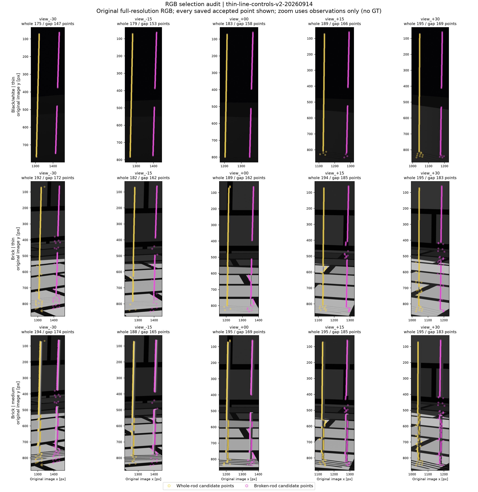
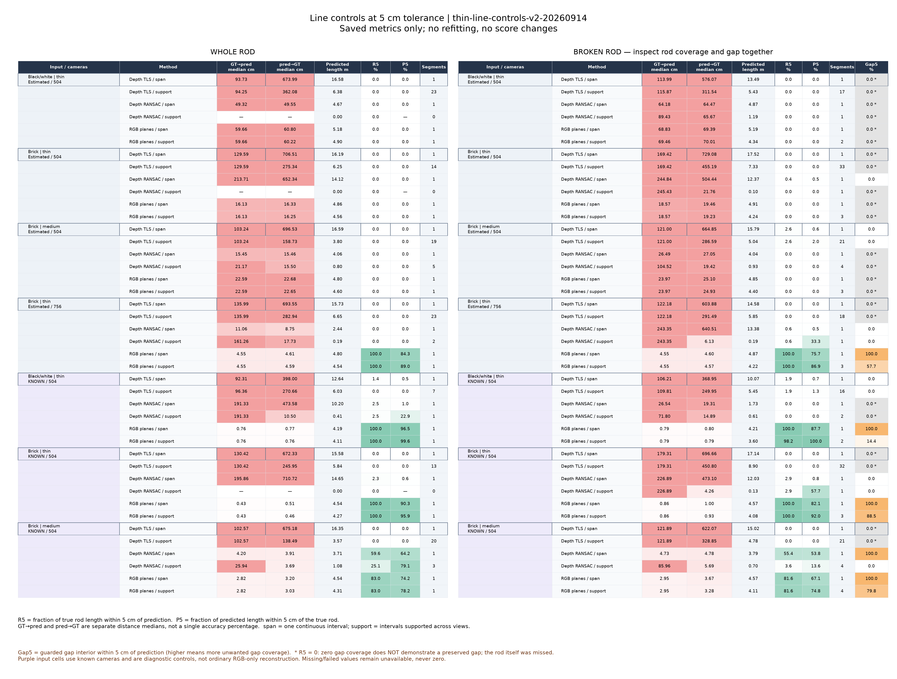

# 2026-09-14：放大图片、换真实相机、拟合直线之后，问题在哪

这轮的结论是：原图里仍有可用的杆状信息，值得继续做基于图像的多视图中心线恢复。单纯放大裁图、放宽过滤、把预测点拉成直线，都没有稳定解决问题。接下来必须一起处理相机可靠性、杆中心定位和“这里本来就应该断开”的证据。

这是同一开发资产上的方向诊断，还不是自动修复成功，更不是独立对象上的方法收益。最终算法选择见 [设计决定](../decisions/0004-evidence-guided-line-recovery.md)。

## 做了哪些实测

新增9次LARGE推理，全部完成：4组偏心/局部裁剪、2组后续居中裁剪、3组真实相机条件诊断。沿用固定模型和环境，504均指最长边处理设置，原图504实际504×280，裁图504实际504×392或504×504。

曲线对照复用了4组之前的完整图预测，加上这9组，共13份预测。每份选择同一根整杆和同一根真实有缺口的杆，比较普通TLS、默认过滤后TLS、低阈值TLS、固定RANSAC及RGB多视图平面交会；各自又比较直接连成一段和沿线位置投票分段。

v1先完成11份预测的朴素对照；观察偏心裁剪失败后，v2明确追加居中裁剪和固定RANSAC。旧版本留存，528条共用指标逐值不变。v2的780条指标记录来自13份预测×2目标×5方法×2端点规则×3距离容差，**不是780次独立实验**。全部拟合过程完成，其中15份“支持分段”输出为空，按空预测计分，没有删掉。

人工输入是助手查看五张原始RGB后确定的裁框和两个对应条带。没有从GT投影得到选区，也没有手工标出缺口给方法。粗条带里用固定对比度脊线找点，所有对照共享规则。模型输入、方法选择、评测真值分别存放；oracle单列。

## 裁剪：留下更多点，不等于位置更准

| 砖块最细条件 | 默认杆中心点保留量 | 估计相机中心RMSE |
|---|---:|---:|
| 原图504 | 3.87% | 0.0235 m |
| 原图756 | 5.80% | 0.0437 m |
| 偏心宽裁图504 | 22.75% | 0.1806 m |
| 偏心紧裁图504 | 17.40% | 0.4544 m |
| 居中宽裁图504 | 21.72% | 0.0711 m |

宽裁图1152×900，处理为504×392；同一根杆的横向像素密度约为原图504的1.67倍。紧裁图672×672，处理为504×504，约2.86倍，但截掉部分杆身，不能当作完整物体恢复。偏心宽框为[350,0,1502,900]，紧框为[780,150,1452,822]；后续居中框为[384,90,1536,990]，准确保留原图光心位置。

砖块中杆的严格区域点位移中位数，原图约0.270 m、偏心宽裁图约2.305 m、居中宽裁图约1.141 m。这里各采样网格的严格区域不同，属于独立重建诊断，**不能把差值当成同一批像素的纯裁剪因果效应**。共同目标的中心线对照也未显示裁剪解决位置问题。

居中裁剪优于这次偏心裁剪，但它还改变了画面内容和上下文，不能把改善全归因于主点。能够支持的判断是：裁剪后独立重新估计相机，会带来额外不稳定；目前没有证据让我们把这种运行方式作为修复主线。

## 真实相机：有帮助，但没有把细杆深度救回来

| oracle条件 | 默认杆中心点保留量 | 严格杆点位移中位数 |
|---|---:|---:|
| 黑白最细504 | 52.72% | null，无严格杆像素 |
| 砖块最细504 | 1.94% | null，无严格杆像素 |
| 砖块中杆504 | 24.35% | 0.14044 m |

砖块中杆比普通估计相机条件的约0.270 m有所改善，但仍约14 cm。真实相机参与了网络输入，深度和置信度本身也改变，不能把全部差值归因于位姿。

上游API会先归一化输入相机，再按相机对齐尺度恢复深度，最后直接用输入外参覆盖返回外参。因此“返回相机误差零”没有被当成相机估计性能。审计保存覆盖前的深度/内参/外参及尺度。原生NPZ不改写；数学像素中心诊断使用K的副本减半像素，返回深度已经是米，不再套第二次Sim3。

两个最细组在这些网格都没有严格单表面像素。混合像素仍保留中心答案作诊断，正式严格深度分数仍为null。

## 原图线条与朴素几何：位置和缺口必须分开看

下表使用single_span端点规则，是RGB平面交会得到的有限直线，到两个指定GT目标的弧长加权位置偏差中位数（GT→预测）。此轨不使用预测深度；oracle行只是“已知相机的经典几何对照”。

| 相机来源 / 条件 | 整杆 | 有缺口杆 |
|---|---:|---:|
| 估计相机，黑白最细504 | 596.6 mm | 688.3 mm |
| 估计相机，砖块最细504 | 161.3 mm | 185.7 mm |
| 估计相机，砖块最细756 | 45.5 mm | 45.5 mm |
| 真实相机，黑白最细504 | 7.6 mm | 7.9 mm |
| 真实相机，砖块最细504 | 4.3 mm | 8.6 mm |
| 真实相机，砖块中杆504 | 28.2 mm | 29.5 mm |

504和756使用相同的原图脊线，改善主要反映估计相机/内参变化，不能说是这个2D读出器看到了更多像素。中杆的对比度峰也可能落在边缘或表面亮纹，不能把其全部偏差怪给交会公式。

用普通TLS拉直预测点，常常被背景拖走；在同一批未过滤点上加入RANSAC：256次、seed=0，距离阈值为估计相机跨度0.005倍，最小点对跨度0.03倍，至少12点/3视图。运行后，部分情况改善，但依然可能选到背景或只找到局部。比如普通砖块中杆整杆在single_span下的位置中位数从约1.032 m降至0.155 m，仍未达到细杆所需的定位精度。不能由此断言所有鲁棒拟合都没用，只能说这版已冻结的朴素控制没有解决任务。

也有值得保留的正面反例：真实相机条件的中杆RANSAC，single_span下整杆/缺口杆位置中位数约42/47 mm；但5 cm容差下仅覆盖约60%/55%的真实长度，而且贯穿缺口。朴素拟合有价值，只是没有同时解决完整性和错误补全。

更危险的是缺口。真实缺口约0.619 m：
- 直接输出一根整线，在已知相机的砖块最细组会贯穿整个缺口。
- 改成“至少三个视图沿线有RGB响应”的位置投票后，5 cm距离容差下，去除两端容差影响的缺口内部仍约88.5%落在预测线附近。
- 估计相机的砖块最细756对应数字约57.7%。这不是已验证拓扑错误率，而是明确的错误补全诊断。
- 某些失败方法的缺口覆盖为0，但杆覆盖也为0，那只是整条线偏了，不是正确保留了缺口。

实际查看选点图后，原因很直观：砖缝、地面纹理和杆底部附近的背景点进入了选择；三个视图都出现背景响应，也会投票通过。当前投票没有射线到直线距离的接受门槛，不能把它叫做完整的多视图对应验证。

5 cm只是本轮较宽松的一档观察容差，不表示达到精确重建标准。2 cm、5 cm、10 cm三档都完整保存；同资产的高覆盖数字不能当作整体恢复率宣传。

## 检查、成本和边界

- 新增30张裁图GT完成。11,770条原图↔裁图核对射线全部ID一致、深度差0；实际DA3预处理张量差0。
- oracle的15张处理图对应检查通过，真实深度射线反投影核对最大误差约5.14e-7 m。
- 16份原生预测与报告哈希、30张原始配对RGB哈希不变。v1/v2共用528条指标完全一致。
- 18项直线/缺口/RANSAC解析测试、9项裁剪与输入边界测试、8项既有相机诊断测试通过；oracle实际API数学检查通过。核心4项测试及6个子测试通过，仓库lint和隔离入口检查通过。
- 原图504约3590 MiB、原图756约5372 MiB、宽裁图约4166 MiB、紧裁图约4730 MiB峰值allocated。逐任务冷启动、推理时间与reserved显存保留于运行报告，不把模型forward当完整流程耗时。
- 当前没有独立物体、保留评测视图、自动对应、完整候选补丁或通用共同曲线读取器。两目标原生曲线诊断不能替代全场景主对照。

## 文件

可随仓库查看的完整数值：[controls-summary.json](2026-09-14-controls-summary.json)。运行方法：[对照重现说明](../thin-pack-controls.md)。

本地不可变运行/评测身份：
- thin-controls-v1-20260914：偏心宽/紧裁剪。
- thin-centered-controls-v1-20260914：后续居中裁剪。
- thin-oracle-controls-v1-20260914：明确使用真实相机的诊断。
- thin-line-controls-v1-20260914、thin-line-controls-v2-20260914：原生目标曲线对照。

RGB在data/inputs，GT在data/eval_gt，推理与方法产物在.runtime/experiments，评测在data/evaluation。两张实际查看过的图在最新line v2评测目录：rgb-selection-audit.png、numeric-controls-5cm.png。旧实验、原始模型输出和源场景均保留。

## 可随仓库查看的诊断图

下图展示RANSAC之前的全部RGB接受点，黄色是整杆目标，紫色是缺口杆目标。砖块组缺口和端部附近的散点，是需要算法拒绝的背景干扰。

数值图只选完整图/真实相机条件便于阅读；完整裁剪和全部容差数据仍在JSON里。紫色输入行使用已知相机，不能与普通照片条件混报。R5为0时，即使Gap5也为0，也不代表正确保住缺口。

