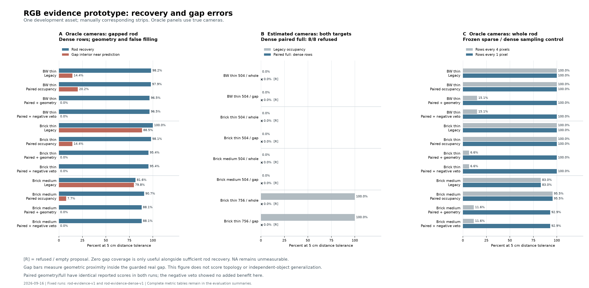
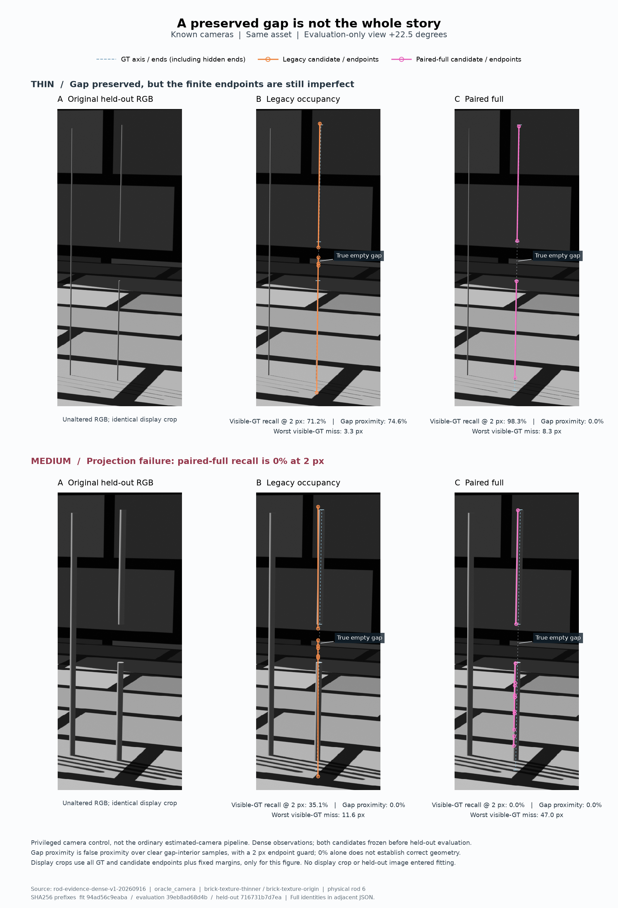

# 2026-09-16：第一版会看证据的线段，哪里进步了，哪里还不行

这次把原图双边缘中心、有限线段、多视图支持和拒绝检查做成了可运行原型。**真实相机条件下，最细杆的真实缺口明显保住了；换回模型估计相机，8 个目标全部被拒绝。较粗杆甚至能通过输入视图检查，却在新视角偏离真实中心。** 所以进度是从“选择方向”走到“有实现、有正反结果”，还没有走到可用的普通照片修复。

这里的“最细 0.01”仍是旧实验的 XY 缩放标签，实际直径为 0.02 m；“中杆 origin/0.05”直径 0.10 m。它们与此前结果严格配对，旧输入和输出都保留。

## 先固定了什么

沿用三种开发条件：黑白最细、砖块最细、砖块中杆；每种都有五张原始 RGB 和同样两个手工对应条带：整杆 `whole`、真实断杆 `gap`。复用 4 份完整图估计相机预测及 3 份真实相机诊断预测，没有重新跑 DA3。

两套协议各比较 7 份相机 × 2 个目标 × 4 种方法，共 56 份候选。每套有 168 条 3D 容差评分和 224 条保留视角评分，**这些是重复测量，不是几百个独立物体**。同一资产换背景和宽度不能代替跨对象验证。

| 方法 | 新增内容 |
|---|---|
| 旧位置投票 | 上轮不可变输出，原图最大亮暗响应 + 2D最小二乘 + 沿线投票 |
| 双边缘 + 旧投票 | 同时替换原图观测与稳健2D拟合；仍保留旧分段规则 |
| 几何与逐段支持 | 真实像素距离、至少3视图支持、重投影和留一视图稳定性 |
| 加背景反证 | 在上一项上加入至少2视图的平坦背景样假设反对票 |

方法、参数、源代码和输入身份在评分前冻结。稀疏版 `rod-evidence-v1-20260916` 于 UTC 10:11:44 完成，逐行版 `rod-evidence-dense-v1-20260916` 于 UTC 10:16:04 完成，随后才执行真值评测。两套拟合分别约90秒、314秒，并行时段有 CPU 竞争，不能当作正式速度基准。

## 一个先被解析测试抓住的错误设计

第一版每隔4行检测一次，三维输出却要求至少3个连续采样点得到支持。在一组完美解析相机和直杆上，支持票交替为 `[5, 0, 5, 0, …]`：几何完全正确，程序仍输出空。这是采样规则失配，不能怪模型，更不能说杆本来就看不见。

因此，在查看这轮真值分数前，追加了只把 `row_stride=4` 改成 `1` 的对照；其他参数不动。稀疏版没有删除。真实相机下，整杆5 cm恢复从 **15.1% / 6.6% / 11.6%** 提升至 **100% / 100% / 92.9%**。逐行观测消除了大量人为断裂，但砖块细整杆仍输出3段、中整杆4段，100%容差恢复不等于完整拓扑已恢复。

## 真相机条件：细杆有进展，端点和中杆仍不稳

下面只比较逐行版中有缺口的杆。恢复率和精度采用完整物理中心线，距离容差5 cm；缺口误覆盖去掉两端各5 cm，防止正确端点被算成错误桥接。

| 条件 | 旧恢复率 | 新恢复率 | 旧缺口误覆盖 | 新缺口误覆盖 | 新结果仍缺失的真杆长度 |
|---|---:|---:|---:|---:|---:|
| 黑白最细 | 98.2% | 96.5% | 14.4% | 0% | 0.125 m |
| 砖块最细 | 100% | 95.4% | 88.5% | 0% | 0.165 m |
| 砖块中杆 | 81.6% | 88.1% | 79.8% | 0% | 0.429 m |

新结果指 `paired_full`；本轮与 `paired_geometry` 完全相同。三者5 cm精度均为100%，只表示输出长度落在这个容差内，不表示位置误差为零，也不表示端点完整。中杆的真值到预测中位距离约3.83 cm，明显比两种最细杆的约4–6 mm更差。

**背景反证没有显示独立收益。** 每套14个相机—目标组合（两套共28次），开启/关闭负票后的线段逐值相同。每套有1个组合在进入投票前已拒绝，其余13个的 `vetoed_despite_positive_sample_count=0`。缺口改善应归于此前的观测、真实投影支持和分段限制，不能归功于一个没有改变结果的开关。

新旧检测与2D拟合同时改变，所以这里是“观测与拟合组合”的对照，不能单独声称所有改进都是双边缘中点带来的。解析亮/暗杆测试证明它能修正一类峰值偏置；真实数据只支持有限范围的效果。

## 新视角：一次有用的验收，也揭穿了一次自洽的错误

追加 `−22.5° / +22.5°` 两个未参与模型、选点、拟合或阈值选择的角度，共6张。全部文件留在 `eval_gt`；相机回归、49个文件哈希、7872条 Blender 对照射线都通过，最大投影误差约0.00013 px、深度差约10 μm。它们仍是同资产的新视角。

下表仍为**真实相机诊断组**：有缺口杆在两个新视角的可见真值召回，容差 **2 px**，采用有限预测线段：

| 条件 | 旧召回（− / +） | 新召回（− / +） | 旧缺口误覆盖（− / +） | 新缺口误覆盖（− / +） |
|---|---:|---:|---:|---:|
| 黑白最细 | 100% / 100% | 99.4% / 99.4% | 11.9% / 10.2% | 0% / 0% |
| 砖块最细 | 100% / 71.2% | 98.3% / 98.3% | 76.3% / 74.6% | 0% / 0% |
| 砖块中杆 | 37.6% / 35.1% | **0% / 0%** | 0% / 0% | 0% / 0% |

中杆是必须留下的失败例：它通过了目标线重投影和留一视图检查，输入视图最大重投影残差约0.56 px，但在两个新视角，真实中心到预测的中位距离为 **3.65 / 7.30 px**。即使放宽到5 px，召回也只有89.7% / 0%。这说明“几张图里看着互相一致”仍可能是在追踪同一条错误亮暗结构。

输入图的中杆双边缘中心，条件中位误差仍约3–8 px；相较旧脊线有所下降，却不是足够好的中心。由此推断，应进一步检查配对边缘是否来自外轮廓、内部明暗或背景；目前不能凭这一结果断定唯一成因。

中杆的缺口误覆盖为0也没有资格被叫作成功，因为整条线横向偏掉，同样会“碰不到缺口”。所有报告都把恢复、错误新增和缺口放在一起看。本轮保留视角没有候选跨深度裁面被丢弃；评测器仍记录该项，未来出现时只作部分诊断。

## 普通估计相机：拒绝有意义，但尚未证明拒绝策略可靠

逐行版的严格方法在4份估计相机预测上，整杆和缺口杆 **8/8全部拒绝**。原因包括不足3个可定位视图、原图约5–12 px的重投影误差、留一视图约8–17 px的误差或线位置不稳定。发布的线段为空，影子候选仅供查错。

其中三个504条件，旧线段在5 cm容差下恢复本就为0；拒绝避免继续发布明显错位的几何。但砖块最细756的旧方法在5 cm下两根杆恢复都为100%，仍被新门槛拒绝。它的缺口误覆盖57.7%、精度约87–89%，谈不上正确完成；不过这确实说明新方法也放弃了一份部分有用的结果。

所以当前只能说“可以保守拒绝”，不能说“可靠地判别好坏”。下一步必须画出拒绝率与恢复/错误新增的关系，并在独立布局验收；不能直接放宽2 px门槛，让这批结果好看。

背景 ORB 诊断也失败了：黑白图只有1–7对匹配，证据不足；砖块图即使用真实相机，也被标为不一致，部分匹配对的 Sampson 中位误差超过20 px。重复纹理或错误匹配是合理怀疑，仍待逐对应检查。这个诊断目前没有参与接受决定，结果也说明它暂不适合直接升级为相机质量门控。

## 接下来按证据改什么

1. **先查中心定位，而不是继续堆三维拟合器。** 保留全部边缘对与宽度，建立解析光照/内部高光/背景条纹的中心已知测试，分清外轮廓、内部明暗和背景候选。中杆必须进入反例集，不能只在最细杆上验收。
2. **全局相机需要独立背景证据。** 当前 ORB 匹配先经过独立几何验证与留出对应检查，再讨论共享相机校正；不能用目标杆或GT把相机调到答案上。
3. **保持逐行取证，保留未知和拒绝。** 不再把稀疏测量间隙当成真实断裂，也不把未检测到边缘当作确实不存在。负反证仅作受可观测性假设约束的实验分支。
4. **追加独立几何布局与遮挡反例。** 冻结参数后检验新布局，同时报告接受覆盖率、正确恢复、错误新增、端点和真实缺口。这里通过之后，再落正式补丁契约及共同曲线读取器。

本轮仍处于G0。完整可撤回补丁、跨对象稳定收益、真实照片、共同读取器和正式运行链路尚未完成；新视角验收已补上，但不代替独立对象。插件界面继续延后。

## 检查、数据与复现

- 94项本地诊断测试全部通过；核心4项测试及6个子测试通过，Ruff和隔离入口检查通过。新增轻量解析测试进入Windows/Linux CI。
- 没有新增模型推理，原模型NPZ、原RGB、旧曲线均通过身份核对。相机仅在评测时对齐一次；不使用目标杆拟合对齐。
- 最终完整性审计核对30张旧RGB、13份旧曲线及观测文件；两套对照复用的84条旧方法指标与原评分逐值相同。
- [可分享的完整精简指标](results/2026-09-16-rod-evidence.json)包含两版全部容差、空候选、保留视角、拒绝原因和源哈希，不只保留5 cm的好结果。
- 原始候选：`.runtime/experiments/rod-evidence[-dense]-v1-20260916/`；完整评分：`data/evaluation/<run_id>/summary.json`；保留视角：`data/eval_gt/thin-heldout-v1-20260916/`。
- [重现命令与边界](../rod-evidence-controls.md)，[开发日志](../journal/2026-09-16.md)。
