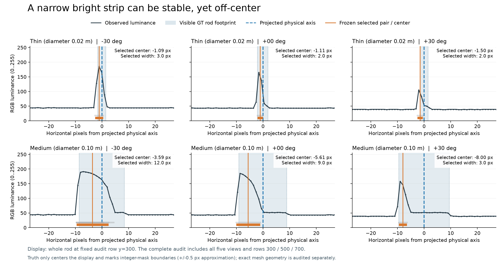
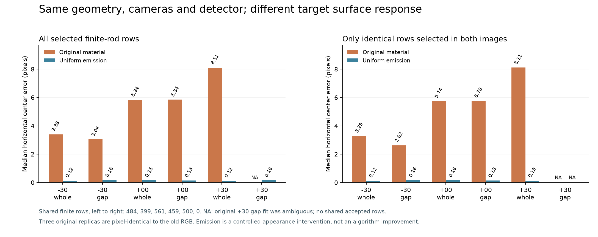
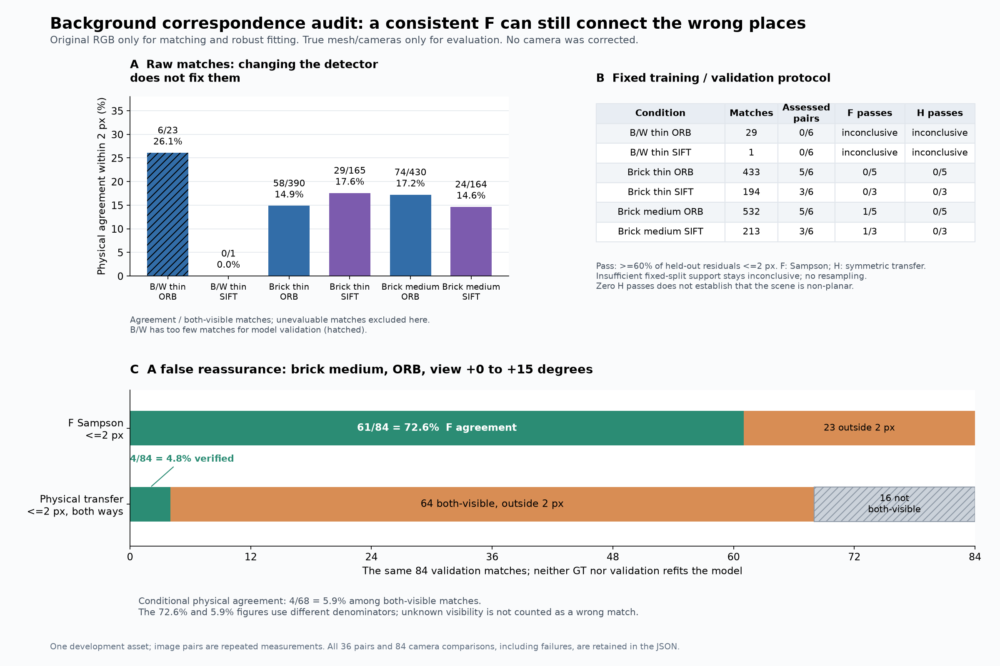

# 2026-09-17：杆中心为什么偏，背景匹配为什么不可信

今天没有继续放宽昨日的拒绝门槛。先把两个失败拆开：中杆的“双边缘”选中了什么；背景匹配到底是不是同一个物理位置。结果支持一个更具体的判断：**当前检测器会把表面亮条当作杆中心，当前背景匹配又含大量错误对应。直接增加三维拟合复杂度，无法消除这两个输入问题。**

本轮是原因诊断与反例基准，不是普通照片修复收益。原来的数据、预测、候选和评分都保留；没有新增DA3推理，没有改变相机，没有扩插件。

## 1. 先排除真值和圆柱几何的问题

独立检查了目标5、6的截面、轴线、重复物体、三角网格投影与首击中掩码。目标每段是32边圆截面，64顶点、124三角形，XY缩放相等；重复对象属于杆3，不影响这两根目标。

在五视角、固定图像行300/500/700上，**中杆网格轮廓中点相对物理轴最多只差0.00728 px**。这比昨日中杆3–8 px的选中中心偏差小得多。86,400条整数中心射线与原native杆掩码一致，未发现轴线定义错误。

轮廓中点和物理轴在透视下确实不必绝对重合，但这点正常差异解释不了当前失败。完整几何数据和适用范围见[独立几何审计](2026-09-17-rod-geometry-audit.json)。

## 2. 冻结的检测结果选中了杆内部的亮条

直接检查昨日不可变观测，方法没有重新选点。评测使用native首击中杆ID区间，像素轮廓边界按半像素近似，1.5 px只用于描述边缘归属，不进入检测或三维接受条件。

中杆整杆五视角的选中边缘宽度，只占可见杆宽的中位 **67% / 50% / 39% / 32% / 16%**；中心随之向左偏约 **3.38 / 4.75 / 5.84 / 6.69 / 8.11 px**。有效选中行几乎全部属于杆内部的非轮廓边缘对。它们确实是稳定亮暗结构，却没有围住整个杆。

图只展示固定第300行的三个角度；完整审计保留三条件、五视角、两个目标和预设300/500/700行剖面，以及所有选中行的分类。[逐帧摘要](results/2026-09-17-edge-attribution.json)没有删掉缺口、不可见或歧义情况。原材质是白色Principled、metallic=0、roughness=0.5；本轮不能把所有偏差单独归因于“镜面高光”。

## 3. 材质干预：相同检测器在相同位置上回到轴附近

固定中杆的−30°、0°、+30°视角，先重渲染原材质，再只替换目标5、6三段物体的材质引用为均匀Emission。其余几何、相机、背景、光源和渲染参数保持原配置；源场景未保存改写。

三个原样副本与旧RGB **逐像素一致**；两条件网格内容哈希相同，相机数值一致。新图进入独立输入目录，真值在独立目录，检测阶段只读取RGB、昨日粗条带和原封不动的检测参数/源码。

| 视角/目标 | 原材质选中行中心误差中位 | 均匀材质中位 | 双方共同选中的有效行数 | 同一批行：原→均匀 |
|---|---:|---:|---:|---:|
| −30°整杆 | 3.38 px | 0.12 px | 484 | 3.29→0.12 px |
| −30°缺口杆 | 3.04 px | 0.16 px | 399 | 2.62→0.16 px |
| 0°整杆 | 5.84 px | 0.15 px | 561 | 5.74→0.16 px |
| 0°缺口杆 | 5.84 px | 0.13 px | 459 | 5.76→0.13 px |
| +30°整杆 | 8.11 px | 0.12 px | 500 | 8.11→0.13 px |
| +30°缺口杆 | 歧义，拒绝 | 0.16 px | 0 | 无法配对比较 |

共同选中行是额外的评测诊断，用来检查误差下降是否仅由选了不同图像行造成；它不进入检测，也不是全杆召回。均匀材质有些视图留下的观测更少，例如−30°整杆从644行降到484行，不能拿这些低误差直接宣布检测完整性改善。

这个干预同时改变了表面明暗与目标/背景对比，支持“外观响应导致中心偏差”，没有隔离出唯一的光照分量。**把合成杆涂成均匀亮度是诊断手段，不是修复真实照片的方法。** [全12项观测结果](results/2026-09-17-appearance-control.json)与[共同选中行结果](results/2026-09-17-appearance-common-rows.json)分别保留。

## 4. 背景对应：换特征器不能自动得到可靠相机约束

冻结三条件、每条件六组原视图对，比较ORB与SIFT，共36份RGB匹配。双向ratio=0.75；匹配点按第一张图128 px格子的固定哈希分为训练和验证，不能看残差重新划分。在训练匹配上分别估计F和H，验证匹配不参与拟合；之后才使用真实相机与网格核验物理对应。

排除的是旧目标条带附近的**特征点中心**，描述子支持范围可能跨入条带，不能声称完全不含目标信息。F/H仅作自洽诊断，没有调整模型相机。

| 背景/特征 | 可双向验证的物理匹配 | 其中两方向误差均≤2 px | 比例 |
|---|---:|---:|---:|
| 砖块最细 / ORB | 390 | 58 | 14.9% |
| 砖块中杆 / ORB | 430 | 74 | 17.2% |
| 砖块最细 / SIFT | 165 | 29 | 17.6% |
| 砖块中杆 / SIFT | 164 | 24 | 14.6% |

这些是匹配记录，不是独立物体，跨视图对可能重复同一物理位置。无法双向验证的遮挡、出界、无交点等匹配另列，不直接判错误，也不冒充正确。黑白图每对ORB只有1–7个匹配、SIFT只有0–1个，全部证据不足。

36份匹配中仅16份满足预设的训练/验证数量，只有2份F达到验证集至少60%落在2 px以内，H没有一份达到。最有警示性的反例是中杆ORB的视图2→3：**F在验证集61/84个点上自洽，但仅4/84个被核实为2 px内的物理对应**。其中68个可双向核验，条件正确率4/68=5.9%；另外16个不能据此直接判成错误。

这不是“验证集没用”，而是F约束本来就没有确定极线上的唯一位置；重复结构可能形成自洽的错误对应。真实相机下残差大，不能立刻推断相机有错；反过来，残差小也不能立即证明物理对应正确。

[完整36对匹配与84项相机诊断](results/2026-09-17-background-correspondences.json)保留了不足样本、无效情况和所有原相机条件。后续共享相机优化必须先解决对应可用性，不能把这批原始匹配直接交给优化器。

## 5. 22种解析反例：简单拒绝规则还不够

先固定22种亮度/几何组合，再生成128×160的解析图；物理轮廓与亮度可分别改变，横向用16倍面积采样处理亚像素宽度。RGB、同一粗guide与方法输出在输入侧；答案单独保留到评价阶段。既有方法B仍是双边缘加鲁棒直线；对照C只增加一条规则：可靠边缘对的中心跨度超过1 px时，整行标为未知。没有按真值挑最接近的候选。

| 测试机制 | 原方法B | 保守对照C | 能说明什么 |
|---|---|---|---|
| 均匀亮杆、暗杆、窄杆 | 中心正确 | 中心正确 | 简单剖面下双边缘可以成立 |
| 线性明暗、非对称阶跃，4例 | 接受，但偏1.5–2 px | 全部拒绝 | 减少错判，未找回中心 |
| 唯一内部亮/暗条，含模糊，3例 | 接受，但偏4 px | 同样接受、偏4 px | 唯一答案也可能是错的 |
| 没有杆，只有背景竖纹 | 全部采样行误接受 | 同样误接受 | 光度响应不能单独证明物体存在 |
| 背景纹理穿过真实缺口 | 32个缺口行全误接受 | 同样误接受 | 这是错误行证据，尚不是3D拓扑分数 |
| 低对比实体杆 | 137行都被标为平坦背景式absence候选 | 相同 | 看不见不能直接当作不存在 |

原方法16/22例能拟合，对照12/22；**这不是正确率**。两方法在全部22例中的“中心误差≤1 px的准确目标行覆盖率”逐例相同：新增规则只撤回4例错误接受，没新增一个正确中心。拒绝时的误差是空值，不能用零误差奖励什么都不输出。

干净缺口仍保持断开，0.75 px亚像素杆保持未知，双物体身份歧义也未偷用最近真值指定目标。对称三角亮度剖面的中心虽正确，选中边界仍可偏3 px，进一步说明中心恰巧正确不代表物理轮廓正确。这些是人为构造的机制反例，22例比例不能外推成现实发生率。

完整44条结果、病例参数、方法源码哈希和复现命令见[解析反例报告](2026-09-17-profile-controls.md)与[冻结摘要](results/2026-09-17-profile-controls.json)。

## 6. 这轮结果如何改变算法设计

本轮没有修改昨日三维恢复原型，没有新DA3推理，也没有把均匀材质结果作为算法增益。新增的是机制测试、独立评测和一个失败边界清楚的保守对照。设计调整记录在[ADR 0005](../decisions/0005-observed-bands-and-correspondence-validation.md)：

1. 图像里的亮暗条带先叫“观测条带”，不直接命名为物理中心线。保留多个边缘解释及宽度、强度、歧义；也不能一刀切改成选最宽边缘对，背景纹理同样能给出宽条带。
2. 平坦低对比行默认保留未知。只有确认有足够观测能力和可见性，缺失响应才有资格作为缺口反证；当前absence只是候选假设。
3. 相机优化之前先验证跨视图对应。训练/验证分离能检查拟合泛化，但F残差还不足以确认同一物理点。需要跨视图轨迹、遮挡/退化诊断及独立场景反例。
4. 后续同时报告正确覆盖、错误接受、拒绝覆盖和真实缺口误连，不能只展示已接受片段的低误差。

下一轮先做新几何布局下的观测实验：改变杆方向、遮挡、背景重复程度与光照，检查多种候选解释能否在固定相机下被跨视图证据区分；再决定哪些观测值得进入三维优化。必须先冻结开发/评价划分和评价规则。9月16日的保留视角已经看过，今后只能用于开发回归，不能再次称为盲测。独立物体和真实照片验证仍未完成，项目仍在G0。

## 7. 运行、边界检查与记录

所有命令从`D:/Creator-newage`执行，先加载`./scripts/Enter-CreatorEnvironment.ps1`。使用已安装的DA3 Python环境；本轮不下载权重。下表命令是首次运行顺序，已存在的原始输出会拒绝覆盖；若重跑需新ID/新配置，并保留旧结果。

材质对照重跑时，各阶段用`--config <新配置>`，评价阶段另传`--share-json <新摘要文件>`，避免新运行覆盖旧分享结果。解析测试脚本固定了本轮ID；本机已有记录时直接查看结果，后续协议应另设运行入口/ID，不删除原记录来腾位置。

边缘审计重跑同样需要新协议run ID，并通过`--protocol <新协议> --share-json <新摘要文件>`指定新位置。分享JSON与本机原始记录都拒绝静默覆盖。

| 工作 | 配置/入口 | 本机不可变运行记录 |
|---|---|---|
| 已选边缘归属 | `configs/rod_edge_audit_v1.json`；`scripts/audit_rod_edges.py` | `data/evaluation/rod-edge-audit-v1-20260917/` |
| 独立网格/轴线/射线核验 | `scripts/audit_rod_geometry.py --output-id <新ID> --share-json <新文件>` | `data/evaluation/rod-geometry-audit-20260917r1/` |
| 材质干预 | `configs/rod_appearance_control_v1.json`；`scripts/run_rod_appearance_control.py prepare`、`infer`、`evaluate` | `.runtime/experiments/rod-appearance-control-v1-20260917/` |
| 背景物理对应 | `configs/background_correspondences_v1.json`；`scripts/run_background_correspondences.py fit`、`evaluate` | `.runtime/experiments/background-correspondences-v1-20260917/` |
| 解析亮度控制 | `configs/rod_profile_controls_v1.json`；`scripts/run_rod_profile_controls.py prepare`、`infer`、`evaluate` | `.runtime/experiments/rod-profile-controls-v1-20260917/` |

材质启动器收尾时补上了“当前配置必须等于冻结协议”和“原样副本必须逐像素一致”的硬检查，并为今后的Blender启动显式指定D盘配置目录、factory startup和禁用自动脚本。已有运行的冻结生产脚本未替换、结果未重跑；另做`data/evaluation/rod-appearance-control-v1-20260917/boundary_audit.json`核实已有协议与三个副本，全部通过。不能把后来增加的启动参数追记成原始运行参数。

本地137项诊断单元测试通过，核心pytest为4项通过、6个子测试通过。新测试覆盖有限线段、半像素射线、遮挡/未知语义、训练/验证隔离、错误但极线自洽的对应、内亮条假中心及低对比假absence。NumPy 2环境另通过解析剖面与几何测试；CI增加对应的纯NumPy检查，4项OpenCV集成测试在本机已运行，轻量CI未安装OpenCV时明确跳过。CI不运行Blender渲染或模型推理，不能把它等同于重做完整实验。

原始RGB、预测、源场景和昨日证据结果继续保留在D盘；Git提交代码、配置、图和带来源摘要，忽略本机大数据。最终旧数据完整性检查记录与提交结果见[当天日志](../journal/2026-09-17.md)。
