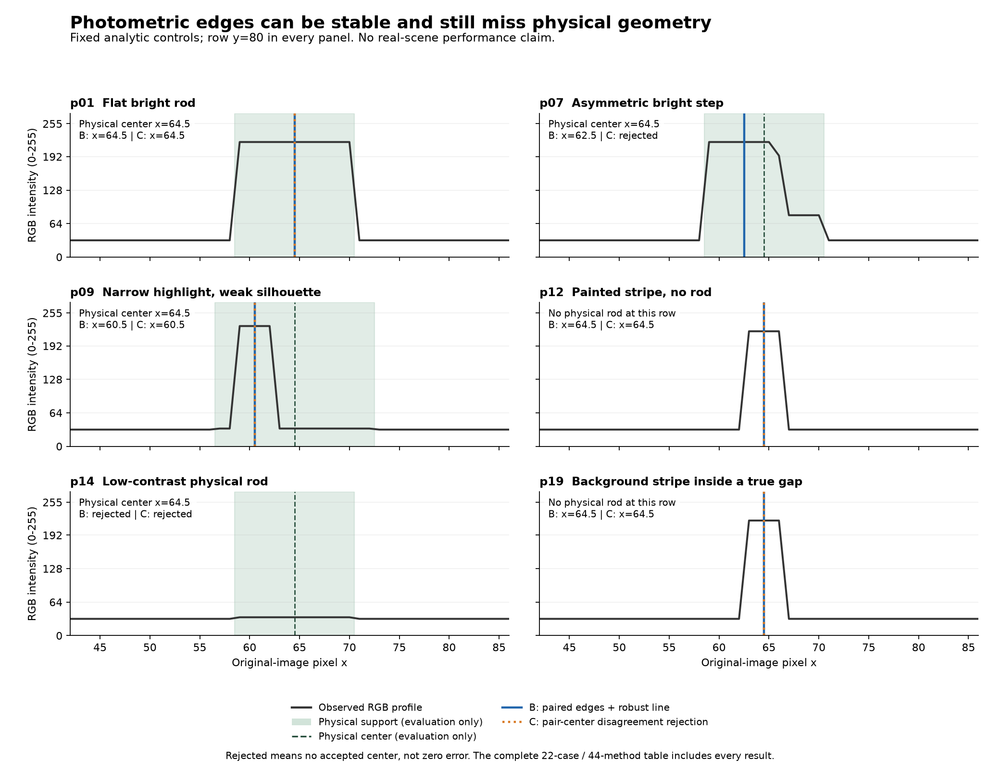

# 2026-09-17：亮度边缘不等于杆的物理轮廓

这是一轮**解析模拟机制检查，不是现实场景性能测试，也不是3D恢复分数**。目的很朴素：杆的物理位置不动，只改亮度，看看双边缘中点还靠不靠谱。

先冻结22种病例，再把输入RGB、解析几何真值、方法输出分别写入不同目录。方法只拿RGB、全病例相同的粗guide和固定参数。输出全部完成后，另一个评价阶段才读取真值。没有用本轮现实场景真值或保留视图选阈值，也没有看完结果删掉难例。

冻结协议SHA256：`cc67f3716e02804ee166dd5213a9d2beb3f2b122954288d841aab6c36d729a8b`。完整参数、44条结果和边界断言见 [可提交JSON](results/2026-09-17-profile-controls.json)。

## 结论和代价

- 平顶亮/暗杆能正确定位；对称三角剖面也能碰巧给对中心，但它的轮廓边界仍偏3px。中心对了，不代表找到了物体边界。
- 线性照明与非对称阶跃让原方法稳定偏1.5–2px。新增“多个可靠边缘对的中心分歧大于1px就整行拒绝”的对照拒绝了这4例；它没有恢复中心，目标行接受率从100%降到0%，1px内准确覆盖率仍是0%。
- 窄亮带、窄暗带和模糊后的窄亮带都只有一对可靠边缘。两方法仍全部接受，中心偏4px，边界最大误差的中位数达到10px。新的拒绝规则解决不了这种唯一但错误的答案。
- 纯背景竖纹被两方法100%接受；竖纹穿过真实缺口时，32个缺口采样行也全部被接受。这个数表示错误的行证据，不是拓扑恢复率。
- 低对比实体杆的137个采样行全部产生flat-background-like absence候选。这说明它只能是局部反证假设，不能证明那里没有杆。
- 干净缺口没有被自动填上，亚像素0.75px杆保持拒绝，两个同样合理的物体没有被真值偷偷指定一个目标。这些约束需要继续保留。

原方法16/22病例产生可用拟合，保守对照12/22；这不是正确率。两方法的1px内准确目标行覆盖率在每个病例都相同，新增对照只是减少4个错误接受病例，没有得到新的正确中心。22例是人为指定的机制检查，不能把比例当成现实发生率。



图固定展示p01/p07/p09/p12/p14/p19的第80行；物理轮廓与中心只在评价侧画上去。p12和p19这一行没有物理杆，仍可看到足以骗过双边缘方法的背景亮条纹。

## 可复现命令

```powershell
. .\scripts\Enter-CreatorEnvironment.ps1
.\backends\da3\.venv\Scripts\python.exe scripts/run_rod_profile_controls.py prepare
.\backends\da3\.venv\Scripts\python.exe scripts/run_rod_profile_controls.py infer
.\backends\da3\.venv\Scripts\python.exe scripts/run_rod_profile_controls.py evaluate
.\backends\da3\.venv\Scripts\python.exe scripts/plot_rod_profile_controls.py
.\reconstruction\.venv\Scripts\python.exe -m unittest discover -s tests -p test_rod_profile_controls.py -v
```

这些命令采用不可覆盖的新输出目录；已有本轮文件时会明确停止，不会重写原始证据。运行ID为`rod-profile-controls-v1-20260917`；输入在`data/inputs`，真值在`data/eval_gt`，推理在`.runtime/experiments`，评分在`data/evaluation`各自同名目录。

11个解析测试覆盖几何/亮度隔离、亚像素面积、确定性噪声、真缺口、中心分歧拒绝、唯一内部高光反例、低对比假absence、拒绝输出的空值语义以及不按最近真值选边或指定双物体身份。

## 完整结果

These are single-image mechanism tests in pixels, not real-data or 3D reconstruction scores. All 22 cases remain in the table.
Coverage is accepted unique-target rows / all physical target rows. Accurate coverage additionally requires center error <= 1 px. Center/boundary errors are conditional on accepted rows; empty predictions have null errors, not zero errors.

B = existing paired-edge + robust line. C = reject rows whose reliable pair centers span > 1 px, then the same line fitter. No true boundary is used to choose an edge pair.

| Case | Method | Fit | Target coverage | Accurate <=1px | Center med/p95 px | Boundary max-error med px | Gap false accept | Empty-row false accept | False absence | Rejected disagreement rows |
|---|---|---|---:|---:|---:|---:|---:|---:|---:|---:|
| p01 flat_bright_width12 | B | fitted | 100.0% | 100.0% | 0.00/0.00 | 0.00 | — | — | 0.0% | 0 |
| p01 flat_bright_width12 | C | fitted | 100.0% | 100.0% | 0.00/0.00 | 0.00 | — | — | 0.0% | 0 |
| p02 flat_dark_width12 | B | fitted | 100.0% | 100.0% | 0.00/0.00 | 0.00 | — | — | 0.0% | 0 |
| p02 flat_dark_width12 | C | fitted | 100.0% | 100.0% | 0.00/0.00 | 0.00 | — | — | 0.0% | 0 |
| p03 flat_bright_width4 | B | fitted | 100.0% | 100.0% | 0.00/0.00 | 0.00 | — | — | 0.0% | 0 |
| p03 flat_bright_width4 | C | fitted | 100.0% | 100.0% | 0.00/0.00 | 0.00 | — | — | 0.0% | 0 |
| p04 symmetric_triangle_width12 | B | fitted | 100.0% | 100.0% | 0.00/0.00 | 3.00 | — | — | 0.0% | 0 |
| p04 symmetric_triangle_width12 | C | fitted | 100.0% | 100.0% | 0.00/0.00 | 3.00 | — | — | 0.0% | 0 |
| p05 linear_bright_left_to_right | B | fitted | 100.0% | 0.0% | 1.50/1.50 | 3.00 | — | — | 0.0% | 0 |
| p05 linear_bright_left_to_right | C | insufficient_support | 0.0% | 0.0% | —/— | — | — | — | 0.0% | 137 |
| p06 linear_bright_right_to_left | B | fitted | 100.0% | 0.0% | 1.50/1.50 | 3.00 | — | — | 0.0% | 0 |
| p06 linear_bright_right_to_left | C | insufficient_support | 0.0% | 0.0% | —/— | — | — | — | 0.0% | 137 |
| p07 asymmetric_bright_step | B | fitted | 100.0% | 0.0% | 2.00/2.00 | 4.00 | — | — | 0.0% | 0 |
| p07 asymmetric_bright_step | C | insufficient_support | 0.0% | 0.0% | —/— | — | — | — | 0.0% | 137 |
| p08 asymmetric_dark_step | B | fitted | 100.0% | 0.0% | 2.00/2.00 | 4.00 | — | — | 0.0% | 0 |
| p08 asymmetric_dark_step | C | insufficient_support | 0.0% | 0.0% | —/— | — | — | — | 0.0% | 137 |
| p09 narrow_highlight_weak_silhouette | B | fitted | 100.0% | 0.0% | 4.00/4.00 | 10.00 | — | — | 0.0% | 0 |
| p09 narrow_highlight_weak_silhouette | C | fitted | 100.0% | 0.0% | 4.00/4.00 | 10.00 | — | — | 0.0% | 0 |
| p10 narrow_dark_band_weak_silhouette | B | fitted | 100.0% | 0.0% | 4.00/4.00 | 10.00 | — | — | 0.0% | 0 |
| p10 narrow_dark_band_weak_silhouette | C | fitted | 100.0% | 0.0% | 4.00/4.00 | 10.00 | — | — | 0.0% | 0 |
| p11 background_vertical_stripe_with_target | B | ambiguous | 0.0% | 0.0% | —/— | — | — | — | 0.0% | 0 |
| p11 background_vertical_stripe_with_target | C | insufficient_support | 0.0% | 0.0% | —/— | — | — | — | 0.0% | 137 |
| p12 background_vertical_stripe_without_target | B | fitted | — | — | —/— | — | — | 100.0% | — | 0 |
| p12 background_vertical_stripe_without_target | C | fitted | — | — | —/— | — | — | 100.0% | — | 0 |
| p13 single_weak_silhouette_edge | B | ambiguous | 0.0% | 0.0% | —/— | — | — | — | 0.0% | 0 |
| p13 single_weak_silhouette_edge | C | insufficient_support | 0.0% | 0.0% | —/— | — | — | — | 0.0% | 137 |
| p14 low_contrast_physical_rod | B | insufficient_support | 0.0% | 0.0% | —/— | — | — | — | 100.0% | 0 |
| p14 low_contrast_physical_rod | C | insufficient_support | 0.0% | 0.0% | —/— | — | — | — | 100.0% | 0 |
| p15 subpixel_width_0_75 | B | insufficient_support | 0.0% | 0.0% | —/— | — | — | — | 0.0% | 0 |
| p15 subpixel_width_0_75 | C | insufficient_support | 0.0% | 0.0% | —/— | — | — | — | 0.0% | 0 |
| p16 blurred_width4 | B | fitted | 100.0% | 100.0% | 0.25/0.25 | 0.25 | — | — | 0.0% | 0 |
| p16 blurred_width4 | C | fitted | 100.0% | 100.0% | 0.25/0.25 | 0.25 | — | — | 0.0% | 0 |
| p17 blurred_highlight_weak_silhouette | B | fitted | 100.0% | 0.0% | 4.00/4.00 | 10.00 | — | — | 0.0% | 0 |
| p17 blurred_highlight_weak_silhouette | C | fitted | 100.0% | 0.0% | 4.00/4.00 | 10.00 | — | — | 0.0% | 0 |
| p18 flat_bright_true_gap | B | fitted | 100.0% | 100.0% | 0.00/0.00 | 0.00 | 0.0% | 0.0% | 0.0% | 0 |
| p18 flat_bright_true_gap | C | fitted | 100.0% | 100.0% | 0.00/0.00 | 0.00 | 0.0% | 0.0% | 0.0% | 0 |
| p19 background_texture_crosses_true_gap | B | fitted | 100.0% | 100.0% | 0.00/0.00 | 0.00 | 100.0% | 100.0% | 0.0% | 0 |
| p19 background_texture_crosses_true_gap | C | fitted | 100.0% | 100.0% | 0.00/0.00 | 0.00 | 100.0% | 100.0% | 0.0% | 0 |
| p20 two_equal_objects_ambiguous_identity | B | ambiguous | — | — | —/— | — | — | — | 0.0% | 0 |
| p20 two_equal_objects_ambiguous_identity | C | insufficient_support | — | — | —/— | — | — | — | 0.0% | 137 |
| p21 sloped_bright_width6 | B | fitted | 100.0% | 100.0% | 0.20/0.44 | 0.24 | — | — | 0.0% | 0 |
| p21 sloped_bright_width6 | C | fitted | 100.0% | 100.0% | 0.20/0.44 | 0.24 | — | — | 0.0% | 0 |
| p22 noise_without_physical_rod | B | insufficient_support | — | — | —/— | — | — | 0.0% | — | 0 |
| p22 noise_without_physical_rod | C | insufficient_support | — | — | —/— | — | — | 0.0% | — | 0 |

Background stripes are image texture without foreground rod geometry. Two equal objects have no declared unique identity, so acceptance would count as an unsupported identity choice; center error is not computed against the nearest object.

A fitted infinite line is only scored at the rows actually selected by the fitter. No bridge or finite extent is inferred across missing observations. Gap false acceptance here is therefore row evidence, not topology.
