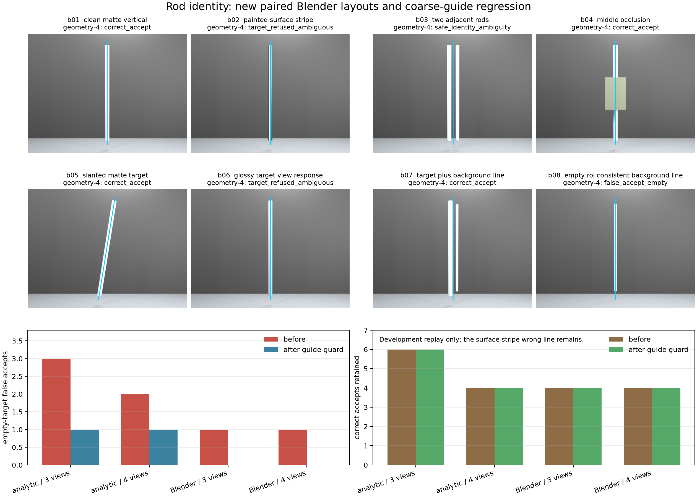

# 2026-09-19：新 Blender 身份场景与粗引导门

> 后续审计补充：本报告的旧 guide 实际由预设三维轴投影生成，属于理想化合成先验，不是真人标注；旧墙体虽用了 Brick 节点，但 XY 映射到 XZ 墙后画面没有预期砖纹。下文分数保持原样，只支持该旧输入条件。40帧检查验证了网格、相机与栅格自洽，没有独立证明 RGB 抗锯齿边界的逐像素覆盖。后续新包改用固定屏幕坐标 guide、实际可见砖纹及 Blender 独立射线交叉核验，见[压力测试与有限杆段](2026-09-19-identity-stress-and-finite-segments.md)。

今天把解析机制测试推进到全新的 Blender 场景族。新包不是旧细杆场景换个阈值，而是从空场景程序化生成8种布局、5个视角，共40张严格配对图；每张都有RGB、精确相机、导出网格、相机Z深度、沿射线距离、表面ID和目标可见掩码。结果确认多候选关联在真实光照、遮挡和视差下能工作，也把剩下的问题钉得更准：几何可以找到一条真实存在的杆线，却仍不知道它是不是用户要的那根。

粗引导身份门在已看过的数据上能挡住明显偏离目标区域的背景杆，且没有破坏本轮正确案例；但靠近目标的杆面条纹仍会通过。因此它只是一层目标身份先验，不是物理轴证明，更不是新的盲测成绩。

## 数据包和隔离边界

[Blender协议](../../configs/rod_identity_blender_v1.json)固定8种情况：干净竖杆、杆面亮条、相邻双杆、中段遮挡、斜杆、强高光、目标加背景杆，以及目标为空但ROI内存在另一根真实杆。相机绕场景取−30°、−15°、0°、15°和30°，图像为640×480。

正式运行是`rod-identity-blender-v1-20260919r3`。协议SHA256为`13798ea4466447e15982f59516ab7681f4d5cbbd562fc3d0a281364a5c2a716b`，冻结推理SHA256为`81ea14105bb5b917f7d892681c635299fc32ef645a776603b06adf33ba8f1751`。输入目录只有PNG和输入清单；深度、ID、网格、物理轴和存在性标签单独放在`data/eval_gt`。推理只读RGB、精确相机、粗guide与冻结方法设置，并写明`gt_read_during_inference: false`。

前两次生成失败和一次管线失败均保留，没有覆盖：

- 初始运行把Blender 5.2的显示名`None`写成内部枚举名`NONE`，在首帧前退出。
- `r1`在首帧前暴露3×3内参与4×4外参直接相乘的形状错误。
- `r2`成功生成40帧，但多视图重投影只处理3×4外参，4×4外参触发的异常又被候选容错吞掉，导致8例全部显示为拒绝。这是管线失败，不是算法“很安全”。原结果保存在[历史r2输出](results/2026-09-19-blender-identity-r2-pipeline-failure.json)。
- 修复后增加4×4相机回归测试，以新运行号`r3`重新生成、冻结、推理和评价。

## 像素、坐标和真值复核

独立核验入口读取冻结产物，不修改真值。40/40帧通过以下检查：

- RGB、逐帧数组和全部真值文件哈希与冻结索引一致；
- 输入和真值记录的内外参逐值一致，数组尺寸全部为480×640；
- 栅格表面ID全部来自该例导出的evaluated mesh；
- 有限深度/射线距离像素与射线命中严格一致，沿射线距离不小于相机Z深度；
- `target_visible`与`surface_id == 1`逐像素完全相等；
- 35个有目标视角中，每个视角采样101个投影轴点，100%落在目标表面或声明的中段遮挡物上。

输入清单SHA256为`2d1e3b82832653cf7a6e58b549c5a62f27637afd79a024018560f7bd6bf0e612`，真值清单为`534dacdf1392cabb71ab77218dba22b24e9ea9b7fd209de5eb3cfa2e46e1eff6`，真值文件索引为`098193728a7a73ac04b90234ce19c9baf9de3ddf06c0179e3801981a89929797`。完整核验记录在本机`data/evaluation/rod-identity-blender-v1-20260919r3/pack_verification.json`。

## 冻结 Blender 结果

下表使用至少4视图版本；至少3视图版本在这8例上的最终分类相同。正确接受要求轴线p95距离不超过0.025 m且方向误差不超过2°。

| 情况 | 结果 | 关键数值或解释 |
| --- | --- | --- |
| b01 干净竖杆 | 正确接受 | p95 0.00037 m，0.014° |
| b02 杆面亮条 | 拒绝强选，保持歧义 | 77个去重三维解释，表面亮条没有被冒充成唯一轴 |
| b03 相邻双杆 | 安全歧义 | 两根物理杆都合理，没有按真值挑最近者 |
| b04 中段遮挡 | 正确接受 | p95 0.00098 m，0.028° |
| b05 斜杆 | 正确接受 | p95 0.00191 m，0.071° |
| b06 强高光 | 拒绝强选，保持歧义 | 48个去重三维解释，召回受损但没有假装确定 |
| b07 目标加背景杆 | 正确接受 | p95 0.00075 m，0.019° |
| b08 目标为空、ROI内有背景杆 | **错误接受假物体** | 背景杆是真实三维线，五视图几何一致 |

内部“更宽候选包住当前亮带”的报警没有改变任何最终状态：两个亮带案例本来就因多候选而歧义，干净接受案例最多只有一个视图触发。这个信号保留为诊断，不进入当前主判定；直接选择最宽边同样没有依据。



[r3完整结果](results/2026-09-19-blender-identity-r3.json)保存32条变体评分、逐视图可见像素数、支持视图和轴线误差。本地`.runtime/experiments/rod-identity-blender-v1-20260919r3/inference.json`还保留所有图像及三维候选。

## 粗引导身份门的开发回放

[回放协议](../../configs/rod_guide_identity_replay_v1.json)在任何真值读取前固定：一条唯一三维线投影后，至少3个视角且至少75%的视角需要落在粗guide附近；容差是原观测搜索半宽的四分之一。解析包对应7.5 px，新Blender包对应12 px。歧义结果维持歧义，不靠guide强选。

运行`rod-guide-identity-replay-v1-20260919`的协议SHA256为`8eefbf21af85f66c17b1e9f7191bc92de53109efda9e4cd449494e9db94e2c59`，推理SHA256为`2d58f5085de6880ab2543c3fb3801d55f0784094389e0d1049ce65166a36e9bb`。它重放了9月19日已经看过的20例，所以只能算开发回归：

| 来源与变体 | 空目标错误接受：之前→之后 | 正确接受：之前→之后 | 仍未解决 |
| --- | ---: | ---: | --- |
| 解析包，至少3视图 | 3→1 | 6→6 | 1条近guide背景线、1条表面错误轴 |
| 解析包，至少4视图 | 2→1 | 4→4 | 同上；原有真杆拒绝也没有恢复 |
| 新Blender，至少3视图 | 1→0 | 4→4 | 杆面亮条与高光仍是歧义 |
| 新Blender，至少4视图 | 1→0 | 4→4 | 同上 |

b08只有1/5视角落入guide带，因此从假物体改为安全拒绝；b07的最大guide残差约11.22 px，仍在12 px边界内并保持正确。解析包中稳定的错误表面轴五个视角都落在guide带内，错误接受完全没变。完整40条前后对照见[回放结果](results/2026-09-19-guide-identity-replay.json)。

## 算法决定和下一步

当前最合理的流水线分成四层：图像内保留多个边缘/亮带解释；相机几何负责跨视图关联；用户粗guide负责排除明显不是所选目标的真实线；物理轴与有限范围仍需外轮廓、表面响应和逐段证据确认。每一层回答的问题不同，不能拿后一层的输入反过来美化前一层成绩。

粗guide门进入下一轮新保留集，但阈值还不是正式参数。必须加入从未看过的guide扰动、近邻杆距离、目标仅部分可见和独立对象，测出误拒与漏拒曲线。表面亮条问题没有解决，下一步要比较候选两侧的轮廓宽度和跨视角表面响应；随后才进入有限端点、真实缺口与可撤回补丁。决定详见[ADR 0007](../decisions/0007-guide-is-target-identity-input.md)。

## 复现

从`D:/Creator-newage`加载环境后运行：

```powershell
. .\scripts\Enter-CreatorEnvironment.ps1
.\backends\da3\.venv\Scripts\python.exe scripts/run_rod_identity_blender.py prepare
.\backends\da3\.venv\Scripts\python.exe scripts/run_rod_identity_blender.py infer
.\backends\da3\.venv\Scripts\python.exe scripts/run_rod_identity_blender.py evaluate
.\backends\da3\.venv\Scripts\python.exe scripts/verify_rod_identity_pack.py
.\reconstruction\.venv\Scripts\python.exe scripts/run_rod_guide_identity_replay.py prepare
.\reconstruction\.venv\Scripts\python.exe scripts/run_rod_guide_identity_replay.py infer
.\reconstruction\.venv\Scripts\python.exe scripts/run_rod_guide_identity_replay.py evaluate
.\backends\da3\.venv\Scripts\python.exe scripts/plot_rod_identity_blender.py
```

所有阶段拒绝覆盖旧输出。复现已有运行时应换run ID和分享文件；旧失败、输入、真值与评价结果继续留在D盘。

当前代码增加了源码冻结检查：重放旧运行应使用对应 Git 版本或其源码快照；直接用变更后的工作树读取旧冻结运行会被拒绝。新方法必须使用新运行号，旧输入和结果不覆盖。
