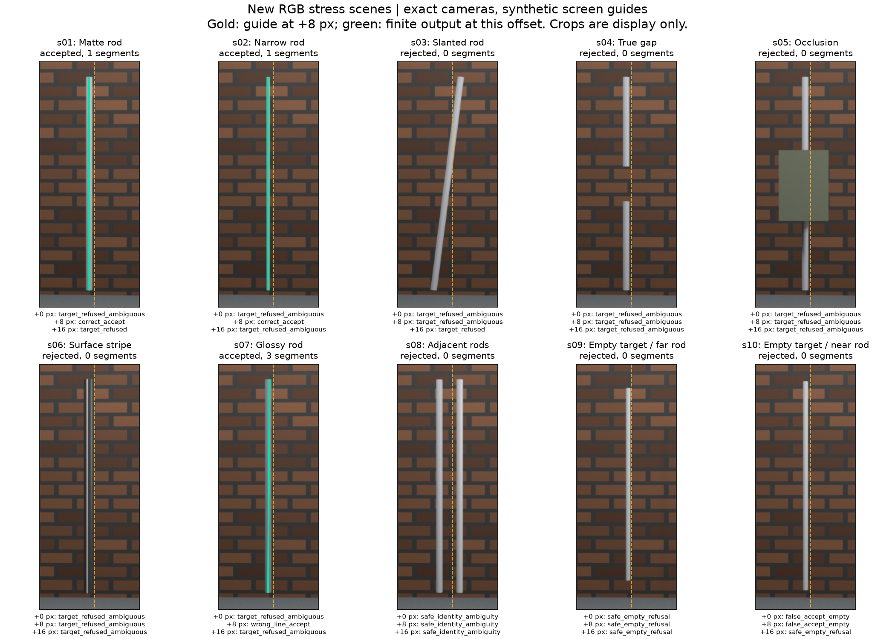

# 2026-09-19：提示偏差、真实缺口与有限杆段

**有限杆段接通了，压力测试还没过。** 新50帧上的30次判定最终只有2次正确输出，另有1次高光偏轴、1次错收近邻杆、26次拒绝。真缺口与遮挡均未恢复；下一步先检查候选截断和物理边缘身份，不以调整guide过滤顺序冒充解决问题。

这一轮把候选关联接到了有限杆段：先决定各张图支持哪条线，再只用被选中的原始像素行决定哪里可以输出。没有观测的地方保持未知，不把一条无限直线从头画到尾。它仍是精确相机条件下的诊断原型，尚未生成正式可撤回补丁。

## 先纠正旧证据的边界

旧 Blender 身份包的 guide 来自预设三维轴投影，不能称为真人粗标注。旧墙体的 Brick 节点沿 XY 取坐标，但墙在 XZ 平面，画面实际上缺少预期砖纹。这轮改为明确的 XZ 纹理映射，实际查看输出后确认砖纹可见；guide 统一是屏幕 x=319.5、y=20到459的线，独立于目标几何，再整体右移0、8或16像素。它仍是合成先验。

旧40帧复核证明了网格、相机与栅格之间的自洽。本轮追加 Blender 的 `scene.ray_cast` 与独立 Open3D 三角网格求交对照，以及 Blender 投影函数对照。中心射线验证不等于证明 RGB 抗锯齿混合覆盖正确，尤其不能据此宣布旧最细0.01杆的问题已经解决。

## 冻结内容与运行边界

[协议](../../configs/rod_identity_stress_v2.json)固定10种场景，每种5个视角，共50张640×480 RGB：干净杆、半径0.02的窄杆、斜杆、中间真实缺口、中间遮挡、表面亮条、高光、相邻双杆、空目标加远背景杆、空目标加近背景杆。相机角为−32°、−16°、2°、19°、35°，全都来自渲染真值，是明确允许的 oracle 相机输入。

这些是同一程序化圆柱族的新配置，`object_group_id`一致。改变半径、材质和视角不等于独立对象泛化。最窄新杆直径0.04世界单位，与旧测试的0.01尺寸不能直接等同。场景可视化预检发生在推理前，因此这里称冻结压力诊断，不称严格盲测。

每例对三个guide偏移各自重新提取RGB候选，总共30次判定。**偏移同时改变观测搜索窗口和guide身份门**，所以是完整流程的敏感性测试，不能当作单独身份门的因果消融。guide门沿用12px、至少3视角且75%视角的旧设置；在5视角中实际需要至少4票。逐行采样沿用已有dense有限证据协议。每图保留最多8候选，5视图共有10组三视图组合，全部候选组合最多10×8³=5120种，当前预算6000；不根据新结果调阈值。

数据结构继续隔离：`data/inputs/<run>`只含RGB及输入清单；相机Z深度、射线距离、表面ID、可见mask、网格、物理轴和标签位于`data/eval_gt/<run>`。方法单独保存在`method_config.json`，完整生成/评分协议不由推理打开。推理前核对输入、方法和源码哈希；推理阶段Python审计钩子会阻止意外打开GT、评价目录和完整协议。它是工程防误读措施，不是操作系统安全沙箱。评价另核对冻结协议、推理身份、全部真值哈希及30条完整且不重复的计划结果。

## 实现与失败记录

- 搜索未完成时返回歧义，不能把预算耗尽伪装成唯一候选。已补故意把预算设为1而隐藏第二条线的回归测试。完整性只覆盖保留的图像候选，RANSAC和每图8候选上限仍可能漏掉解释。
- 相机形状、有限性和旋转在搜索前验证。坏相机属于管线异常，不能被宽泛的`ValueError`捕获变成正常拒绝。
- 有限段适配器只使用最终被选中的候选`row_matches`；其他像素行包括平坦响应都保持未知。固定输入相机，对选中的支持线重新拟合并做留一视图检查，至少4个拟合视角、每个采样点至少3个正票。它不是直接裁切原三视图拟合线，因此分别保存关联和有限段结果。
- 不用GT掩码给支持票，不用端点答案限定恢复范围，不按最近真杆给身份歧义分配正确答案。没有可靠可见性证明，所以这一适配层不开启负证据否决。
- 初始无后缀运行是50帧渲染预检；r1、r2在长批处理的s08中途退出。r2退出码3221226505，日志无Python traceback，具体底层原因未确认。改成每个场景独立Blender进程后，r3完成50帧；补齐完整计划契约检查后另冻r4。所有旧输出保留，只有r4用于正式数值。
- 发布`prepared`前要求案例/视角精确齐全、没有重复，图像尺寸与文件有效，相机和几何记录一致。少一张图不能悄悄变成更容易或更难的另一份实验。

## 指标怎么读

曲线指标按有限杆段双向采样，报告精度、召回和错误新增长度。空输出的召回为0、精度为空值，不奖励“全拒绝”。真实缺口s04的真值是两段；缺口覆盖同时给完整区间及扣掉2.5cm端点容差的内部区间，这是采样覆盖量，不是拓扑连接率。遮挡s05的物理杆仍完整，遮挡区预测单独统计，不能直接叫错误补洞。

有限输出的成功仍以先前身份判断正确为条件。它不自动证明物理中心轴正确，也尚未与新场景的DA3或裁剪基线比较；不能把这份诊断宣传成普通照片修复收益。

## 正式结果：r4

50帧共51,200次 Blender/Open3D射线对照，表面ID不一致为0，最大相机Z差3.174×10⁻⁶m；独立投影最大差2.674×10⁻⁵px。全部30次完成了已保留图像候选的三视图组合搜索。但**30/30次至少一张图触及8候选上限**，因此没有证明图像层候选完备。纯推理总耗时1204.97秒（约20.08分钟，当前本机串行实现）。

| guide右移 | 几何/guide后正确线 | guide后错轴 | guide后空目标错收 | 有限段实际输出 | 有限输出中的正确/错轴/错目标 |
| --- | ---: | ---: | ---: | ---: | --- |
| 0px | 0 / 0 | 0 | 1 | 1 | 0 / 0 / 1 |
| 8px | 2 / 2 | 1 | 1 | 3 | 2 / 1 / 0 |
| 16px | 2 / 0 | 0 | 0 | 0 | 0 / 0 / 0 |

每行分母均为10种场景，三种偏移共享同一批图，不能当30个独立对象估计泛化准确率。七种身份明确真目标共21次中，2次正确有限输出、1次错轴、18次拒绝。16px下guide门拒绝了两条原本正确的几何线，没有带来新的正确输出；0/8px下guide门均未改变判定。

- **s01、s02只在8px下正确输出**，各一段长2.18843m，对应真杆2.2m。在25mm容差下曲线精度/召回都是100%；有限段真值到预测p95分别约0.690mm和1.383mm。这不是端点完全一致，也不是旧0.01细杆修复成功。
- **s04真实缺口、s05遮挡，三个偏移全部拒绝**，恢复率0，原因均是上游关联歧义，有限证据裁切未进入。不能用“没填错缺口”掩盖没有恢复。模块的解析测试能保留两段，本轮新渲染场景尚未验证该能力。
- **s07高光杆在8px下错轴仍被接受**。关联轴p95误差27.606mm，超过25mm门槛；有限输出变成3段，总长2.14803m，精度81.863%、召回81.909%，错误新增长度0.38959m。有限段真值到预测p95为29.643mm，不能把81.9%直接叫修复成功。
- **s10空目标加近邻杆在0px下输出2.18843m错误目标段**，对指定目标的精度为0。这根干扰杆物理上真实存在，错误在于目标身份，不是把空气凭空建成杆。8px下它仍通过几何和guide，后来被有限阶段的留一视图重投影（+19°）挡住；这是局部几何门作用，不证明身份已解决。
- s08相邻双杆全程歧义，s09远背景杆全程由几何歧义拒绝。后者不能记为guide门的改善。



图中绿色只代表算法实际输出，不代表正确；高光例正是反例。展示偏移明确为8px，完整30次数字见[冻结评分](results/2026-09-19-identity-stress-v2.json)。

## 小心求证：提前过滤guide也没有这么神

看到新背景里出现大量歧义，我先猜“主要是guide之外的砖缝，提前过滤就好”。没有直接改算法，而是对推理已保存的最高支持候选逐条套同一个guide条件，且不读GT、不换赢家、不输出新杆段。

结果不支持这个简单解释：s01@0的2/2条、s02@0的3/3条、s04@0的3/3条、s05@0的11/11条候选都在guide内。s04@8仍有2/2条、s05@8仍有5/5条兼容。因此单把guide过滤提前，至少不能消掉这些已有歧义。s06@8有28/32条兼容，s08@0有31/33条兼容，收窄语义并不是一步到位的解法。

[只读诊断](results/2026-09-19-saved-ambiguity-guide-audit.json)仅覆盖原selected及已保存、同等支持且满足分离筛选的alternatives，不包括全部去重候选或被2D上限抛掉的解释。即使某行只剩1条兼容，也不能宣布找到了唯一物理轴。这里也没有证明竞争线都来自砖缝；旧/新包同时改变过纹理、曝光、尺寸和相机，背景因果结论还需要成对干预。

## 根据结果决定下一步

1. **先分离窗口变化与身份门变化。** 固定同一批RGB和观测窗口，只改变身份guide；再固定guide，只移动观测窗口。记录完整2D候选排序与截断前数量，不把“偏8px碰巧好”当稳定算法。
2. **检查候选截断，而不是盲目抬支持票数。** 在开发诊断上固定随机序列，比较候选上限8/16/32及预算完成性；新出现的竞争解释必须被记录。预算不够继续拒绝，不能拿更多截断换表面上的唯一。当前30例从此只作开发/回归，不再称新测试集。
3. **把物理边缘信息保留下来。** 下一版候选应保留左右边、宽度、极性和逐行支持，试验跨视角外轮廓/共享粗细约束能否区分中心轴和表面亮带；不直接选最宽边，不使用真值半径参与推理。对近邻杆和高光偏轴的错误继续保留反例。
4. **有限段暂留诊断层。** 在新的独立对象、固定协议和强基线下出现可重复改善，再接正式补丁。s10当前输入没有表达“要前面的、不是后面的”这一身份信息，不能承诺轮廓/宽度会解决；应补充独立于GT的对应/确认或保持歧义。

当前处于G1可行性开发，未通过G1：没有跨对象重复收益、估计相机下稳定恢复或正式补丁。按每周30–35小时，完整申请展示版仍估5–7周，更扎实的研究与工程版本仍估8–10周；这是工程估计，不是高校评价或录取保证。本轮把问题测清楚了，但结果不支持继续压缩工期。

## 复现与检查

正式运行：`rod-identity-stress-v2-20260919r4`。
协议SHA256：`3b6ec63bf1a68eb2da986705e7b9cccc80021f54fe5724ff54e3316291d1daa0`。

推理SHA256：`defaa4cd204e8eb5f2892d32823e46453d20633ce54b6a4f7b7a700d317b4581`。


在固定本次源码版本后运行：

```powershell
. ./scripts/Enter-CreatorEnvironment.ps1
./backends/da3/.venv/Scripts/python.exe -B scripts/run_rod_identity_stress.py prepare
./backends/da3/.venv/Scripts/python.exe -B scripts/run_rod_identity_stress.py infer
./backends/da3/.venv/Scripts/python.exe -B scripts/run_rod_identity_stress.py evaluate
./reconstruction/.venv/Scripts/python.exe -B scripts/audit_rod_stress_ambiguity.py --run-id rod-identity-stress-v2-20260919r4
./backends/da3/.venv/Scripts/python.exe -B scripts/plot_rod_identity_stress.py --guide-offset 8
```

以上默认产物在本机已存在，入口会拒绝覆盖。复跑时复制协议并只修改run_id，用`--config`传给prepare/evaluate、`--run-id`传给infer/audit，给evaluate传新的`--share-json`、绘图传新的`--summary`与`--output`。改算法后必须新冻运行，不能编辑旧prepared哈希来绕过检查。全部缓存、图、输入和GT位于D盘。

检查完成：164项全量诊断加7项新渲染契约检查通过；相关30项在NumPy2环境也通过；核心4项测试/6个子测试通过；Ruff、128份Python源码与三个CLI边界检查通过；三个Python分发包及Blender插件构建成功。只读歧义诊断另用小型人工fixture核验了guide内外候选及输入不变。图已实际查看。
