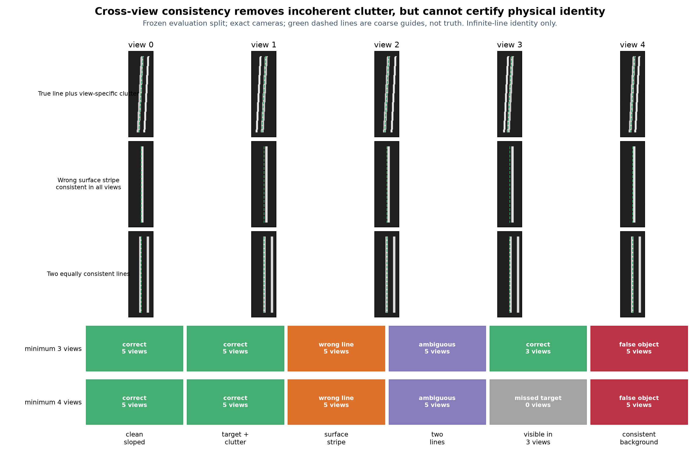

# 2026-09-19：多视图一致不等于物理身份正确

今天实现并冻结了第一版“保留多个图像解释，再跨视图关联”的机制测试。结论很清楚：它能排除每张图各自乱跳的背景条纹，也能在两条同样合理的三维线之间保持歧义；但只要错误亮条本身在多个视图中一致，它仍会稳定选错。增加到四视图也无法解决身份问题，还会拒绝只在三张图可见的真杆。

这是一组解析RGB与精确相机下的机制测试，不是Blender复杂渲染、真实照片或完整3D补丁成绩。输出只是无限三维线的身份假设，不恢复端点、缺口和拓扑。

## 冻结方式和输入边界

[协议](../../configs/rod_multiview_candidates_v1.json)先固定12种情况，开发组与评价组各6种。每种有5个平移视角，图像为320×240；相机、RGB和带小幅偏移的粗guide是方法输入。目标轴、是否存在目标以及身份是否唯一只写入`data/eval_gt`，推理阶段不读取。

严格隔离重跑`rod-multiview-candidates-v1-20260919r1`的协议SHA256为`4145dcefb400ac1266ff4b48efcb46956831b493ad0fd762edd0d735138d6e77`，冻结推理SHA256为`269acb7ed411de8d949798eed5f71a3ea7a446f4c21c15408d1ebec012dd9688`。第一次运行因入口打开了完整协议而不作为正式结果，原文件仍留在D盘；修复后推理只打开独立方法配置、RGB/相机/guide清单和准备状态，数值分类与第一次运行一致。

方法先沿图像行保留所有合格双边缘候选，再得到每张图最多8条有足够纵向支持的图像线。之后枚举三视图候选组合，交会成三维无限线，并在其余视图找最近候选。比较两个事先固定的变体：至少3视图支持，或至少4视图支持。若另一条分离的三维线得到接近的视图支持，返回`ambiguous`，不强选离真值最近的一条。

## 冻结评价组结果

“正确”要求目标到预测线的95分位距离不超过0.03 m且方向误差不超过2°。拒绝项误差为空，不按零分处理。空场景没有“最近目标”，被接受就记假物体。

| 评价情况 | 至少3视图 | 至少4视图 | 关键数值 |
|---|---|---|---|
| 斜真杆 | 正确 | 正确 | p95距离0.00412 m，方向0.153° |
| 真杆 + 各视图位置不同的条纹 | 正确 | 正确 | p95距离0.00233 m，方向0.095° |
| 跨视图一致的杆内表面亮条 | **错误接受** | **错误接受** | 五视图支持，但离物理轴0.075 m |
| 两条同样一致的线 | 保持歧义 | 保持歧义 | 都没有借真值强选身份 |
| 真杆只在三张图出现 | 正确 | **拒绝真杆** | 三视图法p95距离0.00130 m |
| 空场景中的一致背景线 | **假物体** | **假物体** | 五视图一致仍不能证明它是目标 |

评价组6例中，三视图法得到3例正确、1例错误线、1例空场景假物体、1例安全歧义；四视图法得到2例正确、1例错误线、1例空场景假物体、1例安全歧义、1例真杆拒绝。这6例是预设机制覆盖，不是现实频率，不能换算成泛化准确率。

开发组补充了一个重要边界：对各视图独立乱跳的空背景条纹，三视图法会因为“任意三条观测也可能凑成一条三维解释”而误接受；四视图法正确拒绝。但在五视图一致的空背景线上，两个方法都误接受。提高支持数只能过滤不一致噪声，无法产生物理身份信息。



[完整24条评价结果](results/2026-09-19-multiview-candidates.json)保留每例状态、支持视图数、候选数量、方向和距离；本机完整观测及每个三维假设保留在`.runtime/experiments/rod-multiview-candidates-v1-20260919r1/inference.json`。

## 对算法设计的实际影响

今天的实现可以保留，因为它确实完成两件以前做不到的事：跨视图不一致的亮条不再自动升级成杆；两条同样合理的线会显式返回歧义。它应当成为候选关联层，而不是最终验收层。

四视图不能写成全局硬门槛。下一版需要先估计“有多少视图真的具备可观测条件”，再报告支持数；三张清晰视图可能比五张中两张被遮挡更有用。可观测性不能由“没检测到”反推，因为9月17日已经证明低对比真杆也会看起来像平坦背景。

最终把候选命名为物理轴之前，还缺少身份证据。优先测试两类：外轮廓/宽度是否能在至少两个视图支持同一个轴，以及候选两侧的局部外观能否随视角形成合理的表面响应。跨视图一致的独立背景线在纯RGB中可能和目标杆不可区分；这种情况应保留人工对应或返回`ambiguous/no_supported_change`，不能伪造一个全自动答案。

这个决定详见[ADR 0006](../decisions/0006-multiview-consistency-is-not-identity.md)。下一轮进入新的Blender几何布局，加入真实遮挡、不同方向、表面亮条与独立背景细线；今天的解析评价组从现在起只作回归，不再当新方法的盲测集。

## 复现和检查

从`D:/Creator-newage`加载项目环境后依次运行：

```powershell
. .\scripts\Enter-CreatorEnvironment.ps1
.\reconstruction\.venv\Scripts\python.exe -B scripts/run_rod_multiview_candidates.py prepare
.\reconstruction\.venv\Scripts\python.exe -B scripts/run_rod_multiview_candidates.py infer
.\reconstruction\.venv\Scripts\python.exe -B scripts/run_rod_multiview_candidates.py evaluate
.\backends\da3\.venv\Scripts\python.exe -B scripts/plot_rod_multiview_candidates.py
```

所有阶段拒绝覆盖已有运行；重做必须使用新run ID与新分享文件。输入在`data/inputs`，答案在`data/eval_gt`，方法输出在`.runtime/experiments`，评价在`data/evaluation`。代码测试覆盖多图像线保留、唯一三维线、双线歧义、四视图拒绝不一致条纹、目录边界以及拒绝/空场景评分语义。

本地完整诊断共145项，全部通过；Ruff、119份Python源码骨架检查，以及核心4项测试/6个子测试通过。严格隔离r1的当前源码与冻结源码哈希一致；旧运行与r1的24条评分逐项相同，说明入口修复没有改变数值结论。
