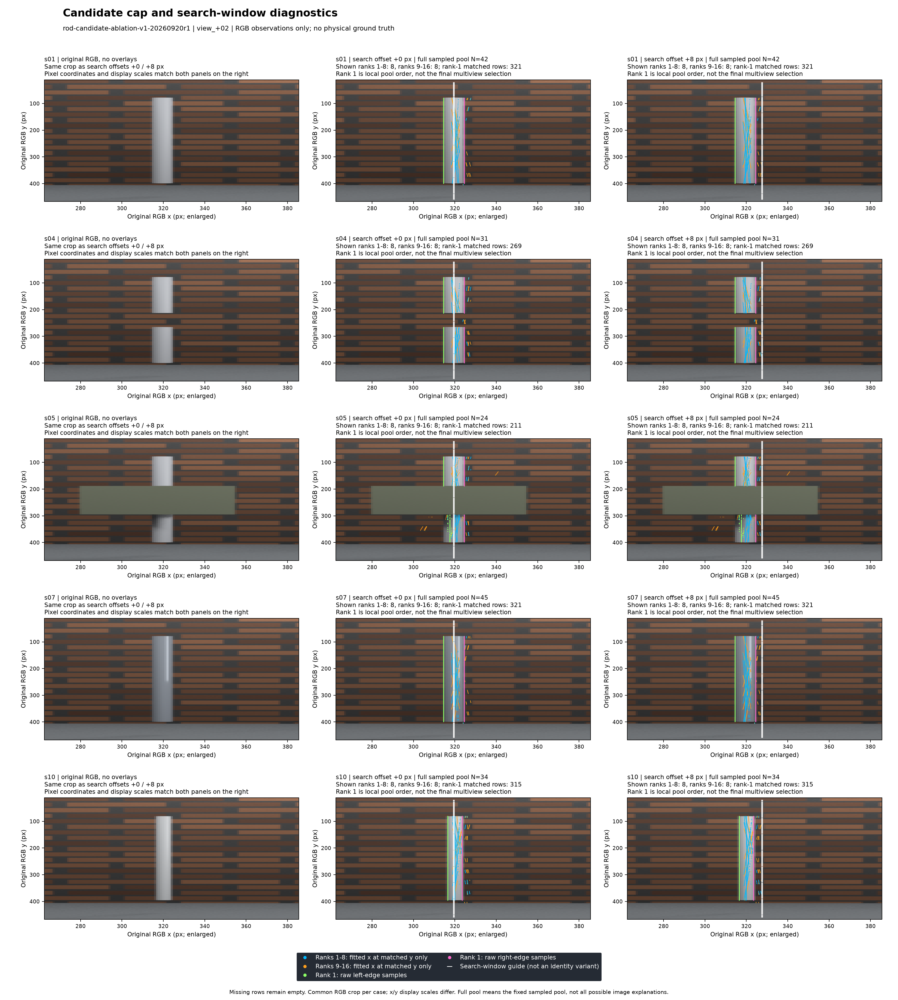

# 2026-09-20：候选截断、搜索窗口与身份提示消融

本轮是旧开发场景上的机制诊断。这里使用身份压力包，不能据此宣称最初标作0.01的细杆已被修复。复用`rod-identity-stress-v2-20260919r4`的RGB与精确相机，没有新增独立对象，没有重渲染，没有重跑深度模型。粗提示仍是合成屏幕线，不能替代真实用户标注验证。

## 实际结果与算法决定

60条件完整，20份几何关联都搜完了保留池中的组合；10组旧cap8条件的完整关联/有限段与guide状态全部复现，2个指定视图的完整采样池也与旧枚举器精确一致。全流程推理约23.16分钟，20份关联合计18.65分钟；cap8合计144.14秒，cap16合计974.78秒。时间没有按三个身份提示重复累计。完整数字见[机器可读摘要](results/2026-09-20-candidate-ablation.json)。

| 案例 | 搜索偏移px | cap8：状态／去重后假设数 | cap16：状态／去重后假设数 |
| --- | ---: | --- | --- |
| s01 干净杆 | 0 | 歧义／60 | 歧义／250 |
| s01 干净杆 | 8 | 接受／72 | 歧义／310 |
| s04 真缺口 | 0 | 歧义／85 | 歧义／303 |
| s04 真缺口 | 8 | 歧义／109 | 歧义／407 |
| s05 遮挡 | 0 | 歧义／135 | 歧义／435 |
| s05 遮挡 | 8 | 歧义／128 | 歧义／468 |
| s07 高光 | 0 | 歧义／128 | 歧义／432 |
| s07 高光 | 8 | 接受／90 | 歧义／421 |
| s10 空目标旁近杆 | 0 | 接受／103 | 歧义／589 |
| s10 空目标旁近杆 | 8 | 接受／121 | 歧义／592 |

这里的假设数是去重后三维假设总数，含弱支持假设；状态“接受”表示没有达到竞争门槛的替代解释，并不要求总数等于1。

cap8的30条件中，有限段接受5次：2次正确、2次高光偏轴、1次错收近杆，其余25次拒绝。两次正确都来自同一个s01/search8几何结果，只是身份提示0/8两次回放，不是两个独立物体成功。cap16的30条件全部拒绝，真目标条件恢复为0。扩大候选池同时挡住了正确和错误输出，不能写成方法收益。

| 案例 | 搜索／身份偏移px | 有限段数 | 输出长度m | 恢复率 | 精确率 | 错误新增m |
| --- | --- | ---: | ---: | ---: | ---: | ---: |
| s01 | 8／0 | 1 | 2.18843 | 100.00% | 100.00% | 0.00000 |
| s01 | 8／8 | 1 | 2.18843 | 100.00% | 100.00% | 0.00000 |
| s07 | 8／0 | 3 | 2.14803 | 81.91% | 81.86% | 0.38959 |
| s07 | 8／8 | 3 | 2.14803 | 81.91% | 81.86% | 0.38959 |
| s10 | 0／0 | 1 | 2.18843 | 不适用 | 0.00% | 2.18843 |

以上都在cap8，距离容差2.5cm。s01真长2.2m，输出2.18843m；100%覆盖不表示端点无误差。s07无限线p95误差27.61mm，超过25mm验收门槛；有限段约81.9%恢复和0.38959m错误新增需要一起看。s10的目标不存在，其2.18843m全部属于错误新增。s04真缺口与s05遮挡在全部条件中都没有恢复；缺口不被填错是全拒绝的结果。

把变量拆开后，s01与s07固定搜索窗口8px时，身份提示0和8px得到相同有限段；搜索窗口0px则已在几何层歧义。此前“guide偏8px就能输出”的现象，在这两个案例主要由搜索窗口改变证据池触发，不能归因于身份提示更准确。身份提示16px会拒绝这两组已接受几何，但不会替它们重新选杆。20组三档身份比较中只有4组改变拒绝状态；guide层cap8共7次接受，有限段再拒绝其中2次。仅移动身份提示没有新增正确恢复。

**本轮决定：不把上限改成16后直接发布，不放宽歧义门槛。先修重拟合后支持契约，再重跑嵌套候选对照；然后验证左右边缘的共同几何约束。** 当前固定采样池每图有4–168个候选，16仍有截断。还需要区分真实竞争解释与不合格短支撑假设，才有资格设计新的选择策略。



图为view_+02，左列纯RGB，中/右列搜索窗口0/8px。白线表示搜索窗口提示；三个身份提示变量没有叠在这张图里。原图与两列叠加共用裁剪和坐标；横纵显示比例不同，不能从展示图直接量物理宽度。图已实际检查，无标题重叠，缺行没有连线补齐。

## 固定了什么

正式运行：`rod-candidate-ablation-v1-20260920r1`。5例为s01干净、s04真缺口、s05遮挡、s07高光、s10空目标旁近杆；每例5视图。搜索窗口偏移0/8px、保留候选上限8/16、身份提示偏移0/8/16px，总共60条件。

先按10个“案例×搜索窗口”生成观测池，每个视图只提取一次原图像素并运行固定seed/trials的RANSAC；8与16取同一排序池的嵌套前缀。20个“案例×窗口×上限”各关联一次，三个身份提示只复用该关联结果。提示横移不改变相机、观测行、候选或几何关联哈希。两个搜索预算均为50,000，覆盖最多40,960个三视图组合；搜索完整指保留下来的候选组合已遍历，绝不代表穷尽图像解释。

算法仍使用既有几何关联、guide门与有限段验收，阈值不动。原guide门只检查唯一接受的结果，不会重选候选、也不会消解已有歧义。只有候选截断和窗口/身份因素被拆开；不能把这次诊断写成新增物理身份算法。

输入索引、源码、方法、协议、父运行和每个派生产物都记录哈希。推理安装真值误读阻断，仅在独立evaluate阶段读取GT。评价要求完整60条件，并把旧条件10项回归设为硬检查；失败不能发布complete。原图像素的ID探针是事后诊断，不进入推理。

## 缓存优化与旧版对照

原`20260920`运行保留为性能预检：3份观测池、5份关联完成后主动停止，无GT评分。单次profile发现逐视图匹配占约90%，拟合约7%；热点是重复计算固定候选坐标和逐候选中位数。

新增缓存关联模块，只缓存每视图9个行位置上的候选坐标并批量计算相同中位残差，原投影、拟合、预算、排序、去重和输出结构保持不变，旧实现继续作为参考。5份实际完整关联SHA逐一精确相等，含accepted与ambiguous以及全部竞争解释。历史单次计时比为2.50–3.88倍；不是独占机器的正式benchmark。参见[可分享等价检查](results/2026-09-20-cached-association-exact.json)。

## 最终选中的边缘属于什么

下表只看4份被几何层accepted的关联，按其最终`selected.matches`、仅在`supporting_views`上审计；不是图中的rank1，也没有把三个身份提示重复计数。数值是各视图匹配行合计，行与视图存在相关性，不是独立样本准确率。

| 案例／搜索偏移／cap | 匹配行总数 | 中心ID为目标 | 左右边均跨目标ID的1px探针 | 中心落在其他ID |
| --- | ---: | ---: | ---: | --- |
| s01／8／8 | 1635 | 1604（98.10%） | 1585（96.94%） | 31 |
| s07／8／8 | 1362 | 1331（97.72%） | 933（68.50%） | 31 |
| s10／0／8 | 1337 | 0 | 0 | ID2：1304；ID100：33 |
| s10／8／8 | 1331 | 0 | 0 | ID2：1331 |

这些匹配行均无越界。s07的中心绝大部分仍落在目标表面，却产生错误物理轴；因此“中心在杆上”不能验收中心线。s10的匹配主要来自另一根杆，说明目标身份问题仍在；其中search8虽然几何层接受，后续有限段验收已拒绝。探针只帮助解释失败来源，未用GT筛选任何推理候选，也不能据此认证原图抗锯齿边缘是物理轮廓。

## 最终支持契约审计

独立RGB观测审计确认：cap8实际保留390条单图候选，18条不满足最终跨度，影响10/50个窗口–视角；cap16实际736条，22条跨度不足、1条行数不足，共23条，影响11/50个窗口–视角。两个前缀嵌套，不能相加为独立样本。最短保留项是s04/search0/view_+35的rank8，跨度75px；门槛150px。唯一行数不足项是s01/search8/view_+35的rank16，51行，小于52行。

这些是继承行为，不是缓存优化新增的问题；也尚未证明它们解释了全部歧义。审计不读取GT，每个池哈希与对应完成的cap8关联核对，详见[完整审计](results/2026-09-20-candidate-support-audit.json)。复现：

```powershell
& reconstruction\.venv\Scripts\python.exe -B scripts/audit_rod_candidate_support.py --run-id <新run_id> --output <新审计.json>
```

## 必须保留的解释边界

- “完整池”是固定随机采样产生的去重池；前16仍可能截掉候选。
- 旧枚举器只在首次支持筛选时检查最小行数与纵向跨度，最小二乘重拟合后没有再次检查。本轮为了保持严格对照保留该行为，因此不能说最终所有候选都满足这些门槛。实际例子：s01/search0/view_+19的rank3有82条匹配，y=164–245，跨度只有81px，小于150px；该视图共5个候选，故两个上限都包含它。下一轮应在重拟合后、排序和去重前修复此契约，并保留本轮作为旧行为对照。不能只在最终去重池删坏项，因为坏项可能已经挤掉附近的有效候选。
- 无限线正确判定采用2.5cm距离和2°角度门槛，有限段的精确率、恢复率、错误新增和缺口覆盖另算。空输出恢复为0，不能当0误差。
- ID探针取匹配原始像素行的中心、左右边各±1px，分母包含全部匹配行；越界不算通过。中心落在目标上不代表轴正确，跨ID不等于认证了RGB物理轮廓；抗锯齿和细条纹仍有限制。
- 图里的rank1是单图池排名，未必是最终多视图选择。最终选边审计只用关联结果的`selected.matches`与`supporting_views`，不用种子三视图索引替代。

## 复现入口

需先有[父压力测试](2026-09-19-identity-stress-and-finite-segments.md)的本地冻结输入；大体积RGB/GT不随Git发布。先按项目环境说明保留D盘缓存，按新的run_id复制协议到新文件；已存在的运行和报告拒绝覆盖。原r1的冻结快照在本机`.runtime/experiments/rod-candidate-ablation-v1-20260920r1/`。

```powershell
. .\scripts\Enter-CreatorEnvironment.ps1
& backends\da3\.venv\Scripts\python.exe -B scripts/run_rod_candidate_ablation.py prepare --config <新协议.json>
& backends\da3\.venv\Scripts\python.exe -B scripts/run_rod_candidate_ablation.py infer --run-id <新run_id>
& backends\da3\.venv\Scripts\python.exe -B scripts/run_rod_candidate_ablation.py evaluate --config <新协议.json> --share-json <新摘要.json>
& backends\da3\.venv\Scripts\python.exe -B scripts/plot_rod_candidate_ablation.py --run-id <新run_id> --output <新图.png>
```

本地验证：198项诊断，核心4项/6子测试，134份Python源码及三CLI边界；缓存关联与候选池分别在NumPy1/2验证。Ruff、评测包构建和既有插件打包通过。
