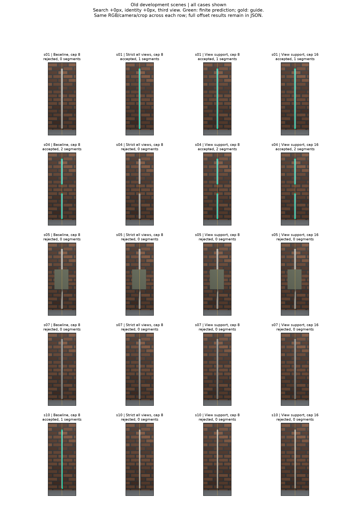
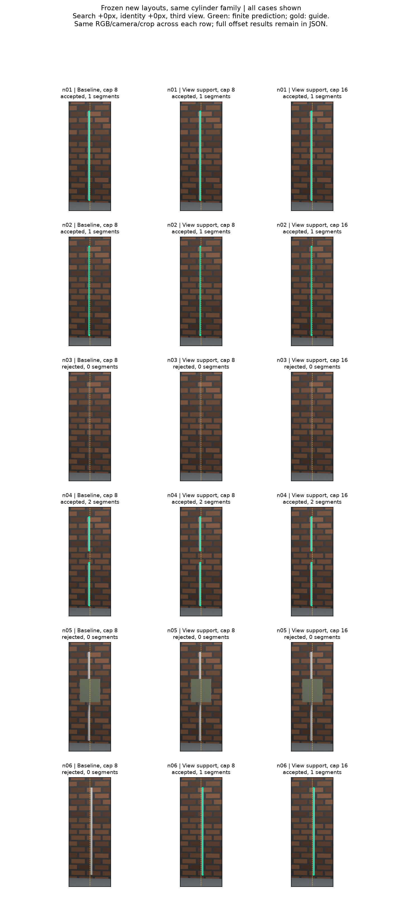

# 2026-09-20：从宽度诊断推进到候选筛选，再检查新布局

今天把上一轮的左右边缘线索做成了实际筛选器。旧开发集先跑严格版，再针对它暴露的整视角拒绝问题做一次视角退出试验；两版的协议、源码、输入、预测和失败结果都留着。随后锁住第二版，生成新相机与几何布局进行配对测试。项目仍在G1方法开发，不把合成圆柱上的结果当成普通照片修复。

## 规则：用像素误差检查一个共同圆柱解释

每个候选仍来自冻结的RGB双边缘、图像线和多视图关联。新增步骤如下：

1. 用该候选全部支持视角的图像线重拟合轴，使用原有固定相机和退化门槛。后续有限段也是这个拟合约定。
2. 计算每个视角左右边缘射线到轴的距离。先分别取中位数，再跨视角/左右侧取中位数，得到一个共同半径。这样长观测不会靠行数压倒短观测。
3. 按该轴和共同半径，精确投影无限圆柱的两个切平面，得到每行的左右轮廓横坐标。
4. 每个视角每一侧至少90%的匹配行须在1原图像素内。至少四个支持视角。1px是当前定位误差假设，尚不是经过实拍校准的置信界；半径是用于筛选的中间量，不能作为恢复的真实表面半径交付。
5. 只在存下的最佳解释与支持度相近的竞争解释之间筛选。仅剩一个才条件式接受；多个继续歧义；原搜索预算不完整时绝不升级成唯一接受。相同匹配索引的重复解释只重拟合一次，不合并不同匹配来凑唯一。
6. 保留原guide身份门和有限段/留一视角几何检查，最终输出轴还要再过一遍轮廓检查。缺测保持unknown，不当作“这里肯定没有杆”，也不把间隙自动连起来。

切平面公式为：相机到轴的垂直距离为d，朝轴的单位方向为u，轴向为v，令w=v×u，则两个单位平面法向为n±=(r/d)u±sqrt(1−(r/d)²)w。图像线是K逆转置乘相机旋转后的法向。解析控制另用射线与圆柱相交判别式的二次方程求切线，避免用同一段投影代码自己证明自己。

这仍是**圆截面轮廓的条件性证据**。非圆截面、弯杆、透明表面不在本版承诺内；一条自洽亮纹或另一根真实圆杆可能通过。几何通过不证明用户目标身份。

## 严格版的回退，和单次视角退出

严格版`rod-cylinder-screen-v1-20260920`要求原来所有支持视角通过。在旧60条件中恢复8次干净杆输出，但上一轮真缺口又被拒。不是轴跑飞：缺口前四个视角通过，+35视角左右通过率只有89.04%和89.37%，低于提前设置的90%。

评价阶段的[逐行ID审计](results/2026-09-20-cylinder-row-audit.json)进一步显示，s04该视角33行像素超限中，32行中心在背景墙、1行在目标上；干净s01的23行超限全部在背景。候选中心线即使很准，也会沿着延长线拾到背景配对。真缺口减少了正确行，背景行的比例就更高。这次审计读了GT，只用于解释，不成为推理特征，也不修改旧预测；中心ID本身仍不证明两侧是轮廓。

第二版`rod-cylinder-support-v1-20260920`保持1px和90%不变，允许**一次视角退出**：初筛后若还有至少四个分别通过的视角，就让失败视角退出轴拟合和有限支持，再重拟合并严格复验所有剩余视角。不递归删视角，不搜索子集直到通过。五视角解析控制确认，坏一个可以保留四视角，坏两个只剩三个就拒绝；退出视角在有限段证据里确实全部unknown。

| 旧60条件 | 正确有限输出 | 错误有限输出 | 拒绝 |
| --- | ---: | ---: | ---: |
| 修复支持后的旧基线 | 4 | 1 | 55 |
| 全视角严格筛选 | 8 | 0 | 52 |
| 单次视角退出＋复验 | 16 | 0 | 44 |

16次来自干净杆和缺口杆**两个物体的重复条件**：各自两个窗口、两档候选、两个身份提示。身份提示16px仍拒。遮挡与高光仍拒绝。候选16档从全部拒绝变为保留这两个正确对象；不能把这个条件计数当独立物体准确率。

干净杆有限段真值到预测p95为0.69–0.78mm。缺口杆得到两段，p95约1.94mm；两端各留25mm保护区后的缺口内部预测接近覆盖为0。该误差比原五视角0.9mm略大，少一个视角有代价。2.5cm容差下两类输出的恢复率和精确率都是100%，不代表端点完全无误差，也不是完整拓扑证明。



固定搜索0、身份0、第三视角，列出旧基线、严格版、第二版cap8与cap16；不按案例挑最好设置。完整JSON保留两种窗口和全部身份偏移：[严格版](results/2026-09-20-cylinder-screen.json)、[视角退出版](results/2026-09-20-cylinder-support.json)。

两版增量推理分别17.34秒和21.62秒，复用了已算好的检测池与关联，**不包含之前的检测/关联耗时**。严格版共读316份保留解释，按匹配索引去重后筛296份；这不是全图全部可能解释的穷举。第二版的设计受严格版开发回退启发，不能把第二版在旧数据上的改善称为盲测。

## 冻结后的新布局

新运行`rod-cylinder-new-layout-v1-20260920`在生成RGB前冻结代码与协议：6个新布局×5个新相机视角，搜索0/8px、候选8/16、身份0/8/16px，共72条件；基线和新增筛选共享完全相同的候选池与原几何关联。相机半径从6.1m变5.4m，高度0.35m、焦距47mm，角度−37/−18/+5/+24/+41度；几何长度、位置、粗细、缺口和遮挡参数均预先写入配置。

| 新布局，每例12条件 | 基线正确／错误／拒绝 | 新方法正确／错误／拒绝 |
| --- | --- | --- |
| n01，半径0.027m普通杆 | 4／0／8 | 8／0／4 |
| n02，半径0.010m较细杆 | 4／0／8 | 8／0／4 |
| n03，半径0.004m，约1.2px宽 | 0／0／12 | 0／0／12 |
| n04，偏移的0.28m真缺口 | 4／0／8 | 8／0／4 |
| n05，改变位置/大小的遮挡物 | 0／0／12 | 0／0／12 |
| n06，空目标旁另一根真圆杆 | 0／0／12 | 0／8／4 |
| 合计72条件 | 12／0／60 | 24／8／40 |

**结果是有恢复收益，但安全性回退；G1不通过。** 正确24次来自3个新布局的重复条件，错误8次来自同一个近邻负例。基线cap8本来就能恢复这三个正例；新增正确输出主要是cap16不再被杂乱竞争解释一起挡住，不能说新约束单独发明了细杆恢复。这里仍是同一个程序化圆柱家族，材质和背景生成器也沿用旧版，不能称为跨独立物体泛化。

正确有限段的真值到预测p95为1.09–1.32mm。普通/较细杆输出长2.05259m，真值2.06m；缺口杆输出两段，总长1.76713m，真值1.78m。在25mm容差下正确输出恢复率与精确率均100%，但缺口端点有偏移：输出间隔大致z=−0.02718至0.25828m，真实间隔−0.03至0.25m。扣掉25mm端点保护后的0.23m缺口内部，仍有0.002m（0.87%）的容差接近覆盖，**不是零**；整段接近覆盖15.71%，主要来自端点容差。输出没有连成一整根，仍不能把接近度指标等同拓扑验收。

n06误收约2.05259m邻杆。核查其五个视角初筛全部通过，没有任何视角被丢弃，说明错误并非视角退出造成。其原图guide残差约4.71/0.17/5.58/9.61/12.38px，4/5视角满足旧12px身份先验，所以上一层门也放行。该物体在几何上确实是圆杆；算法缺的是充分的目标身份输入，而非再多一个圆柱拟合公式。本轮没有事后缩小guide门槛。两版接受结果只能作为条件性几何候选，不能据此自动发布物理目标补丁。

较细正例n02的实际半径为0.010m，筛选用的半径估计约0.0072m；轴误差小，不等于表面半径也准。它还不是最初测试包里的“0.01”设置，模型输入尺度、相机和物体都不同，原始细杆问题不能被这张新图替代。最细n03和遮挡n05仍没有恢复。



[完整72条件配对评分](results/2026-09-20-cylinder-new-layout.json)；[30帧数据契约与有限真值段检查](results/2026-09-20-cylinder-new-layout-pack.json)。独立Blender/Open3D对照共30,700条射线，表面ID不一致为0，最大相机Z误差约2.65µm，最大投影差2.86×10⁻⁵px；这验证的是几何坐标/像素中心约定，不是RGB抗锯齿轮廓精度。四种真值数组、相机、网格与RGB哈希均核过。有限真值段中心取整像素的最小目标/遮挡ID占比99.01%，报告保留取整可能遗漏亚像素几何的限制。

三进程完成从新RGB检测、关联、基线及新方法有限输出共582.4秒，约9分42秒；渲染导出和评分另外计时。所有计划条件齐全、搜索完成，基线与新方法的输入关联SHA逐组一致。新图现已评分，以后只能作为已知回归数据，不能重复标为未见测试。

## 控制、实现边界与复现

[36组解析控制](results/2026-09-20-cylinder-controls.json)覆盖4种半径、两种倾斜与0/0.25/0.5/1px边缘扰动。32个扰动组合条件通过；偏轴、单视角单侧错误、相机平移错误3个控制拒绝；自洽的另一根圆杆通过，明确展示身份局限。亚像素扰动导致左右次序反转的行按不可测丢弃，因此通过只针对留下的测量，不能叫亚像素检测恢复成功。另有[五视角退出控制](results/2026-09-20-cylinder-support-controls.json)。

本轮新增模块`rod_cylinder_gate.py`、`rod_cylinder_support.py`，旧候选池、旧关联与原有限段入口保持不变。冻结运行使用独立脚本，所有写出采用拒绝覆盖；没有删旧实验、扩插件UI、安装新模型。一次`build --no-isolation`因工具环境没有hatchling退出，随后用既有uv离线缓存完成隔离构建，没往旧环境里补装依赖。

复现严格/视角退出开发回放需要本地冻结的`rod-refit-support-v1-20260920`。新布局可以从配置重新渲染，但必须复制协议、换新run_id及输出名，原路径存在时程序会拒绝覆盖。以下为入口，尖括号需要换成新路径：

```powershell
. .\scripts\Enter-CreatorEnvironment.ps1
& backends\da3\.venv\Scripts\python.exe -B scripts/run_rod_cylinder_controls.py --output <新控制.json>
& backends\da3\.venv\Scripts\python.exe -B scripts/run_rod_cylinder_support_controls.py --output <新退出控制.json>
# 开发回放：严格版脚本 run_rod_cylinder_screen.py 或退出版 run_rod_cylinder_support.py
& backends\da3\.venv\Scripts\python.exe -B scripts/run_rod_cylinder_support.py prepare --config <新协议.json>
& backends\da3\.venv\Scripts\python.exe -B scripts/run_rod_cylinder_support.py infer --run-id <新run_id>
& backends\da3\.venv\Scripts\python.exe -B scripts/run_rod_cylinder_support.py evaluate --config <新协议.json> --share-json <新摘要.json>
# 新渲染布局用同样的prepare/infer/evaluate顺序：
& backends\da3\.venv\Scripts\python.exe -B scripts/run_rod_cylinder_validation.py prepare --config <新布局协议.json>
& backends\da3\.venv\Scripts\python.exe -B scripts/run_rod_cylinder_validation.py infer --run-id <新布局run_id>
& backends\da3\.venv\Scripts\python.exe -B scripts/run_rod_cylinder_validation.py evaluate --config <新布局协议.json> --share-json <新布局摘要.json>
```

实际产物目录、输入与源码哈希在每个摘要和prepared文件中；大体积RGB、GT、完整池、预测与缓存留在D盘，Git记录代码、可分享协议、摘要和图表。


本地223项全量诊断通过；随后补上的90%边界回归和其余新增测试，共14项专项在NumPy1和2均通过。核心4项/6子测试、Ruff、148份Python源码与三个隔离CLI边界通过，评测包用uv离线缓存构建成功。两张全案例对比图已实际查看。

下一步先补目标身份的输入/验收协议，再用独立对象、估计相机和真实照片检验几何收益。细杆边缘定位偏差、遮挡情况下的可观测支持也要继续处理。仍不扩插件UI；条件性候选不是正式可撤回补丁。按每周30–35小时估计，完整申请展示版约5–7周，更扎实的研究/工程版8–10周；新负例暴露了真实欠账，今天不靠输出数量上涨把工期硬缩短。
