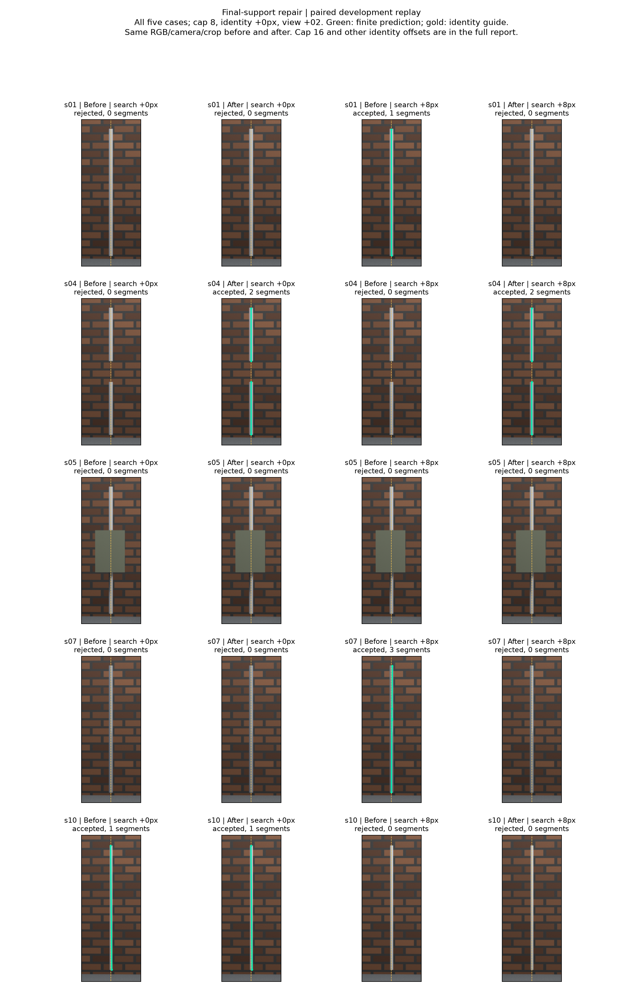

# 2026-09-20：最终支持修复与跨视角边缘宽度诊断

本轮把已确认的支持契约漏洞修掉，并继续推进了一个不读取GT的边缘几何诊断。正式配对运行`rod-refit-support-v1-20260920`，仍使用前一轮5个开发场景的相同观测与相机。没有新增独立物体，也没有将这些条件重新包装成盲测。

## 修复后的实测结果

真缺口s04在cap8、搜索窗口0/8px、身份提示0/8px下都恢复两段；在2.5cm容差下恢复率和精确率均为100%，真值到有限预测的p95距离约0.87–0.90mm。四个条件来自同一个物体的重复对照，不是四个独立成功对象。

| 案例／搜索偏移 | 修复前cap8几何状态／假设数 | 修复后cap8几何状态／假设数 |
| --- | --- | --- |
| s01／0px | 歧义／60 | 歧义／50 |
| s01／8px | 接受／72 | 歧义／64 |
| s04／0px | 歧义／85 | 接受／65 |
| s04／8px | 歧义／109 | 接受／80 |
| s05／0px | 歧义／135 | 歧义／134 |
| s05／8px | 歧义／128 | 歧义／128 |
| s07／0px | 歧义／128 | 歧义／90 |
| s07／8px | 接受／90 | 歧义／86 |
| s10／0px | 接受／103 | 接受／103 |
| s10／8px | 接受／121 | 接受／121 |

cap8的30条件，修复前有限段接受5次：2次干净杆正确、2次高光偏轴、1次错收近邻杆；修复后仍接受5次：4次缺口杆正确、1次错收近邻杆。其余25条件拒绝。cap16的30条件前后都拒绝。**收益和回退并存，不能将条件计数的变化当作跨对象准确率提升。**

干净杆s01/search8的最佳三维模型、匹配记录都与旧版完全相同；改变的是竞争解释从0个增加到1个。因此正确轴仍在候选里，但现有歧义策略取消了最终输出。高光旧误输出被拒绝；遮挡仍未恢复；近邻杆仍被错收2.18843m。这些都没有从报告里删掉。

### 缺口与端点不能混着报

s04真实杆段总长1.84000m，预测总长1.82481m。因此容差内100%不表示端点完全精确。真实缺口长0.36m，两端各留0.025m保护区后，0.31m缺口内部的预测接近覆盖为0；整段缺口在2.5cm容差下有13.33%接近覆盖，来自端点邻域，不能误写成13.33%错误连接。输出本身是两段，未把缺口连成整根。该指标仍是几何接近度，不是完整拓扑验收。



图固定cap8、身份提示0、view_+02；两种搜索窗口和全部五例都展示。绿色为实际输出，黄色为身份提示。未为了图好看挑选每例的最佳配置，未绘制GT来替换预测。完整[60条件与旧结果统一重评分](results/2026-09-20-refit-support.json)保留全部条件。

## 改了什么，怎样保持配对

候选初筛后会做最小二乘重拟合，匹配行可能缩短或变少。修复在重拟合后重新要求至少52行、纵向跨度至少150px，并在排序/去重前执行。只在最终池里删坏项太晚，因为坏项可能已经挤掉近邻的有效解释。

`enumerate_image_line_pool(..., require_refit_support=True)`是修复路径；默认False明确保留旧控制行为，历史实验不偷偷重算。新运行的方法文件要求该标志为True，推理和评价均检查全部最终候选。50个窗口–视角共保留3009条固定采样候选，最终支持违规为0；前8实际388条、前16实际728条，同样全部合格。重拟合后剔除28个行数不足、66个跨度不足的采样假设，这些是去重前次数。

随机种子、1024次抽样、原始像素行、相机、窗口、身份提示、8/16前缀、关联预算和全部评分门槛保持不变。两个指定视图回放旧分支，完整候选SHA与旧实验相等。旧基线的源码快照、方法、输入、预测索引和每个派生文件都有哈希核验；真值仅在独立evaluate阶段读取。旧结果用同一评分函数重算作比较，不要求修复后的结果必须等于旧结果。

原始观测从已冻结的RGB观测池拆出，推理输入不含旧三维预测或GT。不同窗口分到3个进程，输出路径互不共享，完成顺序不会改变候选排序或随机数。此次推理墙钟时间452.72秒，约7分33秒；前一轮为23分9秒。候选集合和旧控制检查的计算方式也变化了，因此这个对比不是纯并行加速基准。

## 继续推进：两条边能否支持同一个杆宽

新增独立模块`rod_radius_consistency.py`，对修复前后全部cap8的最佳解释及竞争解释做诊断，共64个三维假设。它只读取冻结预测、原始左右边缘像素和相机；真值误读阻断开启，没有修改任何已评分预测，也没有启用新的接受门槛。见[诊断记录及源码/输入哈希](results/2026-09-20-edge-radius-diagnostic.json)。

对轴`a+t·v`与相机射线`c+s·r`，在方向归一化后计算最短距离`| (a−c)·(v×r) | / ||v×r||`。平行或最近点位于射线后方时标为无效。若像素边缘确为圆柱轮廓，该距离应接近同一半径；这只是条件性几何关系，图像边缘是否为轮廓仍需验证。

分散度定义为全部有效边缘射线距离的`(p90−p10)/median`；数值越小，越符合共同半径假设。下面使用修复后的候选，展示数据依据而非事后选定门槛。

| 候选 | 相对分散度 |
| --- | ---: |
| s01/search0最佳 | 0.019 |
| s01/search0竞争解释 | 1.007 |
| s01/search8最佳 | 0.015 |
| s01/search8新增竞争解释 | 1.477 |
| s04/search0正确输出 | 0.030 |
| s04/search8正确输出 | 0.028 |
| s07/search8未接受的最佳解释 | 0.543 |
| s10/search0误收近邻杆 | 1.065 |

这支持继续测试左右边缘的联合几何约束：干净杆的正确候选仍在，竞争解释的宽度一致性却差得多。不过小分散度也不能证明用户想要的就是这根杆；另一根真实圆杆完全可能通过，所以目标身份还要单独验证。条纹、非圆截面、亚像素宽度和遮挡也可能破坏圆柱假设。当前数字来自已看过的开发场景，不能用它直接承诺新照片效果。

**下一步决定：保留最终支持检查，测试考虑像素定位误差的左右边缘共同几何约束，再冻结接受/歧义规则做独立对象验证。** 不把一条在开发例上看着顺眼的分散度阈值直接塞进正式接受流程；这轮的64个假设诊断保持纯观察。

## 检查与复现

210项本地诊断、核心4项/6子测试、138份Python源码及三CLI边界通过；新增6项几何回归覆盖解析圆柱切线、偏轴、平行/后向射线、刚体不变性与像素—旋转相机—世界射线完整路径，在NumPy1和2环境均通过。Ruff、评测包构建通过。完整5行配对图已经实际查看，成功、回退和错误接受均可见。

运行需要上一轮本地冻结数据。先复制协议并换新run_id/输出名，旧目录和文件拒绝覆盖。前一轮r1对应Git提交`44eac20`；当前源码已修复，直接拿当前树重评r1会触发其源码冻结检查，这是预期行为。

```powershell
. .\scripts\Enter-CreatorEnvironment.ps1
& backends\da3\.venv\Scripts\python.exe -B scripts/run_rod_support_recheck.py prepare --config <新协议.json>
& backends\da3\.venv\Scripts\python.exe -B scripts/run_rod_support_recheck.py infer --run-id <新run_id>
& backends\da3\.venv\Scripts\python.exe -B scripts/run_rod_support_recheck.py evaluate --config <新协议.json> --share-json <新摘要.json>
& backends\da3\.venv\Scripts\python.exe -B scripts/plot_rod_support_recheck.py --summary <新摘要.json> --output <新图.png>
& backends\da3\.venv\Scripts\python.exe -B scripts/run_rod_radius_diagnostic.py --run-id <新run_id> --output <新诊断.json>
```

项目仍处于G1方法开发，尚未通过。这里的缺口恢复不等同于最初0.01细杆或普通估计相机已经修复。
