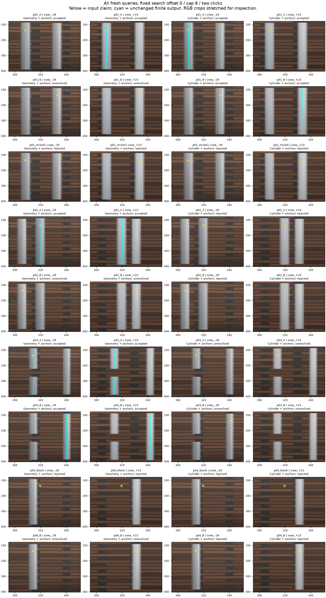
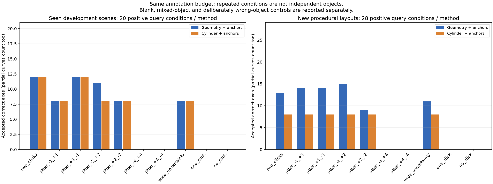

# 2026-09-21：明确点选目标，再比较几何方法

G1继续推进。这次把“用户到底要哪根杆”变成了可检查的输入：在两张原图里各给一个可见前景点。程序已能在一个新双杆布局中，用同一组照片分别选A杆、B杆，混着点两根则不输出。但同预算的普通几何对照在其他新布局恢复更多，点偏后也出现了假杆。**G1仍未通过，不能宣布身份问题或细杆修复已经解决。**

本轮完成旧开发560项、新布局720项，共1280项条件回放。这些包括两种方法、窗口、候选上限和重复点扰动，绝不是1280个独立物体。

## 增加了什么输入

原来的粗guide只圈定搜索区域。新增每个anchor包含原图view_id、RGB SHA256、像素位置及横纵不确定范围，含义是“这个可见位置属于我选的物体”。需要两个不同相机中心的视图；两点可以在杆的不同高度，不要求是同一个三维点，不用点击三角化或重拟合轴。

规则在新场景渲染前冻结：对既有候选先计算有限杆段，再检查点击的不确定矩形是否完全位于该候选选中的实测边缘带和有限段投影范围。缺行、被剔除的视图、只部分重合都保持unknown；与证据相斥则否决。只有一个候选完全支持、没有另一个尚可能的候选时才接受。点不够或搜索未完成不发布，不吸附到最近的杆，也不为了点击移动端点或填缺口。当前实现沿原始整数图像行检查，沿用直杆/逐行观测的适用范围，不支持任意方向的曲线分割。

比较两条路线：普通几何候选＋anchors，以及圆柱筛选候选＋相同anchors。两边复用相同RGB检测池、相机、搜索窗口与原关联；anchors替代旧粗guide身份门，搜索ROI不变。历史只给粗guide的结果属于不同信息预算，不能直接作为新增圆柱方法的功劳。

标注由助手查看RGB放大网格后记录，没有用GT轴投影或预测坐标选点；不是人类用户实验，也没测人工耗时。旧6布局已经看过，只作开发回放。新4布局仍由同一个圆柱/材质/背景生成器产生，准确相机已知，不能称独立资产泛化。新图的两个标注视图预先固定为−29和+23度，没有按筛选后留下的视角重新挑图。

## 旧开发回放：相同点击预算下都能受益

6个旧布局×2窗口×2候选上限，每种方法24个主条件。其中5个正例布局，1个空目标；另保留故意点到邻杆的错误输入对照。正常两点、不扰动时：

| 方法 | 正确轴输出 | 正目标未输出 | 空目标未输出 | 主条件错误输出 |
| --- | ---: | ---: | ---: | ---: |
| 普通几何＋两点 | 12 | 8 | 4 | 0 |
| 圆柱筛选＋两点 | 12 | 8 | 4 | 0 |

两边都拒绝了n06空位置的前景主张。但正确12次并非同一批：普通版保住普通杆、较细杆、部分缺口和部分遮挡；圆柱版保住普通杆、较细杆与所有4个缺口条件，却把遮挡全拒。

普通版遮挡n05有两次正确轴输出，真实杆长2.06m，实际输出约1.502m，25mm容差内恢复率75.63%、精确率100%。真值到预测p95约223.6mm，说明隐藏部分仍缺失；不能只凭轴正确就写“遮挡恢复成功”。最细约1.2px宽的n03两版仍全拒。其余正确输出的误差与上一轮相同，新增身份层没有修改几何。旧缺口保护区内的容差接近覆盖仍是0.87%，没有因为改名变成零。

错误输入对照很明确：两次都点到另一根真实杆，普通版误收2/4，圆柱版误收4/4。它们都无法从一致的错误主张猜到用户心里另一个目标。完整十档扰动中，该错误输入产生普通版12次、圆柱版24次误收；全部保留在评分与审计里，未混进主条件计数。

[完整560项评分](results/2026-09-21-foreground-development.json)。

## 新布局：成功的切换，和明显的回退

新源运行`rod-foreground-scenes-v1-20260921`：4场景、每场景5图，640×480，角度−29/−11/+7/+23/+38度，相机半径5.8m、高度0.12m、焦距49mm。全部参数与源码先冻结。对这些相同照片提出9个查询：7个真实物体查询、1个空位置查询、1个混点对照；每查询4组窗口/候选设置、两种方法、10档点击配置，共720项。

下表为正常两点的4组设置，数字是正确输出次数。其他条件均未输出，没有隐藏错误输出。

| 查询 | 普通几何＋两点 | 圆柱筛选＋两点 |
| --- | ---: | ---: |
| p01_A，分开双杆的A | 4/4 | 4/4 |
| p01_B，同照片的B | 0/4 | 4/4 |
| p02_A，深度重叠双杆的前杆 | 2/4 | 0/4 |
| p02_B，同照片的后杆 | 0/4 | 0/4 |
| p03_A，有邻杆的真实缺口 | 1/4 | 0/4 |
| p03_B，同照片的完整邻杆 | 4/4 | 0/4 |
| p04_B，明确选中原空目标旁的真杆 | 2/4 | 0/4 |
| 正查询合计 | 13/28 | 8/28 |

另有空位置查询，两版均4/4不输出；p01混点对照，两版均4/4不输出。正常两点的主条件共32项/方法，均零错误输出；样本少且反复使用相同对象，不代表已证明安全性。

圆柱版在p01上完成了真正的目标切换：RGB、几何候选均相同，输入点落在哪根，输出就对应哪根；普通版B仍歧义。另一方面，普通版在p03上可以切换完整杆与缺口杆，圆柱版反而两个都不输出。因此不能得出“圆柱更好”或“直接删掉圆柱”这样的一刀切结论，也没有按GT把两条路线的优点拼成一个虚假的新方法。

正常两点的正确输出，25mm容差内恢复率/精确率均100%；普通版真值到预测p95范围约2.66–16.61mm，圆柱版约2.66–4.42mm。这个宽容差不等于毫米级全通过。新缺口p03_A仅普通版搜索0/cap8成功，保持两段，预测间隔z约−0.2241到0.1217m，真实间隔−0.22到0.12m；25mm端点保护后缺口内部的容差接近覆盖为0，整段为12.94%。这是有限几何指标，尚非完整图拓扑验收。



图中固定搜索0、cap8、未扰动两点，黄叉是输入，青线是实际有限输出；所有查询都展示，没有为每例挑最好参数。裁剪按同样范围展示并拉伸便于查看，原图未改。

[完整720项评分](results/2026-09-21-foreground-new-queries.json)。

## 点偏与拒绝原因：不能只留成功图

十档配置为原始两点、两点分别±1/±2/±4像素的两种方向、扩大不确定范围至±1.5px、一点、零点。其余默认不确定范围±0.5px。点击横向移动后不会再调回预测附近。



图中只画正确轴输出，部分曲线也计入；空位置、混点及故意选错物体另报。新布局±1px时普通版14次正确、圆柱版8次；±2px两种方向普通版15/9次、圆柱版8/8次；扩大不确定范围普通版11次、圆柱版8次。小扰动偶尔增加输出恰好说明边缘选择仍敏感，不能事后挑最好一档作为新结果。零点或一点均不输出，是输入契约，不是自动识别成功。

±4px时两版正确输出均为0；普通版额外出现1次错误轴：p02_B、搜索8/cap8、第一点+4第二点−4。它输出约1.966m的虚构中间杆，离请求后杆约112mm，曲线恢复率和精确率均为0。评价后的ID审计确认两次偏点都已落在墙上（ID100），候选边缘带却横跨两杆之间的空隙并包住它们。圆柱版在该条件拒绝。**“点击位于检测带内”仍不等于那里真有目标物体。** 本轮没有据此修改已冻结规则。

新缺口和邻杆的圆柱拒绝也不是轴必然错误。审计定位到p03两个候选都退出了第一个标注视图−29度，该视图有限支持为空，因而anchor保持unknown；p04搜索8的候选有同样问题。不能一边说这个视图不能支持几何，一边为提高分数又偷偷让它支持身份。下一版可以研究独立的局部身份观测，或明确请求新的有效视图，但必须单列新增标注成本，再做冻结验证。

评价审计确认未扰动正查询的点击中心都落在各自目标ID上；混点是ID1/ID2，空位置是墙，故意错点是另一根ID2。该审计在推理和评分后单独运行，不回写标注，也不喂给方法；像素中心ID不能证明抗锯齿RGB区域纯度。

[全量汇总](results/2026-09-21-foreground-summary.json)、[点击可见性与失败审计](results/2026-09-21-foreground-audit.json)。

## 工程检查、隔离和复现

新增独立模块`rod_foreground_identity.py`与冻结回放入口`run_rod_foreground_identity.py`，旧推理源码和旧结果均未覆盖。标签、目标surface ID只放评价协议；推理只读RGB来源、相机、候选观测与anchors，GT读访问阻断继续启用。评价检查每个接受结果与先前有限候选逐字哈希一致，验证完整query/window/cap/method/profile组合。几何不会随点击改变。

新20帧RGB、深度Z、射线距离、表面ID、目标可见mask、相机、网格哈希已核对。[数据契约检查](results/2026-09-21-foreground-pack.json)通过；20,800条独立Blender/Open3D射线ID零冲突，最大Z误差2.825µm、投影差2.88×10⁻⁵px。这检查坐标和像素中心约定，不证明RGB抗锯齿轮廓定位精度。

新RGB检测和两种几何关联共467.1秒；旧/新身份回放增量分别76.6/100.1秒，三进程复用缓存，均不含父运行检测关联与渲染时间。未重装环境，缓存、完整候选、GT和失败记录留D盘。

本地全量238项诊断通过，后补视角退出身份回归后15项新增专项在NumPy1/2均通过；核心4项/6子测试通过，Ruff、隔离CLI边界和评测包离线构建通过。两张报告图已经实际查看。后续CI以GitHub当前提交结果为准。

本机冻结运行如下，路径已存在时拒绝覆盖：

- `rod-foreground-development-v1-20260921`：旧开发输入回放。
- `rod-foreground-scenes-v1-20260921`：新RGB/GT及父几何。
- `rod-foreground-new-queries-v1-20260921`：新照片上的多目标查询。

新环境重做应复制配置、换新run_id和输出文件；先用`run_rod_cylinder_validation.py prepare/infer`生成父数据，再从RGB记录并冻结对应SHA的anchors，随后用`run_rod_foreground_identity.py prepare/infer/evaluate`。`--config`与`--run-id`须显式传入。开发回放依赖9月20日冻结父运行。配置可分享，体积较大的父池和图像尚留本机；公共最小复现数据包仍是交付欠账。

```powershell
. .\scripts\Enter-CreatorEnvironment.ps1
& backends\da3\.venv\Scripts\python.exe scripts/run_rod_foreground_identity.py prepare --config <新协议.json>
& backends\da3\.venv\Scripts\python.exe scripts/run_rod_foreground_identity.py infer --run-id <新run_id>
& backends\da3\.venv\Scripts\python.exe scripts/run_rod_foreground_identity.py evaluate --config <新协议.json> --share-json <新结果.json>
```

## 接下来怎么推进

依据本轮结果，保留普通几何与圆柱的同预算对照，不把圆柱筛选设成唯一总门，也不按测试真值挑分支。下一轮优先处理几何视角退出与身份输入的分离，以及跨两杆空隙的假边缘带；用新物体/保留视图检验，别继续在这几张图上磨到全过。今天的新布局从此属于已知回归集。

G1收口仍差独立对象上的重复收益、共享估计相机下的可用性、共同曲线读取器和第一版实际可撤回补丁；实拍、完整对照和交付流程继续欠着。按每周30–35小时，展示版仍估5–7周，研究与工程更扎实的版本8–10周。今天缩小了方法选择的不确定性，但还不足以凭空缩短这个工期；这些是项目预算，不是高校录取或“卓越”的保证。
