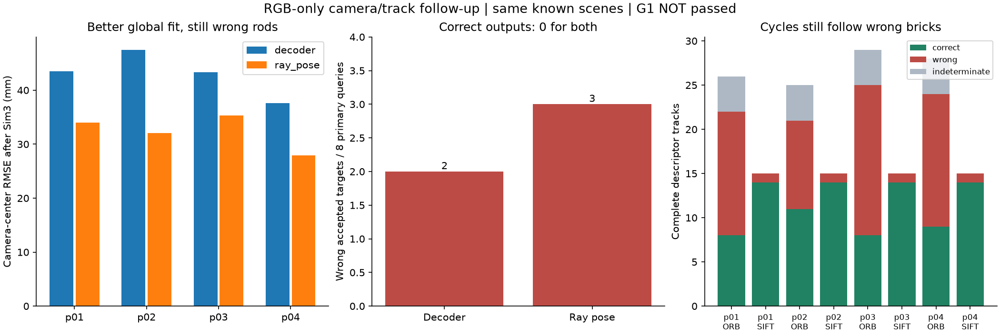

# 2026-09-22继续：换相机分支没救回来，先把可靠对应的入口立住

本轮完成同图DA3相机分支对照、跨视图特征轨迹审计，以及带正反例的相机优化前置检查。**没有得到新的正确杆，G1仍未通过。** 新价值是排除了“换个现成相机头就行”的简单方案，明确当前砖墙图缺少哪些可用观测，并修掉我们自己验证划分中的一个问题。

## 1. 同一批20张图片，换ray pose会怎样

运行`foreground-ray-pose-v1-20260922`沿用上一轮全部RGB、二维观测、9查询两次点击、候选上限和杆规则，只把DA3的`use_ray_pose`改为true。使用已锁定本地模型及源码，4组全部重新推理，未传入真实相机。上游本地代码明确区分camera decoder与ray pose；这是现成模型对照，不是自研相机方法。

两组运行的depth数组逐值相同（最大差0），相机不同，因此重新反投影生成4份新快照，共3,810,240点；没有给旧点云换相机标签。新18个补丁、36份启用/撤回视图保存并重开，基础点和来源ID逐字节不变。58份Schema、5120次来源像素抽查通过，最大回投影差约0.0000214px。坐标链正确不等于相机物理精确。

每方法8个主查询（7个正目标、1个空位置），另有混点控制；两种相机共36条查询/方法结果。正确仍要求25mm容差下恢复率和精确率都≥90%。

| 相机 | 普通：正确 / 错误接受 / 无输出 | 圆柱：正确 / 错误接受 / 无输出 |
| --- | --- | --- |
| 原camera decoder | 0 / 2 / 6 | 0 / 0 / 8 |
| ray pose | 0 / 3 / 5 | 0 / 0 / 8 |

ray pose接受p01_A、p01_B、p02_A，GT→曲线中位偏差21.50、21.00、21.15cm，三者恢复率/精确率均为0。p01混点仍拒绝；圆柱部分变为unresolved，但都无输出。不能把接受更多写成恢复更多。

相机中心共享Sim3的RMSE从43.49/47.49/43.33/37.56mm降到34.00/32.04/35.30/27.89mm，局部杆仍错误。再次说明不能用全局相机残差代替细结构验收。GT仅在评价时参与对齐与打分，没有按GT逐目标挑相机分支。

## 2. 三张图都认成同一个点，就可信吗

`foreground-tracks-v1-20260922`只读相同20张RGB，中心guide两侧64px以外提ORB/SIFT，固定2000特征和0.75双向比值匹配。排除的是关键点中心，描述子覆盖范围可能跨入guide；没有GT分割，也没使用模型深度/相机筛选匹配。全部10视图对×2检测器×4场景，共80对。

新模块要求至少3视图完整互相匹配，不能仅靠链式连接；同一连通组中出现一张图的两个点时，整组拒绝。三角闭环、完整轨迹、被拒绝组均保留。生成后才用独立网格射线做双向表面重投影核验：两方向可见且≤2px为正确；至少一个可见方向>5px为错误；其余保持未知。

| 检测器 | 原双向匹配边 | 完整轨迹 | 正确 | 错误 | 未知 |
| --- | ---: | ---: | ---: | ---: | ---: |
| ORB | 5301 | 108 | 36 | 56 | 16 |
| SIFT | 691 | 60 | 56 | 4 | 0 |

这是同背景四布局的重复轨迹记录，不是168个独立物体，也不能当作真实照片成功率。SIFT每场景15轨迹，其中14正确、1错误，但最侧面视图仅参与1–2条，覆盖严重不足。ORB中的错误轨迹即使闭环，也可能一直沿着错误的砖块走。未将这些匹配喂给优化器。

## 3. 正对照发现的划分问题，以及新版本修正

先冻结`track-image-controls-v1-20260922`，生成15张解析RGB：独特纹理单平面、独特纹理双深度平面、重复纹理双深度平面，各5视角。相机角度、大小、镜头和guide与当前诊断一致。图像通过精确透视投影生成，评价用解析射线/平面交点，RGB推理不读这些几何答案。它们是人工提供好观测的机制控制，不是新杆资产、Blender实拍或方法收益。

第一版划分将任一视图中共享64px格子的轨迹合并分组，再按固定哈希分训练/验证。这样没有共享格子，却在密集正确轨迹中形成大连通组：单平面SIFT的797条全部落到训练；双深度831条中830条落到验证。这是我们自己的划分缺陷，原运行完整保留。

另起`foreground-track-bands-v1-20260922`与`track-image-control-bands-v1-20260922`。固定所有观测的y格子≤1才进验证（y<128），全部≥3才进训练（y≥192）；中间一格及跨区域轨迹不参与F/H拟合。没有重抽直到比例好看，也不按残差/GT换区。**排除的轨迹仍计入完整物理核验，不能靠排除给正确率美容。**

重跑后核对14组完整匹配图、特征坐标和RGB哈希全部与旧版一致，物理评分沿用旧冻结结果；新版本只改变拟合子集。训练/验证在所有视图均不共享格子。以下是已看过的开发回放，不称新盲测。

| 解析RGB / SIFT | 全部轨迹的正确 / 错误 / 未知 | 新训练 / 验证 / 排除 | 前置状态 |
| --- | --- | --- | --- |
| 独特纹理单平面 | 786 / 1 / 10 | 484 / 168 / 145 | 平面解释成立，不进入校正 |
| 独特纹理双深度 | 811 / 2 / 18 | 470 / 194 / 167 | 有资格继续校正实验 |
| 重复纹理双深度 | 0 / 1 / 0 | 1 / 0 / 0 | 证据不足 |

双深度SIFT每视图训练238–401条、验证89–169条；6对F通过验证，其中4对满足非平面诊断，达到事先固定的每视图16/8轨迹、至少3对非平面验证要求。单平面10对都有平面解释；重复纹理连最基础的数量都不够。ORB各控制仍不满足完整入口；重复纹理ORB的12条完整轨迹全部错误。

当前4个杆场景、两种检测器在新版下也全部证据不足。前置检查能在正对照放行、在这些反例拒绝，**但放行仍不是对应准确性或相机标定保证**：双深度正例仍有2条错轨迹，需要后续鲁棒优化和保留观测核验。

## 4. 工程检查与边界

新增13项专项在NumPy1.26/2环境通过；包含图冲突、错误闭环、密集划分、解析射线、以及新进程内GT/模型几何误读阻断。全量诊断结果记在当日日志。175份源码边界、Ruff、实验包离线构建通过。Python audit hook用于发现误读，不冒充操作系统隔离。

ray pose几何与补丁阶段74.75秒；旧场景轨迹15.35秒、解析控制27.70秒；新版划分重跑9.92/13.68秒。都是本机单次阶段计时，不是端到端速度或加速结论。所有输入、失败版、模型结果、大数组与缓存留D盘；本轮不改旧冻结源码，不扩UI。

## 5. 下一步怎么做

1. 先在双深度正对照检验带外点防护的相机校正，留出观测评价，保留原相机及未优化结果。通过入口不代表可以跳过这个验证。
2. 当前杆图的纹理对应不足。下一批可控杆数据需要独特、静止且有深度变化的参考表面；采集条件变化应作为独立变量报告，不能拿换背景的收益冒充同输入算法收益。
3. 无GT校正成立后，再形成一致的新相机/深度/点快照，并回到杆几何、共同读取器、独立对象验收。真实照片修复尚未成立。

G1未通过。9月27日仍为冲刺检查点，剩余25–40有效工时暂不下调；可靠对应与校正尚未跨过，不能因为多了测试数量就宣布进度接近100%。见[ADR0012](../decisions/0012-correspondence-availability-before-camera-optimization.md)。

## 6. 复现

先执行`. .\scripts\Enter-CreatorEnvironment.ps1`，复用DA3环境运行。下列ID均已完成，入口拒绝覆盖；新运行使用新配置/run_id/分享输出。

- ray pose：`run_foreground_estimated_pilot.py prepare --config configs/foreground_ray_pose_v1.json`，之后`predict / infer / evaluate --run-id foreground-ray-pose-v1-20260922`；evaluate另指定新`--output`。
- 旧场景轨迹：`run_foreground_tracks.py prepare / infer / evaluate`，配置`foreground_tracks_v1.json`。
- 解析控制：`run_track_image_controls.py prepare / infer / evaluate`，配置`track_image_controls_v1.json`。
- 新版旧图：`run_foreground_track_bands.py prepare / infer`，配置`foreground_track_bands_v1.json`。
- 新版控制：`run_track_image_controls.py prepare --config configs/track_image_control_bands_v1.json`，之后用`run_foreground_track_bands.py infer --run-id track-image-control-bands-v1-20260922`。
- `report_camera_followup.py`核验5个新运行、旧来源和精确图回放，输出新版划分与沿用物理评分的关联。新版不调用旧evaluate，因为旧版train标签不区分隔离带轨迹。

原始分享结果：[ray pose](results/2026-09-22-foreground-ray-pose.json)、[80对轨迹](results/2026-09-22-foreground-tracks.json)、[解析RGB控制](results/2026-09-22-track-image-controls.json)、[核验及新版划分](results/2026-09-22-camera-followup-summary.json)。逐边射线证据和原始RGB/特征坐标在D盘冻结运行，Git只收代码、配置、图与摘要。
