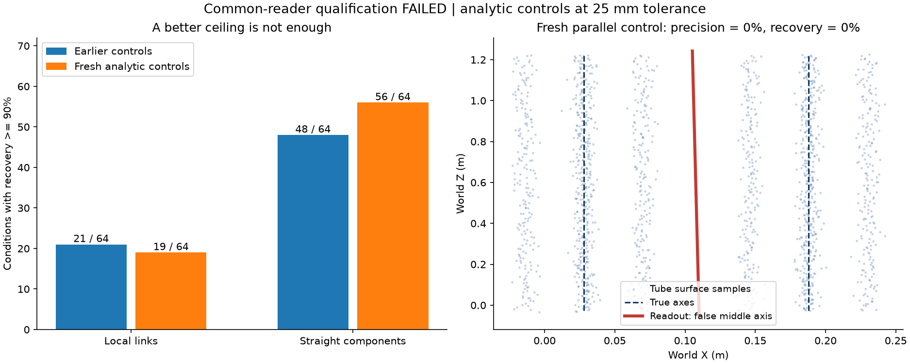
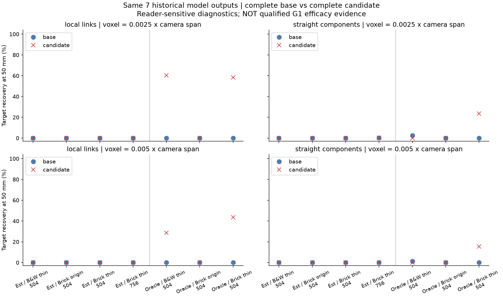

# 2026-09-22：真实基础点、可撤回补丁与共同读取器

今天补上了一个实际工程闭环：把7份历史DA3输出中的 **5,821,200个有效点**存成有身份的快照，应用旧算法产生的有限杆段，保存、撤回并重新打开。原点和来源ID均可精确恢复。与此同时，两版共同读取器都暴露出足以影响结论的缺陷，**G1仍未通过**。

本轮是工程接线与评价工具验证。没有新增身份算法，没有把9月21日前景点方法接入新基础模型，也没有新增独立物体的成功证据。

## 1. 固定输入和运行边界

- 输入：`rod-evidence-dense-v1-20260916`全部7份预测及其冻结的`paired_full`候选；4份估计相机，3份特权真实相机。仍是同一历史资产的材质/尺度/分辨率条件。
- 每份快照保留所有有限、正值的原生深度像素，不按置信度删点。6份各705,600点，756分辨率一份1,587,600点。
- 稳定点ID是`(frame_index, row, column)`，绑定图像SHA、预测SHA、帧顺序、坐标系和单位；预览数组下标不作为身份。
- 估计相机使用其原生整数像素中心；oracle相机的K主点减0.5后用于同一整数索引反投影。独立投影审计见第6节。
- 推理输入、产物和评价GT分别放在D盘的`data/inputs`、`.runtime/experiments`、`data/eval_gt`。推理阶段开启GT文件读取阻断；这是误读防线，不是恶意代码安全沙箱。
- oracle输入本来含真实相机，单独标为特权条件；“推理未打开GT目录”不意味着oracle没有特权信息。

| 运行 | 用途 | 状态 |
| --- | --- | --- |
| `g1-point-patch-v1-20260922` | 第一版点补丁+局部连接读取器 | 完整保留源码快照和84行评分 |
| `g1-point-patch-v1-20260922r2` | 修正保存开关类型与目录名边界 | 当前首版入口；几何、身份和84行评分与原版完全相同 |
| `g1-point-patch-components-v1-20260922` | 第二版连通分量读取器 | 相同7份完整基础/候选，各84行评分 |

原始r1接受字符串开关，且写入端允许读取端不接受的目录名。这两个问题在r2前修正，旧运行不覆盖。历史候选本身也包含已知错误，接进补丁不等于重新认证它们正确。

## 2. 实际补丁做到哪一步

`point_patch.py`实现了独立的 **0.1点快照试行协议**，配有[JSON Schema](../../schemas/pilot/point-patch-0.1.schema.json)及[保存视图Schema](../../schemas/pilot/candidate-view-0.1.schema.json)。这是已物化点数组的工程实现；架构中完整的depth-backed `BaseSnapshot` / `PatchResult`、正式任务入口和Blender操作仍未完成。

快照和补丁分别保存，补丁只能引用精确匹配的快照、坐标系和单位。数组哈希、稳定ID、有限坐标、接受证据与改动的逐项覆盖都要校验；错基底、未知点ID、拒绝证据授权新增、被改动的数组或半成品包会失败。新目录独占，最终manifest最后发布。

本次真实模型回放的抑制列表全为空，完整候选是“全部原点+全部历史接受杆段”。4份估计相机输出0新增段；oracle黑白细杆、砖墙细杆、砖墙原尺寸分别新增3、5、10段。未支持的目标保留原因，记为`no_supported_change`，其完整候选等于基础结果，照常评分。

抑制真实来源ID的装配语义用解析测试验证；**还没有算法在实际模型上决定哪些点该被抑制**。撤回和保存重开已在7份真实快照上验证，但未宣称Blender文件保存/撤回已实现。

## 3. 两版读取器用同一把尺子，但尺子仍不合格

两边都先把新增曲线采样成点，再与原点合并，走同样的固定世界体素网格。相同输入RGB guide条带的并集、至少3个视角投票，限定共同评价区域；它不随候选和GT变化。保留全部基础点与限定评价区域是两个不同操作。

旧guide是历史协议输入，部分来源有理想投影先验，相关限制沿用旧报告。本轮不把它说成新的人类盲标。GT仅用于最后评分；估计相机使用基础相机确定的一次Sim3，基础和候选共享，oracle使用恒等变换。

两个读取尺度均预先固定为基础相机跨度的0.0025和0.005。评分容差2/5/10cm、弧长采样5mm，7任务×2尺度×2完整结果×3容差=84行/读取器。表中的5cm是便于展示的中间容差，不是看完结果再挑的G1通过门槛。

第一版`local_links`使用局部PCA和互惠方向连接，容易读出轴线而漏掉有厚度和噪声的圆柱表面。第二版`straight_components`按占据格子的连通分量拟合主轴，再输出实际占据的轴向区间。它改善了圆杆表面读取，却会把邻近双杆合成假轴，还对基础噪声污染敏感。

### 圆柱上限控制

先对旧4种解析布局（直杆、斜杆、缺口、平行杆）做64条件控制；第二版设计受到这些结果影响，属于开发。随后固定另一组位置、方向、半径、噪声与体素参数，再做64条件，每版读取器都评分，共256行。它们仍是解析条件，不是128个独立物体。

| 条件 | 局部连接：恢复率≥90% | 分量主轴：恢复率≥90% | 分量主轴：非空精确率<90% |
| --- | --- | --- | --- |
| 旧开发64条件 | 21/64 | 48/64 | 1/64 |
| 新解析64条件 | 19/64 | 56/64 | 1/64 |

两次低精确率都来自粗网格、带噪声的平行圆杆：输出一条不存在的中间轴，精确率和恢复率均为0。新条件的杆半径42mm、轴间距160mm、噪声σ=4mm、体素36mm。恢复均值虽提高，误造结构不能藏在均值后面。

另外，完美无噪声直线也出现数值分段：51个连续世界格子，投影相邻距离最大`0.020000000000000018m`，再做`floor(t/voxel)`后出现9处空档。诊断性十位小数舍入消除了空档，但**尚未修改冻结读取器**；不能把这个舍入试探说成已验证的通用修复。

分量版缺口控制的保护区“接近覆盖”最大值，旧条件6.67%、新条件17.5%。输出仍有两段，部分误差来自端点和网格尺度；这不是已测得的拓扑桥接率，也不能写成“缺口完全零污染”。

## 4. 真实模型回放：结果严重依赖读取器

下表为5cm容差，细/粗读取尺度依次列出。`R`为GT中心线恢复率。两版都使用完整基础和完整候选。

| 相机及条件 | 局部连接：基础R→候选R | 分量主轴：基础R→候选R |
| --- | --- | --- |
| 估计相机4条件 | 全部0→0；没有新增段 | 756细尺度0.26%→0.26%，其余0→0；没有新增段 |
| oracle黑白细杆 | 0→60.27%；0→28.52% | 2.56%→0；1.25%→0 |
| oracle砖墙细杆 | 0→58.47%；0→43.42% | 0→23.68%；0→15.42% |
| oracle砖墙原尺寸 | 两尺度0→0 | 两尺度0→0 |

局部连接版oracle细杆候选的非空精确率均100%，但该读取器会漏圆柱表面，所以这些数字不能直接证明候选优越。分量版oracle砖墙细杆候选的细/粗精确率分别73.77%/100%，错误读出弧长0.6239m/0m；细尺度基础本来就有0.6239m错误读出。它是**完整读出错误长度**，不是算法“新增错误长度”。

分量版oracle黑白细杆加曲线后，细尺度连通分量数由93变85，宽度拒绝数由2变3，最终段数由2变0；粗尺度也由1段变0。可确定的是新增点改变了连通结构和拒绝结果；“新增轴与基础噪声连到一起，导致整团拒绝”是与诊断一致的解释，尚未逐分量追踪证明。

估计相机仍全部无修改，不掩盖基础中的错误读出。例如分量版黑白细杆细/粗尺度错误长度0.9151m/3.0237m。全部真实回放的缺口保护区接近覆盖为0，也不抵消大量漏读问题。空结果精确率保留`null`，不填100%。

## 5. 由结果决定下一步

1. 局部连接版保留为诊断，不再作为唯一主评分。第二版也未达到读取器资格要求。
2. 下一读取版本先修数值分段，再处理横截面多峰/多杆分解与局部污染。不同轴不能只因格子相连就合成一条线；新增轴附近的噪声也不能触发整团“一票否决”。这是假设，需先用今天的反例验证。
3. 已看过的解析控制只能做回归。新读取器冻结后再生成其他几何、距离、噪声和网格相位条件，双方完整重跑；不按哪个读取器让候选好看来选结果。
4. 身份算法仍需处理9月21日跨杆暗带、视角退出后的未知，以及一致错点邻杆；禁止通过“黑杆不算杆”这类临时规则绕开问题。
5. 把稳定的当代身份方法接到实际DA3快照，完成不同对象、估计相机、相同人工输入预算的朴素对照；这些才构成G1方法证据。

## 6. 检查、成本和复现

- 核心测试16项，另15个子测试；全量实验诊断253项通过。14项读取器测试在NumPy1.26和NumPy2环境均通过。测试通过没有覆盖掉本报告中的算法失败。
- r2和分量版56份快照/补丁/保存视图JSON通过Schema；所有冻结源码副本及当前版本哈希核验通过。
- 两次运行共71,680次来源像素投影核验（同7任务重复，不是独立新样本），最大误差约`3.98e-13px`。它核验模型点与其原生像素ID对应，不证明估计相机物理正确。
- 逐字节撤回检查、保存重开、输入/产物哈希、全部计划任务与双方尺度完整性均通过。r1/r2全部84行指标和几何身份相同。
- r1/r2/分量版缓存回放分别约63.71/33.89/21.16秒，3进程；不含历史DA3推理、评分、人工输入和照片准备。是单次不同缓存状态记录，不能宣称统计加速比。未新增峰值资源测量。
- Ruff、源码边界检查和核心/评价包离线构建通过。代码、协议、汇总与图进入Git；完整数组、源码快照和缓存留D盘。

原始结果：[r1](results/2026-09-22-point-patch.json)、[r2](results/2026-09-22-point-patch-r2.json)、[分量版](results/2026-09-22-point-patch-components.json)、[首版上限](results/2026-09-22-common-readout-ceiling.json)、[配对上限](results/2026-09-22-common-readout-components.json)、[汇总与数值审计](results/2026-09-22-point-patch-audit.json)、[完整性审计](results/2026-09-22-point-patch-integrity.json)。

命令和协议边界见[复现说明](../point-patch-pilot.md)；本周安排见[日志](../journal/2026-09-22.md)。
