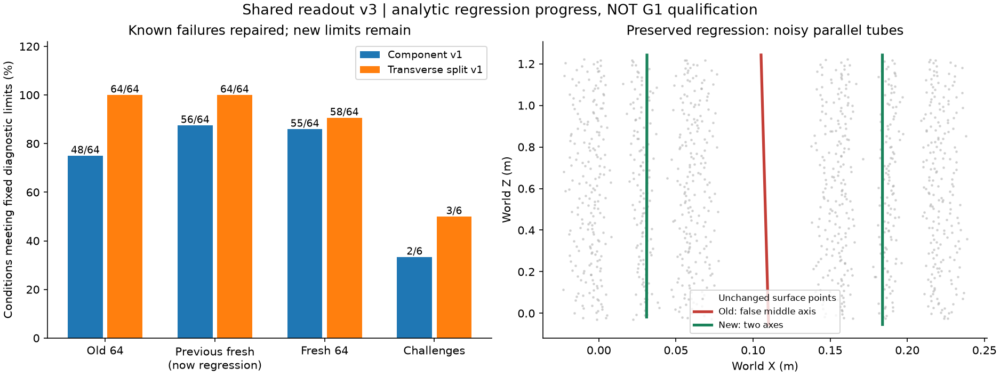
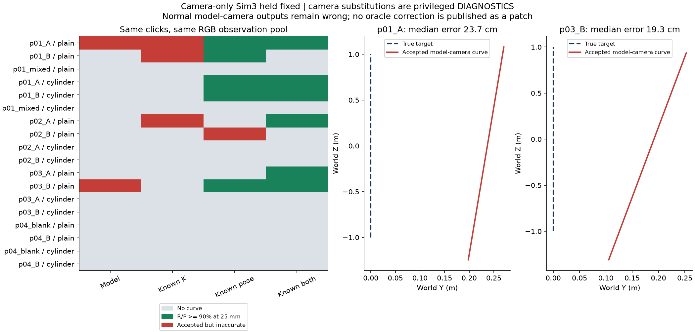

# 2026-09-22加推：修读取器反例，接估计相机，再拆开误差来源

本轮继续推进了两条工程链：第三版共同读取器修掉已知假断裂与两组假中轴；前景身份方法也接上4份新DA3预测、真实基础点与18个可撤回补丁。但估计相机下两个被接受的输出都严重偏轴，**G1仍未通过**。

最有用的新结论来自相机替换诊断：单换真实内参没有得到正确输出，换真实位姿后出现改善。因此下一步优先检验位姿与内参的联合误差、可用的校正和不确定性处理，而不是继续放宽杆的接受门槛。

## 1. 共同读取器的第三版

新模块`common_readout_split.py`保留旧版不动，改了两处：

- 用相邻轴向投影的实际距离判断空档，代替再次`floor(t/voxel)`。浮点边界不再制造断口；分辨率内的小缝仍不可判别。
- 横截面明显拉长时尝试两组分解，检查分离距离、组内数量、轴向持续重叠和子轴方向。若一个圆已经能解释横截面，先阻止硬拆；这项圆拟合只用作分组检查，并未据此修正半边表面的轴心。

所有输入仍先变为同一个固定体素占据集合。基础点和新增曲线没有不同待遇；GT与案例标签不进入读取器。

运行`common-readout-split-controls-v1-20260922`先冻结源码、配置和198份点数组，真值单独保存在`data/eval_gt`；推理只读匿名编号、点数组和读取尺度。第二版/第三版配对推理，共396行评价。

正例预定标准：25mm容差下恢复率、精确率均≥90%。两个负例要求不输出曲线。它是解析诊断标准，不是G1整体通过标准，也不是错误连接率。

| 条件 | 第二版 | 第三版 |
| --- | ---: | ---: |
| 旧开发64条件 | 48/64 | 64/64 |
| 上轮新条件，现只作回归 | 56/64 | 64/64 |
| 本轮新64条件 | 55/64 | 58/64 |
| 预先声明的6个挑战 | 2/6 | 3/6 |

新64条件中6次未达标均在17mm体素、60mm半径附近：四体素横向上限约68mm，加噪声和网格中心偏差后拒绝了完整杆或其中一根。因此，减小体素并不自动提高这套读取器的有效性。没有看到分数后放宽该门槛。

挑战集中的平面、T分支两个负例不输出，近邻双杆正确；半边表面、局部杂点和交叉杆仍失败。这个集合在推理前声明，失败完整保留，不能把它们从报告中删掉后称“全部通过”。

缺口保护区的容差接近覆盖最大值：旧开发6.67%、上轮回归17.5%、本轮新条件16.22%。新版本没有消除端点/网格误差，不能写“缺口零污染”。

### 完整历史模型回放

`g1-point-patch-split-v1-20260922`再次用7份完全相同的快照与历史补丁做双方、双尺度、三容差回放，84行评分。28份读出文件已核验实际使用新模块，避免Windows子进程丢失读取器替换。

读取器修掉假断裂后，也读出了更多基础中的错误长线。例如估计相机砖墙原尺寸，5cm容差、粗尺度的错误读出长度约9.88m；这个量针对选定GT，包含基础读出，不是本次算法“新造了9.88m杆”。估计相机砖墙细杆504粗尺度恢复率25.86%、精确率90.07%，基础与候选相同，因为历史补丁仍无修改。

oracle黑白细杆细尺度恢复率由3.29%降到0，粗尺度由10.10%升到13.45%；oracle砖墙细杆的候选精确率仅55.67%/38.41%。局部杂点与整体分量拒绝的问题仍在。**新读取器还不合格，不能按哪一版分数最好来宣布方法有效。**

## 2. 真实估计相机与前景身份，终于接到同一套补丁

运行`foreground-estimated-pilot-v1-20260922`复用9月21日p01–p04的20张RGB与9个查询。这些图已看过，属于开发；是同一家程序化生成器的4个场景，不能算独立资产验证。

冻结设置：DA3-LARGE-1.1、本地锁定权重、504处理尺度、默认估计相机分支；原图640×480，模型输出504×378。固定search0/cap8，复用相同RGB观测池和原来的两次点击，普通几何与圆柱两条方法均不调参。

准备阶段用字段白名单复制二维观测，去掉旧池的K、位姿、真实相机来源和所有旧三维候选；嵌套相机字段也会被拒绝。模型与后续几何推理都开启GT目录读取阻断。恢复原图K时沿用已核验的像素中心缩放约定，三维几何全部重新按模型相机求解。

4份新基础各952,560点，合计 **3,810,240点**。全部有限正深度保留，18个查询/方法组合各保存一个补丁及启用/撤回视图，真实原点和来源ID精确恢复。抑制列表仍为空。

正常估计相机结果：普通方法接受p01_A、p03_B，圆柱方法全不输出。共享相机中心Sim3对齐到评价世界后，两条接受曲线的GT→预测中位距离分别 **23.69cm、19.32cm**，25mm容差下恢复率/精确率都为0，错误新增中心线长约2.323m、2.251m。其余结果均无新增，空位置和混点也无输出。

错误补丁仍作为实验产物保留，评分明确标错；没有接入Blender自动应用。可保存、可撤回的工程正确性与几何是否正确分开验收。此处评分是新增有限中心线诊断，尚不冒充合格共同读取器上的完整候选收益。

## 3. 相机误差为何成了下一优先级

相机只按中心求一次Sim3，不使用目标点/轴拟合；同场景所有查询共享该变换。

| 场景 | 相机中心RMSE | RMSE/相机跨度 | 旋转误差范围 |
| --- | ---: | ---: | ---: |
| p01 | 43.49mm | 0.679% | 0.88–1.97° |
| p02 | 47.49mm | 0.742% | 0.61–1.53° |
| p03 | 43.33mm | 0.677% | 1.92–2.51° |
| p04 | 37.56mm | 0.587% | 0.55–1.33° |

四例都未触发旧的全局相机跨度5%诊断标志，但细杆位置已经明显偏离。**“全局相机拟合看起来不差”不能当作厘米级局部几何保证。** 该GT误差仅在评价侧计算，不能直接拿它做实际照片上的接受规则。

模型原图尺度fx比真实值低约8.08%–11.11%，主点相差约0.635px。后者沿用模型原生像素中心约定，不是本轮偷偷做了0.5px校正。只看这些数字无法分开内参与位姿的作用，所以追加固定规则的替换实验。

### 仅评价侧的72条件替换诊断

`camera-counterfactual-v1`位于正常运行的`data/evaluation`下，独立冻结配置与源码哈希。保持RGB、点击、观测池、筛选阈值和Sim3不动，分别换真实K、换真实位姿、两者都换。真实位姿按既有Sim3转回估计坐标单位；没有用目标几何重新找对齐，没有写回模型输入或补丁。

下表“正确”表示25mm容差下恢复率/精确率均≥90%；每方法8个主查询（7个正目标、1个空位置），另一个混点查询单列在原始结果，共9查询×2方法×4相机条件=72项。

| 相机条件 | 普通：正确/错误接受 | 圆柱：正确/错误接受 |
| --- | ---: | ---: |
| 全部模型估计 | 0 / 2 | 0 / 0 |
| 只换真实K | 0 / 3 | 0 / 0 |
| 只换真实位姿 | 3 / 1 | 2 / 0 |
| 真实K与位姿 | 4 / 0 | 2 / 0 |

仅换真实位姿仍有p02_B错误接受；p01两个正确输出精确率约90.66%/91.10%，p03_B约92.33%，不能写成几何完全恢复。全部换真实相机后的18项状态及核心曲线指标与9月21日对应search0/cap8条件一致，最大指标差0；这也验证了诊断坐标换算没有额外改进几何。

这支持**位姿处理优先于单独改焦距**，但不证明某个无需GT的位姿优化已经有效。下一步需要固定一个RGB证据支持的校正/不确定性方案，检验它能否在未用GT的情况下保住正确杆、拒绝错误接受。不能把oracle代入当成普通照片修复。

## 4. 检查、成本与边界

- 全量263项诊断通过，新增10项专项在NumPy1.26/2均通过；168份源码边界、Ruff和评价包离线构建通过。实际协议86份通过Schema，50份保存视图可重开，11份快照的14,080次来源像素抽查通过。这包括7份重复历史快照和4份新预测，不是独立场景数。
- 原有点快照协议与旧实验源码未修改；新运行源码哈希固定。真值和特权诊断留评价侧，所有缓存、大数组和模型输出仍在D盘。
- 解析配对推理37.87秒；7份历史读出回放21.10秒；新估计相机几何/补丁阶段56.37秒；特权相机诊断98.79秒。后三类CPU任务3进程。这些是单次阶段时间，不是端到端速度或统计加速结论。
- DA3每组记录的模型加载7.29–10.20秒、前向推理1.89–4.01秒，Torch峰值已分配显存约4092–4094MiB。权重哈希、启动、文件读写和历史二维检测不全在这些计时内，不能相加冒充总耗时。
- 对齐采用相机中心，不使用杆GT；没有新增对象、盲测、人类标注计时或真实照片效果证据。G1未通过，UI仍不扩建。

## 5. 复现与原始记录

从项目根先执行`. .\scripts\Enter-CreatorEnvironment.ps1`。已有运行拒绝覆盖，新实验需复制配置并更换run_id和公共输出路径。

- 解析：`run_common_readout_split.py prepare / infer / evaluate`，配置`common_readout_split_v1.json`；点数组与真值分目录生成。
- 历史完整读出：`run_g1_point_patch_split.py prepare / infer / evaluate`，配置`g1_point_patch_split_v1.json`。
- 新估计相机：`run_foreground_estimated_pilot.py prepare / predict / infer / evaluate`，配置`foreground_estimated_pilot_v1.json`。predict用已安装DA3环境及固定本地权重；CPU阶段也可复用该环境。
- 特权诊断：`audit_foreground_camera_transfer.py --config <新诊断配置>`。它读取评价GT，不属于正常推理；必须给新audit_id。
- 核验/绘图：`check_g1_extension.py`、`report_g1_extension.py`，使用本地已保存数组，Git克隆不包含这些大文件。

原始结果：[396行读取控制](results/2026-09-22-readout-split-controls.json)、[84行历史完整读出](results/2026-09-22-point-patch-split.json)、[18行估计相机结果](results/2026-09-22-foreground-estimated-pilot.json)、[72行相机替换](results/2026-09-22-camera-counterfactual.json)、[来源与撤回审计](results/2026-09-22-g1-extension-integrity.json)、[图表汇总及oracle回归](results/2026-09-22-g1-extension-summary.json)。
