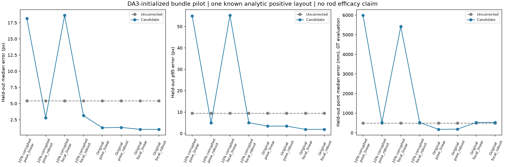
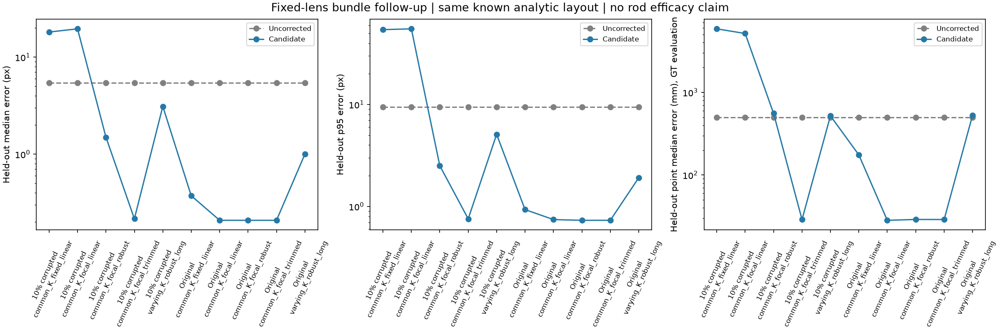

# 2026-09-23：相机校正原型得到三维改善，像素检查仍不能单独签字

今天实现了从DA3估计相机出发的RGB轨迹联合优化，并完成两轮冻结实验。固定镜头假设下，两阶段方法在一个已知双深度解析场景中，把保留特征点三维中位误差从497mm降到约29mm；加入47条错误训练轨迹后结果接近。**这不是杆恢复成绩，G1仍未通过，也没有自动替换任何现有点云或补丁。**

## 1. 输入、假设和独立检查

复用9月22日15张解析RGB与20张杆RGB，都是已经看过的开发数据。本轮为3个解析场景实际运行DA3-LARGE504估计深度/相机，4组杆场景复用原decoder预测，哈希和图像顺序核验一致。真实相机不参与初始化、匹配选择或优化。

7组中只有`unique_two_depths`的SIFT满足昨日冻结的轨迹可用性条件。单平面、重复纹理和4个杆场景共6组保持原相机，未调用优化器。唯一正例原有831条完整轨迹：470条下部训练、194条上部验证、167条跨区/隔离带轨迹不参与拟合。

优化同时调整相机与训练点。固定第一台相机位姿、第一到最后相机的距离，消除世界坐标和尺度自由度；距离是模型初始单位，不是已知真实米制尺度。保留集每条轨迹用初始相机选定的最宽基线两视图三角化，只在其余观测上计分，共280个像素误差。优化器没有收到这194条验证轨迹；没有用全部验证观测拟合点后再称其误差为预测误差。

另设压力条件：固定种子23092026，改错10%训练轨迹，即47条，每条替换一个观测为同视图另一轨迹的坐标，位移至少20px。验证集不改。所有方法看到相同修改，原有自然错配仍保留。这里10%是轨迹比例，不是全部像素观测比例。

预定RGB候选检查：优化收敛、不碰参数边界、不出现负深度，至少24个有效保留观测，中位误差改善≥20%、p95≤3px且至少80%误差≤2px。这个检查只决定是否形成研究候选，下文保留它无法保证三维精度的反例。

## 2. 第一轮：普通联合优化有改善，也有陷阱

`camera-bundle-pilot-v1-20260923`比较只调位姿/同时乘一个焦距比例，普通平方损失/soft-L1损失，两种错配条件，共8项。焦距比例版本仍保留DA3每视图、每坐标轴的不同初始焦距比例。预算250次函数评价。

原保留像素中位/p95误差5.423/9.463px，194个保留点的三维中位/p95误差497.1/732.4mm。相机按中心一次Sim3评价，不用场景点或GT杆对齐。

- 原匹配、只调位姿：像素中位降到约1.25–1.30px，三维点中位降到171–184mm，但没达到预定像素绝对阈值。
- 原匹配、乘共享焦距比例：像素中位约1px，但相机中心RMSE从47.8mm变为约58mm，三维点中位约523–525mm，且250次时未收敛。像素改善不能自动算几何改善。
- 注入错配、普通平方损失：相机严重跑偏，点中位误差超过5m。soft-L1减少破坏，但没有恢复到高精度。

8项全部被预定检查扣留。原结果、源码与迭代未收敛记录完整保留，未改预算后重写同一运行。

## 3. 第二轮：明确固定镜头假设，并单独控制更长预算

`camera-bundle-shared-v1-20260923`复用完全相同的RGB、DA3数组、训练/验证及47项修改，不重新跑模型。新假设是**同一台固定镜头、方形像素的相机**：各视图fx/fy共享一个焦距，初始值取模型焦距几何平均；主点仍沿用模型输出，不抄真实K。这个假设不能静默用于混用镜头、变焦或不同裁剪的照片。

第二轮增加到1200次预算，并保留“原先每视图K比例不变、仅增加预算”的对照。共5方法×2错配条件=10项，全部保留。单独把K改为公共初始值、完全不优化时，保留中位误差仅从5.423降到5.318px，主要改善不是替换一个矩阵的直接效果。

两阶段方法先用soft-L1拟合，最多250次；只根据**训练轨迹**的最大重投影误差剔除>4px或无有效结构的轨迹，检查每视图仍至少16条，再重拟合。第二阶段的焦距界限换算回原始界限，最终相机运动也检查相对于原始起点的界限，不能两次各走一段就越过总限制。没有使用注入清单或GT来决定删除谁。

| 条件 / 方法 | 保留像素中位 / p95（px） | 相机中心RMSE（mm） | 保留点三维中位（mm） | RGB候选检查 |
| --- | ---: | ---: | ---: | --- |
| 原始DA3，不优化 | 5.423 / 9.463 | 47.78 | 497.14 | 基线 |
| 原匹配，原K比例，长预算抗错配 | 1.002 / 1.913 | 58.64 | 529.07 | 通过，但三维仍差 |
| 原匹配，共享K固定焦距，仅调位姿 | 0.373 / 0.931 | 16.21 | 174.87 | 通过，但三维仍差 |
| 原匹配，共享焦距，平方损失 | 0.208 / 0.743 | 1.86 | 28.29 | 通过 |
| 原匹配，共享焦距，soft-L1 | 0.208 / 0.731 | 1.79 | 28.98 | 通过 |
| 原匹配，共享焦距，两阶段 | 0.208 / 0.731 | 1.78 | 28.90 | 通过 |
| 改错47轨迹，共享固定焦距，平方损失 | 18.166 / 54.322 | 753.49 | 5875.72 | 扣留 |
| 改错47轨迹，共享焦距，平方损失 | 19.601 / 55.321 | 776.26 | 5159.36 | 扣留 |
| 改错47轨迹，共享焦距，soft-L1 | 1.496 / 2.511 | 49.96 | 555.85 | 扣留 |
| 改错47轨迹，共享焦距，两阶段 | 0.216 / 0.755 | 1.94 | 28.89 | 通过 |
| 改错47轨迹，原K比例，长预算抗错配 | 3.110 / 5.096 | 43.73 | 519.91 | 扣留 |

原匹配两阶段不删除轨迹；压力条件恰好剔除47条，事后与注入清单核对全部命中、没有额外删除，剩423条。这个结果只针对本次固定错配机制，不外推成能识别任意真实错配。

两阶段原始/压力条件的保留点三维p95为39.90/39.77mm，相机方向中位误差从1.232°降到0.222°/0.210°。194条保留轨迹均有可评价的真值交点，未按GT挑出正确匹配再计算优化收益。三维点真值是第一条三角化观测处的解析表面交点，包含关键点定位误差，不是杆轴真值。

## 4. 当前能确认什么，不能确认什么

可以确认：在这个可观测、固定镜头的已知解析场景中，不使用GT优化的联合校正产生了真实三维改善；训练阶段筛除明显不受支持的轨迹，比只换鲁棒损失更能抵抗本次注入错配。单纯延长原K比例模型预算没有解决偏位。

仍有两项明显反例通过RGB候选检查，三维点误差却有175mm、529mm。因此“保留像素误差达标”不是物理相机正确性证书。状态`candidate_camera_correction`仅指研究候选，不能解释成自动部署许可。尚未实现校准不确定性或对错误固定镜头假设的可靠识别。

约29mm的保留点误差也不是零，更不是证明杆已达到25mm恢复阈值。只有一个正布局、一个错配种子、同一组已知图片，没有新的杆几何成绩或独立对象证据。当前4个杆图组仍被观测不足挡住。新相机只写为独立实验候选，没有替换原相机、深度快照或18/36个既有补丁。G1仍未通过。

## 5. 检查、成本及下一步

285项全量诊断通过，新增9项在NumPy1.26/2环境通过。测试覆盖已知三角化、固定坐标尺度、未拟合观测计分、错配复现、训练输入不变、空证据拒绝及两阶段总位移界限。18项候选另逐项核验固定首相机/基线、训练验证不交叉、保留视图计划精确相同、错配清单复现；原4份杆预测哈希不变。181份源码边界、Ruff与实验包离线构建通过，两张图已查看。远端CI以本次Git提交为准。

两轮CPU推理阶段分别63.57秒与143.63秒（2进程），不含准备、DA3加载/预测和评价，不是端到端性能。真实实验仍复用D盘模型与环境，缓存/输出/失败记录均留D盘。

下一步冻结共享焦距两阶段版本，制作具有独特参考纹理及不同深度表面的新杆场景，加入变焦/错配条件检验假设失配，完整报告采集条件变化。随后验证杆轴与缺口收益，形成一致的新几何快照，再走共同读取器和独立对象验收。不能拿新背景下的收益冒充原砖墙同输入收益。见[ADR0013](../decisions/0013-shared-calibration-and-training-outlier-control.md)。

## 6. 复现与记录

先加载`Enter-CreatorEnvironment.ps1`，复用DA3 Python。以下运行ID均已完成且拒绝覆盖；新运行请换ID、配置及输出路径。

- `run_camera_bundle_pilot.py prepare / predict / infer / evaluate`，配置`camera_bundle_pilot_v1.json`。第一轮初始相机来自实际DA3。
- `run_camera_bundle_shared.py prepare / infer / evaluate`，配置`camera_bundle_shared_v1.json`。第二轮引用第一轮的同一预测数组；有独立源码快照和协议。
- `audit_camera_bundle.py`、`audit_camera_bundle_shared.py`核验两轮，并输出三维保留点诊断/图表。真值只由evaluate/audit读取；推理含GT目录误读阻断。

原始结果：[第一轮8项](results/2026-09-23-camera-bundle-pilot.json)、[第一轮审计](results/2026-09-23-camera-bundle-audit.json)、[第二轮10项](results/2026-09-23-camera-bundle-shared.json)、[第二轮审计](results/2026-09-23-camera-bundle-shared-audit.json)。本机`.runtime/experiments/<run_id>`保留完整候选相机、优化点、训练清单和逐观测误差；`data/evaluation/<run_id>`与推理分开。
