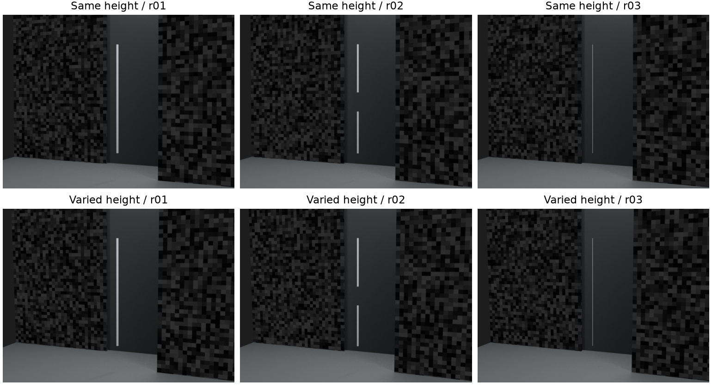
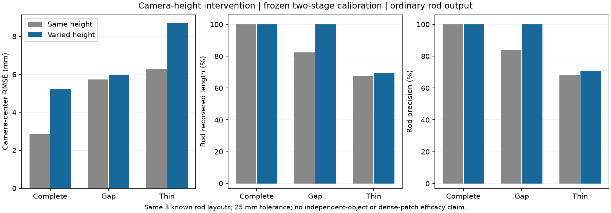

# 高度配对实验与相机点云版本：断杆改善，细杆仍卡住

**增加拍摄高度变化改善了这根断杆，但没有普遍提高相机或杆的精度。G1仍未通过。** 本轮还将初始/校正相机各自生成独立点云版本，完成保存、重开、精确撤回和旧补丁拒绝检查。它解决了工程版本关联问题，不代表未修改的DA3深度已经正确。

## 冻结的配对条件

沿用上一轮参考纹理场景的r01完整杆、r02断杆、r03细杆，几何、纹理种子、照明、49mm镜头、方位角和5.8m拍摄半径保持相同。五个相机高度由统一0.12m改为`[0.12, 0.75, -0.45, 0.62, -0.32]`m，仍朝向原点。输出15张640×480 RGB及配对真值。

这三种布局已经看过，只是采集路径干预，**不是三个新独立对象或新盲测集**。参考板仍是明确的采集辅助；旧砖墙输入与所有历史结果保留。

算法和配置先冻结再渲染，普通/鲁棒/两阶段共享焦距优化及两种杆方法均未调参，主方法仍为两阶段。新RGB上的两个前景点击在模型推理前查看并封存，数值恰与旧点击相同；未使用GT投影。3份新DA3-LARGE/504预测的原生尺寸为504×378，12相机条件×2杆方法共24行结果。

配对审计核对实际网格字节相同、内参相同、相机XY相同、高度符合配置、朝向符合约定。第一视图解码RGB完全相同，其余四图均变化。第一视图PNG文件哈希不同，原因是`Date`/`RenderTime`元数据；初次按整文件要求相同的检查失败后，改为同时记录文件与解码像素身份，失败日志保留，没有修改图像。

| 场景 | 完整轨迹数 | 训练/验证/排除 | GT事后正确/错误/未知 |
| --- | ---: | --- | --- |
| 完整杆 | 300 | 182/60/58 | 290/1/9 |
| 断杆 | 260 | 161/48/51 | 250/1/9 |
| 细杆 | 291 | 185/43/63 | 281/1/9 |

三组通过原SIFT入口。仍按y<128验证、y≥192训练，中间及跨区轨迹排除拟合。GT分类仅事后分析，不挑选训练/验证点。断杆、细杆训练集中各有一条事后确认错误轨迹。

## 主方法结果：不能只挑好看的数字

R/P表示输出有限曲线在25mm容差内的恢复率/精确率，不是DA3点云恢复率。相机与曲线只使用相机中心拟合的Sim3进入真值坐标，不按杆对齐。

| 普通杆方法、两阶段相机 | 旧同高度R/P | 新高度变化R/P | 曲线p95：旧→新 | 缺口保护内部容差覆盖：旧→新 |
| --- | --- | --- | --- | --- |
| 完整杆 | 100%/100% | 100%/100% | 9.68→9.62mm | 不适用 |
| 断杆 | 82.30%/84.05% | 100%/100% | 27.96→14.08mm | 19.87%→2.65% |
| 细杆 | 67.60%/68.30% | 69.40%/70.46% | 28.75→30.35mm | 不适用 |

断杆仍输出两段，改善明显，但缺口保护内部的2.65%覆盖不是零，不能称缺口完全合格。细杆变化很小，p95反而稍差。初始相机下两种杆方法三组均拒绝；新圆柱筛选对完整杆和断杆的三种校正全部拒绝，仅细杆输出且与普通版相同。这是旧完整杆圆柱通过之后的退步，不能隐去。

| 两阶段相机 | 新保留像素中位 | 相机中心RMSE：旧→新 | 新保留点三维中位 |
| --- | --- | --- | --- |
| 完整杆 | 0.215px | 2.84→5.24mm | 21.09mm |
| 断杆 | 0.225px | 5.72→5.96mm | 28.41mm |
| 细杆 | 0.308px | 6.27→8.70mm | 63.92mm |

相机中心RMSE三组都比旧路径更差。断杆的朝向中位误差约0.686°→0.162°、保留点中位76.88→28.41mm，因此只用相机中心误差解释杆精度也不够。高度变化并非统一改善，不能宣布已找到唯一病因。

九项校正有七项通过像素候选门，断杆/细杆的单次鲁棒校正被扣留。为诊断保留了所有数值相机下的杆回放，但扣留相机不会生成候选点云版本。普通平方拟合虽然通过相机门，断杆R/P仅43.39%/44.71%、细杆70.40%/71.04%，再次说明像素候选门不是物理验收。

## 真实相机诊断推翻了一个过强的推断

正常实验结束后另开评价侧9项相机替换、18行输出，保持像素池、点击和杆算法相同。GT不进入正常推理、点云版本或补丁。

| 场景 | 只换真实K，普通法 | 只换真实位姿，普通法 | K和位姿全真实，普通法 |
| --- | --- | --- | --- |
| 完整杆 | R/P100%，p95 11.21mm | R/P100%，8.67mm | R/P100%，5.83mm |
| 断杆 | R/P100%，14.41mm | R/P63.76%/64.33%，35.04mm | 拒绝：竞争或部分支持的身份解释 |
| 细杆 | R/P63.30%/64.66%，31.53mm | R/P100%，5.02mm | R/P100%，1.51mm |

断杆只换真实K的缺口覆盖仍2.65%；只换真实位姿为零，但杆本身大幅漏错，不能拿单独的零缺口指标当成功。完整杆在真实位姿/全部真实相机下圆柱输出p95约7.23/4.62mm；断杆圆柱始终拒绝。

上一轮“换真实位姿即可恢复”的结论只适用于上一轮数据。新路径下断杆在全真实相机时也产生候选歧义，说明候选保留、身份支持和视角退出稳定性必须重新检查。当前只定位到了失败层级，尚未证明圆柱候选消失的底层原因；下一轮先做冻结池的支持与候选审计，不靠放宽阈值救分。

## 新相机真正生成新点云

新增`camera_point_snapshot`模块，把原生深度、相机、帧身份和来源哈希一起记录。原图内参到原生深度尺寸使用明确的半像素变换；每个有效深度像素保存`(帧, 行, 列)`来源ID，用对应版本的相机重新反投影到世界坐标。

固定生成三场景×初始/两阶段相机共6份基础快照，每份952,560点，总计5,715,360点。两版本的深度数组哈希相同，相机和几何身份不同。12份普通/圆柱研究补丁分别绑定自己的基础；拒绝结果保留空补丁与原因，已知细杆错误候选也只作研究输出。抑制集合仍为空。

- 24份开启/撤回视图保存重开成功，撤回后的基础点和来源ID逐字节一致。
- 30,720个重投影抽查：最大像素误差5.12×10⁻¹³px、深度误差4.44×10⁻¹⁶重建单位。这验证内部坐标对应，不验证物理深度。
- 独立重读原预测与相机再核对3,840个来源像素；18份基础/补丁协议验证通过，三个实际旧相机补丁均被新基础以`Stale patch`拒绝。
- 原预测哈希不变，GT误读阻断启用。保存的侧文件明确声明深度未修正，不能称完整正式深度契约已迁移，也不能称基础到候选的共同评分已经通过。

## 检查与复现

15,400条独立Blender/Open3D射线的ID零冲突，最大Z误差2.263微米，最大投影误差0.0000292px。295项全量诊断通过（109.21秒），新增6项在NumPy1.26和2环境通过；16项核心测试及15子测试、Ruff、194份源码边界、核心离线构建通过。图表已实际查看。审计脚本初次运行的导入顺序失败日志保留，修复后独立审计通过，未改冻结实验源。

运行边界：

| run_id | 内容 |
| --- | --- |
| `rod-height-scenes-v1-20260923` | 15张RGB及隔离GT |
| `rod-height-bundle-v1-20260923` | 3新预测、9校正、24杆输出 |
| `rod-height-camera-counterfactual-v1-20260923` | 评价侧9干预、18输出 |
| `rod-height-camera-versions-v1-20260923` | 6基础、12补丁、24保存视图 |

先加载`scripts/Enter-CreatorEnvironment.ps1`。采集入口为`prepare_rod_height.py`和`configs/rod_height_v1.json`；RGB轨迹用`run_foreground_track_bands.py infer --run-id rod-height-scenes-v1-20260923`。沿用`run_rod_reference.py`的prepare/annotations/predict/bundle/pools/rods：prepare显式指定新配置，其余指定新bundle run_id，annotations另指定`configs/rod_height_annotations_v1.json`。评价入口`evaluate_rod_reference.py`须显式指定新run_id和输出路径；配对、特权诊断、快照、独立审计分别为`report_rod_height.py`、`diagnose_rod_height_cameras.py`、`materialize_rod_camera_versions.py`、`audit_rod_camera_versions.py`。

已存在的运行不能覆盖重跑。修改方法必须新建run_id并冻结源码；不要改冻结源后拿旧ID重新评分。相机优化114.36秒、杆回放27.58秒（2进程），不含渲染、模型推理及评分，不能当整轮耗时。

证据：[正常结果](results/2026-09-23-rod-height.json)、[配对审计](results/2026-09-23-rod-height-paired.json)、[评价侧相机替换](results/2026-09-23-rod-height-camera-counterfactual.json)、[版本与补丁](results/2026-09-23-rod-camera-versions.json)、[独立审计](results/2026-09-23-rod-camera-versions-audit.json)。

剩余优先级：候选/身份稳定性与细杆位姿，合格共同读取器及完整基础到候选评分，独立对象/失配/实拍验证。新版本基础已接通，但仍不自动应用校正、不扩UI。G1继续按20–35有效工时的条件预算安排，9月27日是检查点，不是预先宣布成功的日期；完整研究成果还需单独安排泛化实验和论文材料。
