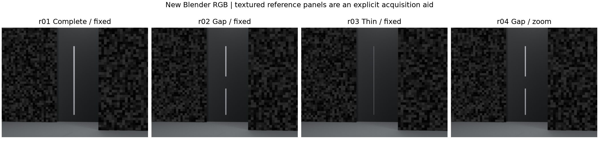
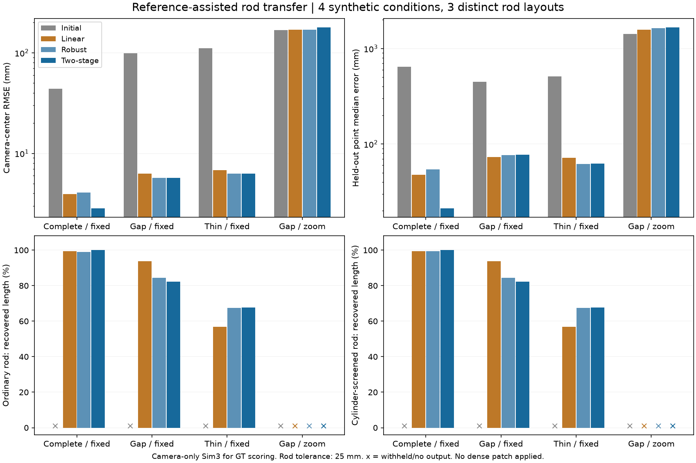

# 参考纹理辅助的杆恢复：有真实收益，位姿尾差仍挡着G1

本轮把已冻结的共享焦距校正接到了新Blender杆图。**完整杆首次在实际DA3初始化、无GT校正的条件下取得合格的有限曲线输出；断杆和细杆有改善，但仍未达标。G1没有通过。**

这里的恢复率是自研输出曲线在25mm容差内对真实杆长的覆盖，不是DA3点云恢复率。共同读取器尚未合格，不能把本轮曲线分数冒充完整“基础点云→候选点云”的净收益。

## 数据和冻结边界

- `rod-reference-scenes-v1-20260923`：4条件×5视角=20张640×480新RGB，3种杆布局，仍属同一程序化圆柱家族，不是4个独立对象。
- `rod-reference-bundle-v1-20260923`：4份实际DA3-LARGE/504预测，保留默认decoder相机；输入实际处理为504×378。12项相机校正，加4项未校正对照；两种杆方法共32行。
- `rod-reference-camera-counterfactual-v1-20260923`：仅评价侧的12项相机替换、24行杆输出。不能算正常方法表现。

三个固定镜头条件是完整杆r01（半径22mm）、断杆r02（18mm）和细杆r03（5mm）。r04与r02几何、纹理种子、视角完全相同，仅镜头序列从固定49mm改为43/46/49/52/55mm。它检验强行套用固定镜头假设的后果。三种杆的长度包络为2m，断杆中间有350mm真实缺口。

使用已有Blender 5.2.1 LTS、EEVEE、48采样、曝光−2，沿用已核验的坐标和导出工具。新视角为−32/−14/+3/+19/+35度，半径5.8m、高度0.12m。两侧增加不同深度的独特随机纹理参考板，中间保持普通暗背景。**参考板是新增采集辅助条件，不能声称旧砖墙照片已经修好。**

算法、参数和生成协议在渲染前冻结。共享焦距普通平方损失、单次soft-L1、两阶段soft-L1并排运行；优化预算与候选门沿用上一轮，没有根据新图调参。主候选事先指定两阶段，不能事后挑某场景分数最好的普通拟合替代。

每组两个前景点击来自模型预测前的RGB网格图查看。不是GT投影，也不是用户研究。所有相机条件复用同一观测池、同一点击、同一前8候选和杆门槛。RGB输入清单不含真实相机；真实深度、射线距离、物体ID、可见掩码、相机和网格均在`data/eval_gt`。推理阶段启用真值误读阻断。



## 对应可用，但对应通过不代表物理精度保证

继续使用原SIFT参数、目标区域排除带及固定上下区域划分：y<128验证、y≥192训练，中间与跨区轨迹排除拟合。四组都满足原有入口要求。

| 条件 | 完整轨迹 | 训练/验证/排除 | GT事后正确/错误/未知 |
| --- | ---: | --- | --- |
| r01完整杆 | 290 | 176/68/46 | 277/2/11 |
| r02断杆 | 268 | 174/50/44 | 253/3/12 |
| r03细杆 | 292 | 184/50/58 | 282/0/10 |
| r04变焦 | 287 | 191/58/38 | 276/3/8 |

GT分类不选择优化轨迹。保留三维点包含全部验证轨迹；未按GT正确性筛选。两阶段在r01删1条、r02/r03不删、r04删1条。不能把上一轮人工错配“47条全命中”推广到这些自然匹配。

## 相机改善与实际杆输出

下面固定比较预先指定的两阶段候选。相机与曲线都只按相机中心拟合一个Sim3进入GT坐标，绝不按杆对齐。

| 条件 | 保留像素中位：前→后 | 相机中心RMSE：前→后 | 保留点三维中位：前→后 |
| --- | --- | --- | --- |
| 完整杆 | 2.310→0.146px | 43.81→2.84mm | 643.31→21.19mm |
| 断杆 | 4.275→0.195px | 99.33→5.72mm | 447.69→76.88mm |
| 细杆 | 3.153→0.203px | 110.59→6.27mm | 513.10→62.12mm |
| 变焦反例 | 3.658→1.330px | 168.58→178.42mm | 1417.92→1661.07mm |

三组固定镜头的9项校正通过像素候选门，变焦3项均扣留。变焦的投影误差也下降了，但真实三维更差，说明采集假设必须明确保留。这里一次成功拒绝不能证明任意变焦都会被识别。

未校正时四组自研曲线均拒绝输出。校正后普通/圆柱筛选两种杆方法结果如下：

| 两阶段相机 | 段数 | 恢复率R | 精确率P | 输出到真实杆p95 | 缺口保护内部容差覆盖 |
| --- | ---: | ---: | ---: | --- | --- |
| r01普通 | 1 | 100% | 100% | 9.68mm | 不适用 |
| r01圆柱 | 1 | 100% | 100% | 8.20mm | 不适用 |
| r02两种方法相同 | 2 | 82.30% | 84.05% | 27.96mm | 19.87% |
| r03两种方法相同 | 1 | 67.60% | 68.30% | 28.75mm | 不适用 |
| r04两种方法 | 0 | 0% | 未定义 | 未定义 | 0%，因无输出 |

断杆仍分两段，并没有完整架桥；但两段整体上移约66–75mm，一端侵入真实空隙。“有两段”不等于正确保住缺口。细杆虽有连续输出，约三成长度偏离25mm容差，不能称完整修复成功。原图最细杆可见，不是从完全没有信息的像素中凭空恢复。

普通平方损失在断杆上R/P为93.70%/95.25%，优于本轮两阶段的82.30%/84.05%，但缺口保护区仍有19.21%容差覆盖。保留这一反例，不宣称鲁棒两阶段在所有场景都更好。18个接受结果是3布局×3相机方法×2杆方法的重复条件，不能当作18个独立成功对象。



## 追加定位：先解决残余位姿，而不是乱改缺口规则

主实验全部评分后，冻结独立诊断，分别只替换真实K、只替换真实位姿、两者都替换。其余像素池、点击、候选和算法保持相同。所有特权输出只进入`data/evaluation/rod-reference-camera-counterfactual-v1-20260923`。

普通杆方法的主要结果：

| 条件 | 只换真实K：R/P | 只换真实位姿：R/P、p95 | 真实K和位姿：p95 |
| --- | --- | --- | --- |
| 完整杆 | 100%/100% | 100%/100%，6.01mm | 1.66mm |
| 断杆 | 81.58%/83.63% | 100%/100%，4.11mm | 1.20mm |
| 细杆 | 63.10%/64.00% | 100%/100%，4.68mm | 0.80mm |
| 变焦 | 0%/0%，错误接受 | 91.39%/100%，10.34mm | 1.63mm |

断杆只换真实位姿后，缺口保护内部容差覆盖变为0%；只换真实K仍为17.22%。这支持优先改进残余位姿精度。变焦仅换真实K反而产生约1.27m偏离的错误接受，进一步说明单换一半相机参数不是可发布的修复。

一个待验证假设是：全部视角处于近乎同一高度，微小姿态偏差仍能使远处结构整体偏移，而像素评分不够敏感。下一轮应冻结“相同高度/增加高度变化”的采集对照，保留现有端点方法。该假设尚未验证，不把它写成已经找到的唯一原因；自然错配、定位误差和优化条件也可能有影响。

## 检查、复现和剩余工作

- 20,600条Blender/Open3D独立射线：表面ID零冲突，最大Z误差2.78微米；独立投影最大误差0.000050px。
- 12项相机候选逐项核对首相机、基线长度、训练/验证隔离、相同验证计划及完整保留/删除集合。16相机与32杆条件计划完整；24条特权诊断单独标识。
- 289项全量测试通过（111.99秒）；新增4项在NumPy1.26和2环境通过。187份源码边界、Ruff、实验包离线构建通过，图已实际查看。
- 旧输入、旧预测、失败结果、基础快照和补丁均未覆盖。新相机尚未接入一致的新深度/点快照，不发布自动补丁。

新运行须使用新run_id，已存在目录会拒绝覆盖。现有冻结运行不要改源码后原ID重评。运行顺序如下，均先加载D盘环境：

```powershell
. .\scripts\Enter-CreatorEnvironment.ps1
.\backends\da3\.venv\Scripts\python.exe scripts\prepare_rod_reference.py
.\backends\da3\.venv\Scripts\python.exe scripts\run_foreground_track_bands.py infer --run-id rod-reference-scenes-v1-20260923
.\backends\da3\.venv\Scripts\python.exe scripts\run_rod_reference.py prepare
# 先从RGB查看记录两次点击，再封存；已有复现可用同图的冻结标注。
.\backends\da3\.venv\Scripts\python.exe scripts\run_rod_reference.py annotations
.\backends\da3\.venv\Scripts\python.exe scripts\run_rod_reference.py predict
.\backends\da3\.venv\Scripts\python.exe scripts\run_rod_reference.py bundle
.\backends\da3\.venv\Scripts\python.exe scripts\run_rod_reference.py pools
.\backends\da3\.venv\Scripts\python.exe scripts\run_rod_reference.py rods
.\backends\da3\.venv\Scripts\python.exe scripts\evaluate_rod_reference.py
.\backends\da3\.venv\Scripts\python.exe scripts\diagnose_rod_reference_cameras.py
.\backends\da3\.venv\Scripts\python.exe scripts\plot_rod_reference.py
```

本机相机优化约100.29秒、杆回放39.38秒、特权诊断22.98秒，各用2进程；不包含渲染、模型加载、RGB提取和评分。完整证据：[主结果](results/2026-09-23-rod-reference.json)、[相机替换诊断](results/2026-09-23-rod-reference-camera-counterfactual.json)、[图表身份](results/2026-09-23-rod-reference-figures.json)。

下一步先检验位姿精度和拍摄几何，再完成新几何快照、合格共同读取器、独立对象与实拍验证。G1后续仍按20–35有效工时有条件排期；完整杆的进展不抵消断杆、细杆和泛化上的剩余风险。
