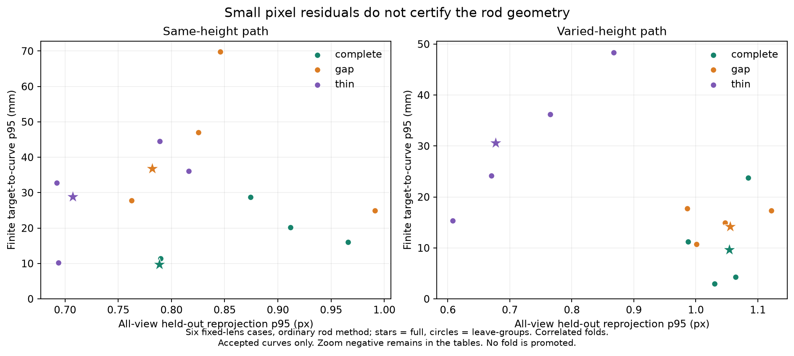

# 9月24日：杆像素没换，相机轻微变化仍会把细杆带偏

固定训练分组的结果支持把**相机不确定性传播到杆几何**作为下一步主线。两条细杆路径在四次删组后，选中的图像候选和全部支持像素行都没变，但三维恢复率仍大幅波动。今天没有从这些结果中挑最好的一次替换原结果。

正式运行：`camera-training-sensitivity-v1-20260924r2`。7个已知场景条件，各做完整训练控制及4次留组，共35相机、70普通/圆柱杆行、70组两两相机比较。它们是相关的训练扰动回放，不是35个独立物体，也不是统计置信区间。推理约101.29秒，3个进程并行。

## 到底改了什么

训练轨迹按最早观测视图中的64px格子分组，整个轨迹一起撤掉；组号由固定seed `24092026` 与格子坐标的SHA256确定。每次删除30–73条，组大小不均，约占原训练量16.5%–38.2%。删组后每视图至少59条，35条件均满足拟合前覆盖。这个格子规则不声称所有视图都整格隔离。

固定不动的是原DA3初始K/E、共享焦距两阶段优化、计算预算、训练后trim、旧相机门、两套验证计划、RGB候选池、用户两次点击、有限段和圆柱门槛。旧验证计划及新增全视图计划都由初始相机预先确定；分组不读取验证坐标或GT。

同一场景所有拟合固定第一相机完整位姿与首尾相机距离B，因此正常诊断直接比较native坐标，不逐次对齐来掩盖漂移。中心差和曲线差除以B，不能叫毫米。物理评分在独立进程中才用GT相机做原有camera-only Sim3，杆不参与对齐。

## 结果：亚像素验证可以容纳非常不同的杆结果

下表是**普通杆方法四次留组**的范围。R/P沿用25mm容差；p95明确为“目标有限轴→预测曲线”的距离，包含漏恢复端部的影响。旧报告常引用反方向“预测曲线→目标”的p95，两者不能直接混比。完整双向指标都保留在JSON里。

| 路径/对象 | R范围 | P范围 | 目标→曲线p95 | 全视图像素p95范围 |
| --- | ---: | ---: | ---: | ---: |
| 同高度完整杆 | 82.5–100% | 83.8–100% | 11.36–28.78mm | 0.790–0.966px |
| 同高度断杆 | 61.45–95.52% | 62.86–96.60% | 24.96–69.80mm | 0.763–0.991px |
| 同高度细杆 | **0–100%** | **0–100%** | 10.19–44.56mm | **0.692–0.816px** |
| 变高度完整杆 | 99.3–100% | 100% | 2.97–23.78mm | 0.988–1.084px |
| 变高度断杆 | 98.06–100% | 98.43–100% | 10.72–17.77mm | 0.986–1.122px |
| 变高度细杆 | **6.7–99.3%** | **7.16–99.80%** | 15.32–48.32mm | **0.608–0.867px** |

六个固定镜头条件的控制和四次留组共30相机全部通过原RGB候选门，但这不是物理正确的数量。每组四次普通法都接受；没有因为其中某一次恰好达到100%就将其提升为主结果。恢复率跨越0–100%也反映25mm二值容差的阈值效应，不能理解成图像中杆时有时无。



图中星号为完整训练，圆点为留组，颜色为已知三种杆条件。横轴几乎都在1px附近，纵轴差异却很明显。它是描述性配对图，不做跨条件回归或独立样本显著性检验。变焦反例留在完整结果表里，未进入此固定镜头图。

同高度细杆相对完整训练，最大单视图中心变化为B的0.085%–0.276%，最大旋转变化0.095–0.183°；高度变化细杆分别为0.062%–0.166%、0.084–0.171°。这些量很小，但已足够让当前杆恢复产生明显差异。共同焦距K也随训练组改变，本实验没有将K和位姿分别干预，因此不能把效果单独归因于位姿。

## 是相机变了，还是候选换人了

独立审计追到冻结的`(view_id, candidate_index, pool_sha256)`及实际`(view, row_index, raw_candidate_index)`。两条细杆路径的普通和圆柱方法，四次留组都与完整训练选择同一组图像候选，支持行Jaccard均为1.0。所有可比的固定镜头“接受→接受”对也保持这些像素身份不变。

不经过任何GT对齐的native比较也出现了变化：同高度细杆control→各fold的双向有限段p95最大值为B的0.0586%–0.2103%，变高度为0.1146%–0.2678%。因此物理分数的波动不只是每次重新估计评价Sim3造成的。

所以这轮细杆波动不能归因于候选切换：**相同杆像素证据，换了一点相机参数，三维就明显变化。** 这不推翻昨天发现的其他候选歧义，只说明本次干预已把一个独立的敏感性来源钉住了。

门控状态仍会跳变：高度完整杆圆柱法在完整训练被拒绝，leave_group_0却接受，其余三次仍拒绝。变焦反例5次相机全部被扣留；其中2次普通杆输出被接受但R/P均为0，目标→曲线p95约1.25–1.28m。圆柱也有一次接受。它们始终只是扣留相机上的研究诊断，未形成补丁。不能绕过相机层，单看杆局部门就发布结果。

## 检查、失败与复现

第一次`camera-training-sensitivity-v1-20260924`在写出第一条记录前，被过严的1e-8规范尺度检查拦下。原模型旋转有约1e-7的非正交浮点误差，用`-R.T @ t`读中心、再编码两次即可重现。独立七例核验：最终基线相对差最多2.80e-7；用`-solve(R,t)`仅读中心，和优化器记录的固定尺度吻合到2.22e-16。这是数值读取容差问题，不是给优化器新尺度自由度。

原v1的输入、失败记录、源码快照全部保留。只在新helper公开1e-6数值容差并补float32回归，然后另开r2，优化器、坐标与物理验收阈值不改。**实际r2的7个完整训练相机结果、14个杆身份结果都与历史完全相同**，不是只在宽松阈值下接近。

来源审计分评价前后两步：父bundle→场景prepared/inference/input→GT manifest身份链，35条件完整性，训练/验证隔离，验证残差重放，原像素池/点击/旧full来源，以及评分前后的推理文件哈希。评价前后90份封存文件哈希均不变，40个接受→接受对可比，另外16对因拒绝不计算虚假的一致性。原post审计还曾把内存tuple与JSON list误判为变化；失败日志/源码保留，独立completion入口引用真正的评价前证据，按canonical JSON比较后通过，没有补造评价前记录。推理启用GT与评价目录误读阻断。没有新图、新深度、新基础点云或自动补丁。

加载`scripts/Enter-CreatorEnvironment.ps1`后，使用已装DA3 Python，按顺序运行：

```text
scripts/run_camera_training_sensitivity.py prepare
scripts/run_camera_training_sensitivity.py infer
scripts/audit_camera_training_sensitivity.py pre-evaluate
scripts/run_camera_training_sensitivity.py evaluate
scripts/complete_camera_training_audit.py
scripts/report_camera_training_sensitivity.py
```

正式ID已冻结，不能覆盖重跑；新实验应另设run ID和输出，旧来源只读保留。算法/分组/相机比较/身份审计的新专项测试加入CI。

数据：[完整35/70结果](results/2026-09-24-camera-training-sensitivity-r2.json) · [可读范围与缺失计数](results/2026-09-24-camera-training-readable.json) · [独立身份与前后哈希审计](results/2026-09-24-camera-training-audit.json) · [浮点尺度核验](results/2026-09-24-camera-gauge-precision.json)。

下一步应在固定像素赋值下传播相机扰动，给有限段位置/方向/端部报告不确定性，再用新的几何与采集条件检验接受/拒绝规则。今天四组不能包装成校准置信区间，也不能事后用GT选择一个“稳”的阈值。G1仍未通过。
