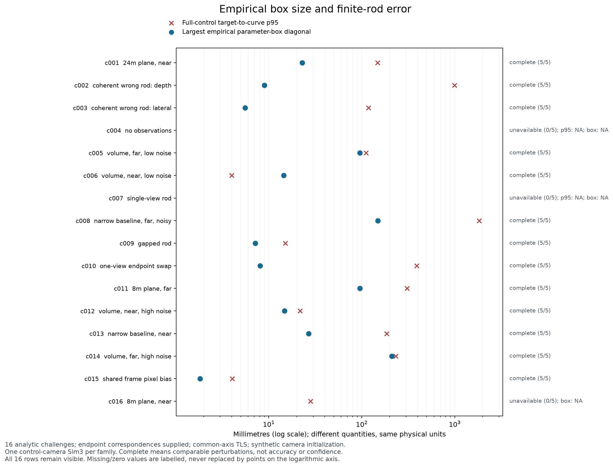

# 9月24日：窄经验范围不能直接当准确性门

本轮固定保留14个历史杆方法族和16个解析反例，共150个条件行（70个回放、80个解析）。历史回放：完整10、未决0、不可用4；解析反例：完整13、未决0、不可用3。
共23个族得到完整经验范围，其中23个并未包含全部预定真值参数点，23个一个真值参数点也没有包含。这里要求每段33个相同比例位置的真值点同时落入三坐标经验盒，除了浮点数容差不另加宽；这是很严格的参数位置检查，不是概率覆盖率，也不能据此说所有重建曲线都错了。
例如c006的目标到预测曲线p95只有4.000 mm、25 mm容差下R/P均为100%，参数点包含仍为0%。同参数位置不同于到整条曲线的最近距离：端点略偏就会改变比例位置，方向、坐标系或共同偏差也可能让点落在薄盒外。当前实验没有校准这些误差。

控制结果始终是原来的完整训练结果。四个删组结果只用来展示变化范围，没有选最好的一次、求平均替换控制，或用GT调一个“看起来够窄”的阈值。五个条件槽位都保留；缺失、相机扣留、身份拒绝、像素赋值改变以及有限段无法对应，都会留下原因并使范围未决或不可用。

## 怎么读这些数

- 完整只表示预定五条件都有可比较的相机、固定像素支持和有限段对应，不代表真实正确。
- 表中p95是目标有限轴→预测曲线的距离95分位数；反方向的预测曲线→目标有限轴p95也完整保存在可读JSON条件行中，没有把两个方向混成一个数。R是在25mm容差内恢复的目标轴采样比例，P是落在目标轴25mm以内的预测曲线采样比例。它们是有限曲线诊断，不是点云恢复率；100%也只表示达到该容差。
- 每个族只用完整控制相机拟合一次camera-only Sim3，所有fold沿用同一变换。对齐的残余误差和所有fold共享的偏差没有被这个变化范围消除，也没有作为不确定性单独加入。与前一份逐条件分别对齐的训练扰动报告口径不同，不能直接混表。
- 经验盒在固定控制轴的正交坐标系中，比较每段33个相同比例位置。包含率按这些点计数，每段等权，包含端点；不是弧长覆盖率、距离管、体积或置信区间。
- 表中的留组范围分别标注p95、R、P各自有效数/4。空预测的R=0是有效的漏检结果，纳入R范围；没有预测曲线时P未定义，保留缺失。只有无对齐或缺少度量等情况的R才是null，破折号不替代有效的0。五条件始终保留。

## 14个历史方法族

这些复用已知RGB、像素池与已计算相机；普通和圆柱方法各七行，没有新增图像或重跑DA3。扣留相机上的数值几何只作为诊断列出，不能发布补丁。

| 条件 | 状态（可比/5） | p95：控制 / 四留组范围 mm | 控制R/P % | 四留组R / P范围 %（各有效数/4） | 最大盒对角 mm | 真值参数点包含 % |
| --- | --- | ---: | ---: | ---: | ---: | ---: |
| 变高-r01-普通 | 完整（5/5） | 9.62 / 4.47–18.95（4/4） | 100.0 / 100.0 | 100.0（4/4） / 100.0（4/4） | 17.16 | 0.0 |
| 变高-r01-圆柱 | 不可用（0/5） | — / 3.61（1/4） | 0.0 / — | 0.0–100.0（4/4） / 100.0（1/4） | — | — |
| 变高-r02-普通 | 完整（5/5） | 14.22 / 11.25–20.21（4/4） | 100.0 / 100.0 | 100.0（4/4） / 100.0（4/4） | 15.24 | 0.0 |
| 变高-r02-圆柱 | 不可用（0/5） | — / —（0/4） | 0.0 / — | 0.0（4/4） / —（0/4） | — | — |
| 变高-r03-普通 | 完整（5/5） | 30.64 / 19.30–46.72（4/4） | 69.4 / 70.5 | 0.0–98.4（4/4） / 0.0–99.0（4/4） | 32.37 | 0.0 |
| 变高-r03-圆柱 | 完整（5/5） | 30.64 / 19.30–46.72（4/4） | 69.4 / 70.5 | 0.0–98.4（4/4） / 0.0–99.0（4/4） | 32.37 | 0.0 |
| 同高-r01-普通 | 完整（5/5） | 9.69 / 7.10–18.11（4/4） | 100.0 / 100.0 | 99.9–100.0（4/4） / 100.0（4/4） | 22.65 | 0.0 |
| 同高-r01-圆柱 | 完整（5/5） | 8.21 / 8.19–15.10（4/4） | 100.0 / 100.0 | 100.0（4/4） / 100.0（4/4） | 19.44 | 0.0 |
| 同高-r02-普通 | 完整（5/5） | 36.80 / 33.21–37.66（4/4） | 82.3 / 84.0 | 52.8–93.6（4/4） / 53.7–95.3（4/4） | 20.77 | 0.0 |
| 同高-r02-圆柱 | 完整（5/5） | 36.80 / 33.21–37.66（4/4） | 82.3 / 84.0 | 52.8–93.6（4/4） / 53.7–95.3（4/4） | 20.77 | 0.0 |
| 同高-r03-普通 | 完整（5/5） | 28.88 / 18.63–38.55（4/4） | 67.6 / 68.3 | 2.9–98.6（4/4） / 3.1–99.3（4/4） | 27.09 | 0.0 |
| 同高-r03-圆柱 | 完整（5/5） | 28.88 / 18.63–38.55（4/4） | 67.6 / 68.3 | 2.9–98.6（4/4） / 3.1–99.3（4/4） | 27.09 | 0.0 |
| 同高-r04-普通 | 不可用（0/5） | — / 1251.67–1294.35（2/4） | 0.0 / — | 0.0（4/4） / 0.0（2/4） | — | — |
| 同高-r04-圆柱 | 不可用（0/5） | — / 1293.39（1/4） | 0.0 / — | 0.0（4/4） / 0.0（1/4） | — | — |

## 16个新解析反例

这里直接给定跨视图端点对应，对三角化端点做公共直线TLS，同时保留端点和缺口对应。初始相机是预先规定的真实相机扰动，不是DA3预测。它检验相机传播与读数边界，不声称完成照片中杆的检测、身份辨认或真实对象泛化。

各条件使用不同随机种子。近/远、噪声、背景或基线标签用于描述场景，不能把两行之差当作严格配对的单因素因果效应。

| 条件 | 状态（可比/5） | p95：控制 / 四留组范围 mm | 控制R/P % | 四留组R / P范围 %（各有效数/4） | 最大盒对角 mm | 真值参数点包含 % |
| --- | --- | ---: | ---: | ---: | ---: | ---: |
| c001 24m平面背景／近杆 | 完整（5/5） | 147.60 / 140.30–160.05（4/4） | 58.6 / 59.1 | 54.6–59.4（4/4） / 55.2–60.0（4/4） | 22.90 | 0.0 |
| c002 各视图一致看错深度 | 完整（5/5） | 995.94 / 992.26–1000.12（4/4） | 0.0 / 0.0 | 0.0（4/4） / 0.0（4/4） | 9.01 | 0.0 |
| c003 各视图一致看错横向杆 | 完整（5/5） | 118.28 / 117.36–118.63（4/4） | 0.0 / 0.0 | 0.0（4/4） / 0.0（4/4） | 5.59 | 0.0 |
| c004 没有观测 | 不可用（0/5） | — / —（0/4） | — / — | —（0/4） / —（0/4） | — | — |
| c005 体积背景／远杆／低噪声 | 完整（5/5） | 111.05 / 75.22–169.53（4/4） | 0.0 / 0.0 | 0.0（4/4） / 0.0（4/4） | 95.55 | 0.0 |
| c006 体积背景／近杆／低噪声 | 完整（5/5） | 4.00 / 4.64–11.12（4/4） | 100.0 / 100.0 | 100.0（4/4） / 100.0（4/4） | 14.46 | 0.0 |
| c007 杆仅单视图可见 | 不可用（0/5） | — / —（0/4） | 0.0 / — | 0.0（4/4） / —（0/4） | — | — |
| c008 窄基线／远杆／高噪声 | 完整（5/5） | 1828.01 / 1755.45–1897.66（4/4） | 0.0 / 0.0 | 0.0（4/4） / 0.0（4/4） | 149.03 | 0.0 |
| c009 体积背景／断杆 | 完整（5/5） | 15.07 / 10.55–16.93（4/4） | 100.0 / 100.0 | 100.0（4/4） / 100.0（4/4） | 7.18 | 0.0 |
| c010 一个视图端点对应交换 | 完整（5/5） | 390.84 / 388.50–393.28（4/4） | 8.0 / 12.5 | 8.0–8.1（4/4） / 12.3–12.5（4/4） | 8.07 | 0.0 |
| c011 8m平面背景／远杆 | 完整（5/5） | 307.65 / 217.53–311.94（4/4） | 0.0 / 0.0 | 0.0（4/4） / 0.0（4/4） | 95.38 | 0.0 |
| c012 体积背景／近杆／高噪声 | 完整（5/5） | 21.78 / 18.35–23.66（4/4） | 98.0 / 98.6 | 97.8–98.0（4/4） / 98.2–99.1（4/4） | 14.82 | 0.0 |
| c013 窄基线／近杆 | 完整（5/5） | 185.89 / 169.84–194.24（4/4） | 0.0 / 0.0 | 0.0（4/4） / 0.0（4/4） | 26.78 | 0.0 |
| c014 体积背景／远杆／高噪声 | 完整（5/5） | 232.35 / 53.01–262.01（4/4） | 0.0 / 0.0 | 0.0–18.5（4/4） / 0.0–19.1（4/4） | 210.90 | 0.0 |
| c015 背景与杆共享像素偏移 | 完整（5/5） | 4.04 / 3.67–4.55（4/4） | 100.0 / 100.0 | 100.0（4/4） / 100.0（4/4） | 1.82 | 0.0 |
| c016 8m平面背景／近杆 | 不可用（0/5） | 28.09 / 26.85–28.68（4/4） | 83.2 / 83.6 | 80.9–88.0（4/4） / 81.0–88.4（4/4） | — | — |

图保留全部16行。红叉为控制的目标→曲线p95，蓝点为完整范围中的最大参数位置盒对角；二者量纲相同但含义不同。横轴为毫米对数轴，缺失不画点，真实0另行标注，不塞到某个很小的正数。

## 完整范围中的方向与缺口

下表的方向是五个已观测方向之间的最大夹角。缺口是相邻预测有限段在固定控制轴上的间隔范围，只描述预测，不能证明那里真的没有物体。单段没有这一内部缺口指标。

| 条件 | 最大两两方向角 ° | 预测缺口范围 mm | 最大同参数位移 / B % |
| --- | ---: | --- | ---: |
| 变高-r01-普通 | 0.1933 | 单段 | 0.1642 |
| 变高-r02-普通 | 0.0601 | 0→1: 353.07–359.49 | 0.1501 |
| 变高-r03-普通 | 0.0660 | 单段 | 0.2801 |
| 变高-r03-圆柱 | 0.0660 | 单段 | 0.2801 |
| 同高-r01-普通 | 0.2509 | 单段 | 0.2093 |
| 同高-r01-圆柱 | 0.1985 | 单段 | 0.1995 |
| 同高-r02-普通 | 0.0830 | 0→1: 352.29–358.70 | 0.1918 |
| 同高-r02-圆柱 | 0.0830 | 0→1: 352.29–358.70 | 0.1918 |
| 同高-r03-普通 | 0.1896 | 单段 | 0.2488 |
| 同高-r03-圆柱 | 0.1896 | 单段 | 0.2488 |
| c001 24m平面背景／近杆 | 0.0788 | 单段 | 0.5291 |
| c002 各视图一致看错深度 | 0.0177 | 单段 | 0.2065 |
| c003 各视图一致看错横向杆 | 0.0254 | 单段 | 0.1456 |
| c005 体积背景／远杆／低噪声 | 0.0192 | 单段 | 2.4728 |
| c006 体积背景／近杆／低噪声 | 0.0114 | 单段 | 0.4839 |
| c008 窄基线／远杆／高噪声 | 1.2313 | 单段 | 33.0848 |
| c009 体积背景／断杆 | 0.0273 | 0→1: 297.23–298.16 | 0.2270 |
| c010 一个视图端点对应交换 | 0.0611 | 单段 | 0.1762 |
| c011 8m平面背景／远杆 | 0.0231 | 单段 | 3.7925 |
| c012 体积背景／近杆／高噪声 | 0.0548 | 单段 | 0.5070 |
| c013 窄基线／近杆 | 0.0777 | 单段 | 7.2331 |
| c014 体积背景／远杆／高噪声 | 0.0516 | 单段 | 7.5376 |
| c015 背景与杆共享像素偏移 | 0.0106 | 单段 | 0.0432 |

## 一致错误输入的观察结果

横向看错杆、看错深度、共享像素偏移与端点交换在运行前就已列为反例，不是跑完后按分数挑出来的。它们用来检查“所有fold可能一起错”的边界；不要求每个随机实例都呈现同一种数值趋势。

- c002 各视图一致看错深度：完整；控制p95 995.940 mm，最大盒对角 9.006 mm，真值参数点包含 0.0%。
- c003 各视图一致看错横向杆：完整；控制p95 118.283 mm，最大盒对角 5.586 mm，真值参数点包含 0.0%。
- c010 一个视图端点对应交换：完整；控制p95 390.845 mm，最大盒对角 8.075 mm，真值参数点包含 0.0%。
- c015 背景与杆共享像素偏移：完整；控制p95 4.039 mm，最大盒对角 1.823 mm，真值参数点包含 0.0%。

## 完整但未包含全部真值参数点的族

- 变高-r01-普通：包含 0.0%，控制p95 9.62 mm，盒对角 17.16 mm。
- 变高-r02-普通：包含 0.0%，控制p95 14.22 mm，盒对角 15.24 mm。
- 变高-r03-普通：包含 0.0%，控制p95 30.64 mm，盒对角 32.37 mm。
- 变高-r03-圆柱：包含 0.0%，控制p95 30.64 mm，盒对角 32.37 mm。
- 同高-r01-普通：包含 0.0%，控制p95 9.69 mm，盒对角 22.65 mm。
- 同高-r01-圆柱：包含 0.0%，控制p95 8.21 mm，盒对角 19.44 mm。
- 同高-r02-普通：包含 0.0%，控制p95 36.80 mm，盒对角 20.77 mm。
- 同高-r02-圆柱：包含 0.0%，控制p95 36.80 mm，盒对角 20.77 mm。
- 同高-r03-普通：包含 0.0%，控制p95 28.88 mm，盒对角 27.09 mm。
- 同高-r03-圆柱：包含 0.0%，控制p95 28.88 mm，盒对角 27.09 mm。
- c001 24m平面背景／近杆：包含 0.0%，控制p95 147.60 mm，盒对角 22.90 mm。
- c002 各视图一致看错深度：包含 0.0%，控制p95 995.94 mm，盒对角 9.01 mm。
- c003 各视图一致看错横向杆：包含 0.0%，控制p95 118.28 mm，盒对角 5.59 mm。
- c005 体积背景／远杆／低噪声：包含 0.0%，控制p95 111.05 mm，盒对角 95.55 mm。
- c006 体积背景／近杆／低噪声：包含 0.0%，控制p95 4.00 mm，盒对角 14.46 mm。
- c008 窄基线／远杆／高噪声：包含 0.0%，控制p95 1828.01 mm，盒对角 149.03 mm。
- c009 体积背景／断杆：包含 0.0%，控制p95 15.07 mm，盒对角 7.18 mm。
- c010 一个视图端点对应交换：包含 0.0%，控制p95 390.84 mm，盒对角 8.07 mm。
- c011 8m平面背景／远杆：包含 0.0%，控制p95 307.65 mm，盒对角 95.38 mm。
- c012 体积背景／近杆／高噪声：包含 0.0%，控制p95 21.78 mm，盒对角 14.82 mm。
- c013 窄基线／近杆：包含 0.0%，控制p95 185.89 mm，盒对角 26.78 mm。
- c014 体积背景／远杆／高噪声：包含 0.0%，控制p95 232.35 mm，盒对角 210.90 mm。
- c015 背景与杆共享像素偏移：包含 0.0%，控制p95 4.04 mm，盒对角 1.82 mm。

## 未决与不可用条件：没有从分母里消失

- 变高-r01-圆柱（不可用，0/5可比）：control, leave_group_1, leave_group_2, leave_group_3: identity_not_accepted；leave_group_0, leave_group_1, leave_group_2, leave_group_3: control_unavailable。
- 变高-r02-圆柱（不可用，0/5可比）：control, leave_group_0, leave_group_1, leave_group_2, leave_group_3: identity_not_accepted；leave_group_0, leave_group_1, leave_group_2, leave_group_3: control_unavailable。
- 同高-r04-普通（不可用，0/5可比）：control, leave_group_0, leave_group_1, leave_group_2, leave_group_3: camera_not_accepted；control, leave_group_0, leave_group_1: identity_not_accepted；leave_group_0, leave_group_1, leave_group_2, leave_group_3: control_unavailable。
- 同高-r04-圆柱（不可用，0/5可比）：control, leave_group_0, leave_group_1, leave_group_2, leave_group_3: camera_not_accepted；control, leave_group_0, leave_group_1, leave_group_2: identity_not_accepted；leave_group_0, leave_group_1, leave_group_2, leave_group_3: control_unavailable。
- c004 没有观测（不可用，0/5可比）：control, leave_group_0, leave_group_1, leave_group_2, leave_group_3: camera_not_accepted；control, leave_group_0, leave_group_1, leave_group_2, leave_group_3: missing_numeric_camera；control, leave_group_0, leave_group_1, leave_group_2, leave_group_3: identity_not_accepted；leave_group_0, leave_group_1, leave_group_2, leave_group_3: control_unavailable。
- c007 杆仅单视图可见（不可用，0/5可比）：control, leave_group_0, leave_group_1, leave_group_2, leave_group_3: identity_not_accepted；leave_group_0, leave_group_1, leave_group_2, leave_group_3: control_unavailable。
- c016 8m平面背景／近杆（不可用，0/5可比）：control, leave_group_0, leave_group_1, leave_group_2, leave_group_3: camera_not_accepted；leave_group_0, leave_group_1, leave_group_2, leave_group_3: control_unavailable。

这些是四次相关的训练扰动，既没有覆盖所有相机误差，也没有标定概率；杆的像素噪声、有限端点误差与共同偏差也不由它们单独覆盖。它们还能共享相同的对应错误和系统偏差。不能把本次23个零包含结果写成“统计覆盖概率为0”，也不能把某个方向的失配归因于某一种误差而不另做检验。范围窄、真值样本落入盒中或某次R/P达到100%，都不自动构成G1通过或物理正确保证。

## 来源与复现

此报告脚本只读取两份已完成的公开汇总，派生JSON保存各自SHA256；不重做拟合、对齐、匹配或评分。原始结果、失败记录和控制均保留。
源记录的推理耗时：历史回放3.077秒，解析反例448.216秒；这里没有把准备、冻结、评价和检查时间算成推理时间。

- [历史回放完整结果](results/2026-09-24-replay-rod-camera-envelope.json)
- [解析反例完整结果](results/2026-09-24-analytic-rod-camera-envelope.json)
- [五槽可读结果与来源SHA](results/2026-09-24-rod-camera-envelope-readable.json)
- [报告生成脚本](../../scripts/report_rod_camera_envelope.py)

输出采用只创建模式；复现时使用新的输出路径，不能覆盖本次产物。
