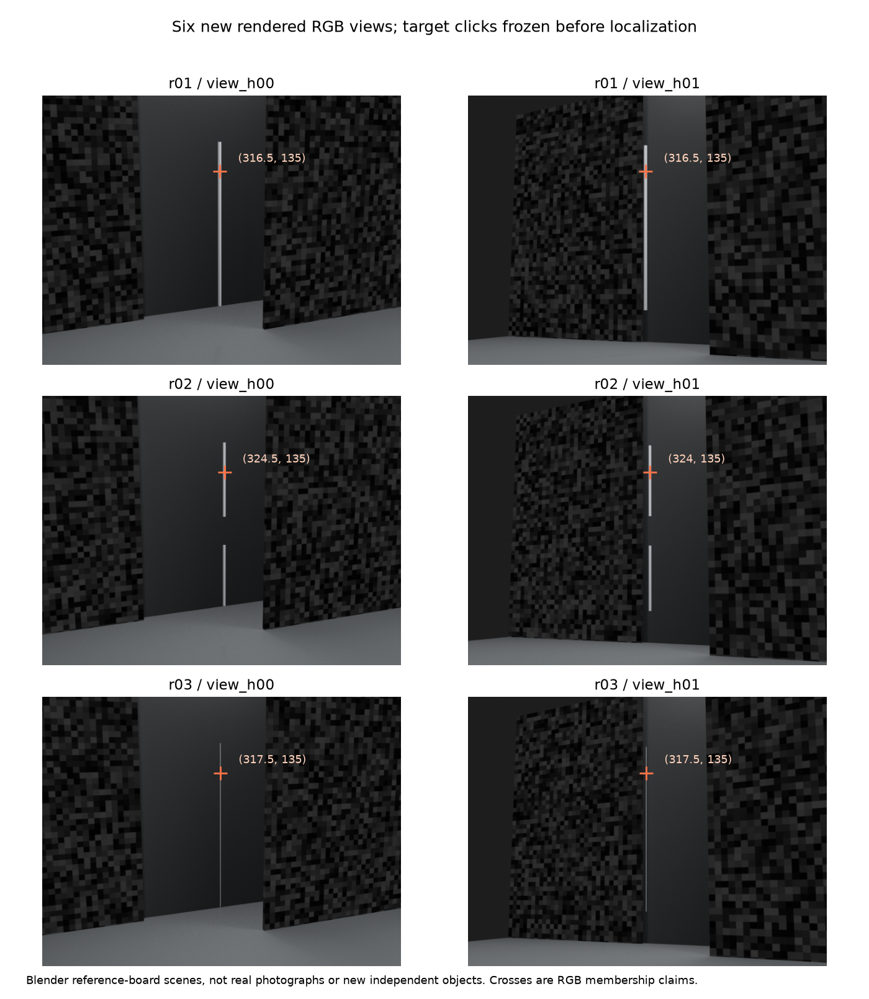
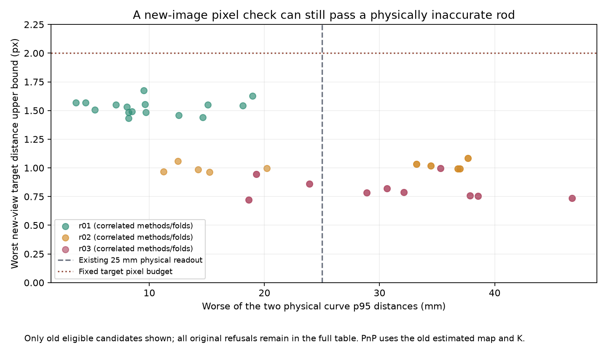

# 9月26日续接：新照片进来了，但定位新照片仍会继承旧地图偏差

本轮新增6张Blender RGB，复用已有完整杆、断杆和细杆三个物体，额外拍两个未参与原重建的视角。旧同高度/变高度两条采集路径各有完整控制和四个固定删组，合计30份地图；每份地图定位两个新视图，再检查普通/圆柱两种旧杆，共60个联合决策和120个单视图投影槽。它们相互关联，不是60个独立物体，也不是实拍。

所有60个新相机通过预先冻结的背景验证。原51个可继续审查的杆候选也全部通过新目标投影；其中27个双向p95均≤25mm，24个至少一向超出，新增拦截仍是0。另9个原身份不接受仍不接受。新增图像没有自动带来可用的三维筛错能力。

## 新图像与目标点，如何隔开

新视角相对既有场景只改变角度与高度，场景网格、纹理和光照保持原样；正常输入只含匿名view_h00/view_h01、RGB、SHA及固定屏幕guide。精确相机、深度、ID、可见性和网格独立保存于GT目录，推理禁止读取。生成前冻结显式源码闭包，正常算法另行冻结，没有抓取并行工作中的半成品。

六张原图逐一目视检查，目标点选在可见杆的y=135行，随后仅核查该行RGB像素来记录x位置。点击来自助手查看RGB，不是GT投影、模型覆盖图或人类用户实验。半像素矩形只是坐标格表示，不是经过标定的点击误差界；点表示可见杆成员，不能自动解释为物理轴上的对应端点。点击在任何新PnP或杆投影之前已封存。

## 新相机只由背景定位，旧杆和旧地图不动

用原SIFT参数重新提取五张旧图，逐feature坐标/顺序必须与冻结旧track数据完全相同。新图屏幕guide两侧64px内不提供定位特征；匹配采用固定0.75双向比率，一个新feature必须由至少两个旧视图一致指向同一个旧track。冲突或多个新feature争用同一track一律排除，不按拟合分数选赢家。

定位点只取旧BA保留的训练三维点，既不重拟合也不换地图。只有旧train且新图y≥192的对应进入PnP；旧validation且新图y<128的点只用于验证，其三维位置只从旧验证像素三角化。中间带与角色不相容的观测明确排除。旧K的焦距几何均值与主点均值给新图使用，是固定镜头假设，不是GT内参。

PnP采用固定2px RANSAC、5000次预算、0.99置信参数和固定随机种子；至少24训练点/24内点，三维点及内点不能近共面。LM只用训练内点。验证至少8点，p95≤2px且2px内比例≥0.8，正深度与来源检查同时满足。阈值没有按这批分数调。数值姿态和验证决定分开保存，验证不能改pose；新目标点从未进入定位。

这仍不是独立绝对相机标定：旧地图、旧K和旧验证点都依赖同一旧相机解，误差可以共同传递。SIFT有像素邻域支撑，中心排除条和y分带也不等于每一个底层像素严格互不相交。这里只证明新观测ID和数值拟合角色隔离。

## 完整读数和遗漏代价

| 范围 | 原物理读数 | 原eligible数 | 保留 | 新目标拒绝 | 新目标未决 | 新相机未决 |
| --- | --- | ---: | ---: | ---: | ---: | ---: |
| 全部五条件 | 双向p95≤25mm | 27 | 27 | 0 | 0 | 0 |
| 全部五条件 | 至少一向p95>25mm | 24 | 24 | 0 | 0 | 0 |
| 全部五条件 | 未评分 | 0 | 0 | 0 | 0 | 0 |
| 仅完整控制 | 双向p95≤25mm | 4 | 4 | 0 | 0 | 0 |
| 仅完整控制 | 至少一向p95>25mm | 6 | 6 | 0 | 0 | 0 |
| 仅完整控制 | 未评分 | 0 | 0 | 0 | 0 | 0 |

这两个物理分组沿用旧25mm读数，只作诊断，不等于整条杆正确性或G1验收。旧几何、像素赋值与控制相机Sim3都完全不变；不能逐fold或新视图重新对齐来消掉偏差。拒绝/未决是空输出，R=0、P未定义。

60次定位的训练对应数为69.000–127.000（中位89.000；60/60），验证对应数为19.000–41.000（中位29.000；60/60）；背景验证p95为0.443–1.110（中位0.603；60/60）px。

评价阶段再看真值，沿各旧完整控制的固定Sim3，新视图中心误差为1.803–19.721（中位10.829；60/60）mm，旋转误差为0.065–0.827（中位0.309；60/60）度。这里没有把新相机重新对齐到GT。

## 这次结果决定什么

单纯再收集视图、用旧地图定位、再核一次同目标投影，尚不能承担三维精度验收。下一步要分清已知内参、独立相机定位和额外目标观测分别能约束什么；参考板若提供已知尺寸或坐标，必须作为明确新增的采集输入，不能从GT悄悄复制。仅把误差阈值调紧没有本轮证据支持。

为辨别机制，另做[特权相机替换诊断](results/2026-09-26-heldout-view-oracle.json)：它是在看到正常流程仍全保留之后提出的事后评价，对同一固定杆/控制Sim3分别替换新相机的K或位姿，不是正常方法的可用输入，不用于调这轮门槛。正常结果保持封存。

## 检查与产物

新视图匹配、PnP和杆检查合计8.042秒，复用旧DA3与旧BA；不含渲染、GT、冻结和审计，不能当完整系统耗时。

- [60相机与60联合杆完整结果](results/2026-09-26-heldout-view-validation.json)
- [可读统计与来源](results/2026-09-26-heldout-view-readable.json)
- [独立评分前后审计](results/2026-09-26-heldout-view-audit.json)
- [新图像生成入口](../../scripts/prepare_rod_heldout_views.py)
- [验证入口](../../scripts/run_rod_heldout_views.py)
- [训练独立截面诊断](2026-09-26-section-model-trainonly.md)

复现先加载项目D盘环境。新图生成与点击封存独立在先；验证入口prepare/infer/pre，独立外审pre通过后evaluate，再外审post。旧run与公共结果拒绝覆盖。所有数据、源码快照和失败记录仍保留，G1未通过，无新自动补丁或UI扩建。
