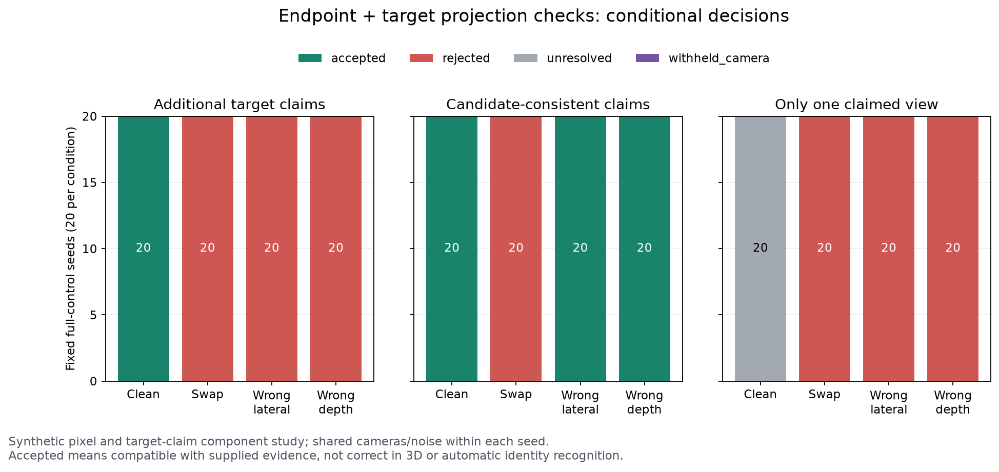

# 9月26日：分开检查端点对应和目标声明

这次先把比较条件锁在一起：20个随机种子，每个种子的四种杆观测共用同一背景、初始相机和二维噪声。相机只拟合100次，复用到400条杆条件；三套目标声明与四个检查组合产生4800个决策。独立重复单位仍是20个种子，不能把它写成4800个独立实验。

方法在生成数据和评分前冻结，只跑这一版。正确端点、一个视图交换端点、一致认错横向杆、一致认错深度四种机制是预先指定的，不是从成绩中挑出来的。原来的五条件波动范围没有被当成通过门。

## 两类像素证据分别检查什么

端点检查对每个给定端点留出一个视图，用其余至少三个视图三角化，再预测留出像素；需要至少四个观测视图。2px预算沿用旧有限段的像素尺度，但这是新的残差语义，尚未被标定为准确性保证。它可以检验对应不一致，不能排除所有视图共同认错。

目标检查把额外二维声明与已有有限杆段投影比较，不重拟合杆、不改变候选排序，也不把缺口连成整线。沿用2px预算和至少两不同中心视图，声明不确定矩形的外接圆给出保守距离上下界：整块均相容才supported，明确不相容才contradicted，其余unresolved。

本轮目标点是合成测量，噪声流与端点分开，但共享潜在模拟场景。它不是人工用户标注实验，也没有实现从照片自动获得目标身份。跟随错候选的目标声明故意保留：若额外输入也认错，系统可能继续相容。缺少第二视图也必须留在分母中。

## 完整训练控制：全部20个种子留在表里

下表每格依次是接受 / 拒绝 / 未决 / 相机扣留，总和恒为20。只描述决策，不把接受叫物理正确。baseline同样受原相机门和几何可用性约束；没有从扣留条件里挑出好看的相机。

| 杆观测 | 目标声明 | 原控制 | 只查端点 | 只查目标投影 | 两者同时查 |
| --- | --- | --- | --- | --- | --- |
| 正确端点 | 额外目标点 | 20 / 0 / 0 / 0 | 20 / 0 / 0 / 0 | 20 / 0 / 0 / 0 | 20 / 0 / 0 / 0 |
| 正确端点 | 跟着候选一起错的点 | 20 / 0 / 0 / 0 | 20 / 0 / 0 / 0 | 20 / 0 / 0 / 0 | 20 / 0 / 0 / 0 |
| 正确端点 | 只提供一个视图 | 20 / 0 / 0 / 0 | 20 / 0 / 0 / 0 | 0 / 0 / 20 / 0 | 0 / 0 / 20 / 0 |
| 一个视图交换端点 | 额外目标点 | 20 / 0 / 0 / 0 | 0 / 20 / 0 / 0 | 0 / 20 / 0 / 0 | 0 / 20 / 0 / 0 |
| 一个视图交换端点 | 跟着候选一起错的点 | 20 / 0 / 0 / 0 | 0 / 20 / 0 / 0 | 0 / 20 / 0 / 0 | 0 / 20 / 0 / 0 |
| 一个视图交换端点 | 只提供一个视图 | 20 / 0 / 0 / 0 | 0 / 20 / 0 / 0 | 0 / 20 / 0 / 0 | 0 / 20 / 0 / 0 |
| 一致认错旁边杆 | 额外目标点 | 20 / 0 / 0 / 0 | 20 / 0 / 0 / 0 | 0 / 20 / 0 / 0 | 0 / 20 / 0 / 0 |
| 一致认错旁边杆 | 跟着候选一起错的点 | 20 / 0 / 0 / 0 | 20 / 0 / 0 / 0 | 20 / 0 / 0 / 0 | 20 / 0 / 0 / 0 |
| 一致认错旁边杆 | 只提供一个视图 | 20 / 0 / 0 / 0 | 20 / 0 / 0 / 0 | 0 / 20 / 0 / 0 | 0 / 20 / 0 / 0 |
| 一致认错深度 | 额外目标点 | 20 / 0 / 0 / 0 | 20 / 0 / 0 / 0 | 0 / 20 / 0 / 0 | 0 / 20 / 0 / 0 |
| 一致认错深度 | 跟着候选一起错的点 | 20 / 0 / 0 / 0 | 20 / 0 / 0 / 0 | 20 / 0 / 0 / 0 | 20 / 0 / 0 / 0 |
| 一致认错深度 | 只提供一个视图 | 20 / 0 / 0 / 0 | 20 / 0 / 0 / 0 | 0 / 20 / 0 / 0 | 0 / 20 / 0 / 0 |

clean和交换端点条件的“跟着候选”的声明与额外目标点字节相同，是重复等价对照；交换端点不凭空创造另一根物理杆。它们不算新增独立证据或样本。

## 拒绝带来的损失也照算

相机对齐只用每个种子的完整控制相机中心，得到一个Sim3后给四种机制、五个相机条件及所有声明共用。目标真值不参与拟合或对齐。下表先列未过滤几何的真值→曲线p95，再列joint最终输出的平均恢复率；被拒绝/未决/扣留是空输出，R=0、P未定义，不能把漏检删除后再平均。没有可用对齐而仍接受的结果保持未评分。

| 杆观测 | 原控制p95：中位（范围；有值数）mm | joint额外目标点平均R % | joint跟随候选点平均R % |
| --- | ---: | ---: | ---: |
| 正确端点 | 20.29（4.14–42.36；20/20） | 79.07（20/20） | 79.07（20/20） |
| 一个视图交换端点 | 387.38（376.54–397.18；20/20） | 0.00（20/20） | 0.00（20/20） |
| 一致认错旁边杆 | 119.61（113.55–129.81；20/20） | 0.00（20/20） | 0.00（20/20） |
| 一致认错深度 | 973.61（937.77–1060.32；20/20） | 0.00（20/20） | 0.00（20/20） |

R仍使用原25mm曲线容差及2mm采样，不是像素识别率。反方向p95、P、每个种子和全部五fold数据都在公开JSON中；图和本表没有挑最佳fold。纯几何是否准确与证据是否相容是两个不同问题。

## 五条件一致性与保留边界

| 杆观测 / 目标声明 | 五次决策全相同 | 五次均接受 |
| --- | ---: | ---: |
| 正确端点 / 额外目标点 | 20/20 | 20/20 |
| 正确端点 / 跟着候选一起错的点 | 20/20 | 20/20 |
| 正确端点 / 只提供一个视图 | 20/20 | 0/20 |
| 一个视图交换端点 / 额外目标点 | 20/20 | 0/20 |
| 一个视图交换端点 / 跟着候选一起错的点 | 20/20 | 0/20 |
| 一个视图交换端点 / 只提供一个视图 | 20/20 | 0/20 |
| 一致认错旁边杆 / 额外目标点 | 20/20 | 0/20 |
| 一致认错旁边杆 / 跟着候选一起错的点 | 20/20 | 20/20 |
| 一致认错旁边杆 / 只提供一个视图 | 20/20 | 0/20 |
| 一致认错深度 / 额外目标点 | 20/20 | 0/20 |
| 一致认错深度 / 跟着候选一起错的点 | 20/20 | 20/20 |
| 一致认错深度 / 只提供一个视图 | 20/20 | 0/20 |

一致性仍不是准确性证书；这一张表只检查同样证据在既定相机扰动下是否改变决定。没有改端点、延伸有限段、替换初始模型或生成新补丁。G1仍需要实际采集、独立对象、可靠共同读取与错误代价的证据。

## 复现与来源

共享相机推理阶段耗时229.98秒，不含准备、冻结、真值评价和审计。

- [冻结完整结果](results/2026-09-26-rod-validation-evidence.json)
- [20种子可读对照](results/2026-09-26-rod-validation-readable.json)
- [独立审计](results/2026-09-26-rod-validation-evidence-audit.json)
- [运行入口](../../scripts/run_rod_validation_evidence.py)
- [协议](../../configs/camera_evidence_challenges_v1.json)

加载Enter-CreatorEnvironment.ps1，用D盘DA3环境执行入口的prepare、infer、pre、evaluate。正式run拒绝覆盖，源码已有快照；重新设计须另开版本。外部审计在评价前保存真实before、评价后检查来源和配对。旧实验与失败记录完整保留。
