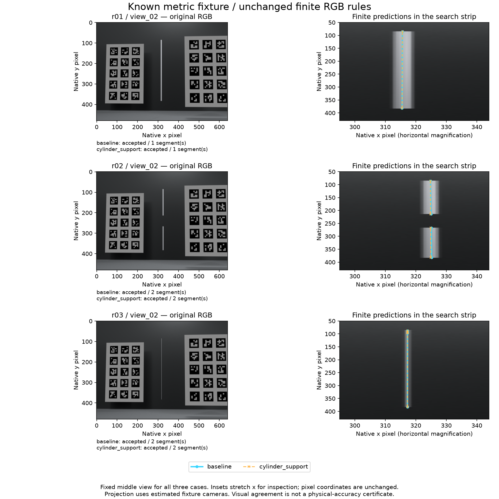

# 2026-09-27：已知尺寸标定物下的有限杆恢复

本轮得到一个明确的受控正例：正常输入公开增加已知尺寸的标定物，完全从RGB估相机，原有两条有限杆方法都能给完整杆、断杆、0.01直径细杆输出曲线。六个结果在25mm容差下R/P都是100%，但细杆仍有19.219mm假断口，总长度短39.631mm，不能宣布完整恢复。G1仍未通过。

没有更换旧实验结果，也没有把GT相机传给方法。本轮没有重跑DA3或修改稠密点云；`baseline`在本文专指旧普通几何曲线法，不是DA3基础点云。

## 输入条件与正常流程

复用旧height包三个杆布局、五个相机视角、杆尺寸与材质、光照、640×480分辨率、48采样和固定屏幕guide。参考纹理板替换成两块明确声明的标定板。它们是新辅助采集条件，不能把本轮结果说成旧照片自动改善，更不能把差异全部归因于一个单独变量。

[公开CAD](../../configs/rod_fixture_cad_v1.json)定义两板中心为(-1.45,0.8,0)、(1.45,-0.15,0)m；每板3列×5行，30个唯一ArUco标记，黑边边长0.30m、中心间距0.42m。中列10个ID固定做验证，其余20个用于标定，两边均覆盖两个深度。CAD先冻结，再渲染；它是模拟的已知制造尺寸，尚未包含真实制作、测量或畸变误差。

每个case五图单独估一份共享K和五个位姿。焦距与主点都拟合，方像素、零偏斜、零畸变固定；初始焦距仅按图像长边×1.2给定。真实镜头参数不进入推理。留出的是标记ID，五个相机姿态本身都参加标定。三个case的板和采集位置相同，因此相机结果相同，不能当成三个独立标定对象。

正常杆方法沿用旧冻结参数：逐行RGB双边观测、图像线候选、跨图关联、普通/圆柱支持两条路径、实际行支持决定有限范围。未观测位置保持未知，不自动补齐。固定屏幕带声明了单根目标的任务范围，本轮没有自动目标身份识别或额外点击。全部五相机通过留出标记验证，才允许两条杆方法运行。

## 相机与配对检查

15张RGB分别配对导出Z深度、欧氏射线距离、surface ID、可见掩码、相机及网格，真值位于隔离目录。15400条独立Blender射线零ID冲突，射线Z最大误差约0.00000235m。整数index像素与edge像素只转换一次0.5px。

每组五视图检测到的训练标记数为15/20/19/16/20，验证标记均为10。正常验证p95约0.136–1.038px，15相机全部通过。物理评分直接使用声明CAD世界坐标，没有Sim3，也没有对杆重新对齐：相机中心误差8.205–12.279mm，焦距相对误差-0.1869%，主点误差0.312px。通过标记验证不等于相机完全无误差。

## 六个结果一个不省

`p95`列取两个曲线方向中的较大值，单位mm；长度差为预测总弧长减真实总弧长，负数表示少了。端点计数列为预测边界/真实边界，连续小段的共享接点不重复计算。

| 布局 | 方法 | 输出段数 | R/P（25mm） | 曲线p95 | 长度差 | 边界数 | 端点一一匹配最大误差 |
| --- | --- | ---: | --- | ---: | ---: | --- | ---: |
| 完整杆r01 | 普通几何 | 1 | 100%/100% | 1.588 | -14.005 | 2/2 | 8.407 |
| 完整杆r01 | 圆柱支持 | 1 | 100%/100% | 1.588 | -14.005 | 2/2 | 8.407 |
| 断杆r02 | 普通几何 | 2 | 100%/100% | 3.220 | -22.765 | 4/4 | 8.925 |
| 断杆r02 | 圆柱支持 | 2 | 100%/100% | 1.465 | -22.765 | 4/4 | 8.313 |
| 细杆r03 | 普通几何 | 2 | 100%/100% | 0.084 | -39.631 | 4/2 | 不可配对 |
| 细杆r03 | 圆柱支持 | 2 | 100%/100% | 0.084 | -39.631 | 4/2 | 不可配对 |

r02真实缺口长350mm，两端各留25mm保护后，内部300mm的假占据长度为0。另一路没有调用主指标实现的数学复核表明：整个保护区间与两种预测的z方向距离下界分别28.002、27.974mm，都大于25mm，因此零误填不只来自有限采样点碰巧没命中。

r03尤其容易被漂亮数字骗过去。它的横向轴偏差小，但在z约0.974–0.993m间断开19.219mm，上端也约短18.564mm；边界从应有的2个变成4个。缺失总长不足全杆5%，95分位自然可能避开这些坏位置；25mm邻域又能覆盖这处小断口，所以R/P仍是100%。长度、端点和连续性必须跟曲线误差一起看。

所有case的view_04图像候选池都被cap8截断，完整池数分别159、54、160；不能把保留池内搜索完成说成穷尽了全部图像解释。细杆五图完整候选数为[1,1,0,1,160]，固定展示的view_02恰好没有合格候选，输出依赖其他视角。投影线出现在这张照片上，不表示该图的细杆检测已经解决。



左侧为原图，右侧为固定像素窗口；横向放大已标注，坐标没有移动。两种方法在完整杆与细杆上的结果重合，断杆略有不同。图只使用正常估计相机与曲线，不读GT，也不构成独立物理验收。

## 实际代价、检查与限制

正常相机检测/标定及来源复核共0.639s，杆证据与两法输出26.634s，合计约27.27s；不含渲染、启动、GT生成、独立审计、测试或人工开发时间。三次重复标定没有去重，计时按实际执行记录。

评价定义在正常推理前冻结；独立pre实际保存409份收据，评价后全不变，另核87份GT收据。15次标记检测、15次杆观测池都重放核对，投影算术另行复核。主物理post使用同一个已知答案测试通过的指标实现重新计算，不冒充另一套独立评分器；CAD网格、像素转换、长度和连续缺口下界另有不同实现的复核。

493项全量回归通过（93.183s），之后新增7项审计专项也在NumPy1.26与2通过；本轮38项新增专项均完成双环境检查。核心16项/15子检查、Ruff、262份源码/三个CLI边界、实验包离线构建通过。25个冻结run的1152条源码引用、129份不同活跃源、137份Git源码核验通过，19份新源字节一致。历史换行映射和失败快照保留。

这是一组旧程序生成对象、理想CAD尺寸、无镜头畸变、单目标搜索带下的曲线正例。没有独立对象、实拍、完整DA3基础/候选共同评分、正式深度补丁或自动身份收益；正常默认流程没有切换。两方法和同一对象的重复视图不能扩充独立样本数。

## 复查入口

四个run依次为：`rod-fixture-scenes-v1-20260927`、`rod-fixture-calibration-v1-20260927`、`rod-fixture-finite-v1-20260927`、`rod-fixture-audit-v1-20260927`。已完成run拒绝覆盖；需要修改方法时另开版本和ID。

在新根目录进入现有环境后，生成与正常阶段为：

```powershell
backends\da3\.venv\Scripts\python.exe -B scripts\prepare_rod_fixture.py
backends\da3\.venv\Scripts\python.exe -B scripts\run_fixture_calibration.py prepare
backends\da3\.venv\Scripts\python.exe -B scripts\run_fixture_calibration.py infer
backends\da3\.venv\Scripts\python.exe -B scripts\run_rod_fixture_finite.py prepare
backends\da3\.venv\Scripts\python.exe -B scripts\run_rod_fixture_finite.py infer
```

上述是已执行的顺序，不是让下一轮覆盖重跑。评价定义预先保存在审计run的`evaluation-freeze.json`及`evaluation_source_snapshot/`，之后审计入口按`freeze → pre → evaluate → post`执行；不能事后补造pre。已有产物可只读核对，来源审计允许`--output <新路径>`保存另一次检查。

[全部物理读数](results/2026-09-27-rod-fixture-physical.json) · [独立前后审计](results/2026-09-27-rod-fixture-audit.json) · [额外数学复核](results/2026-09-27-fixture-independent-math.json) · [源码/Git核验](results/2026-09-27-fixture-git-freeze-audit.json) · [图来源](results/2026-09-27-fixture-figure.json) · [今日日志](../journal/2026-09-27.md) · [后续决定](../decisions/0021-metric-fixture-and-finite-completeness.md) · [新交接](../HANDOFF-2026-09-27.md)
